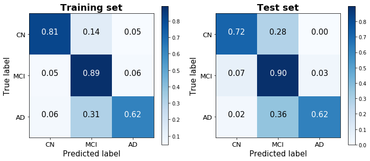
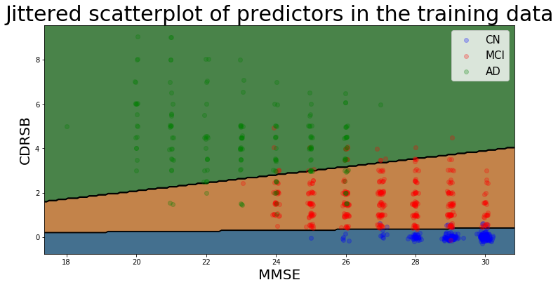
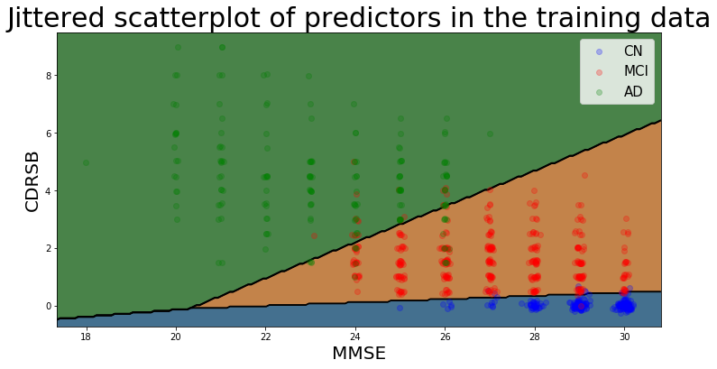
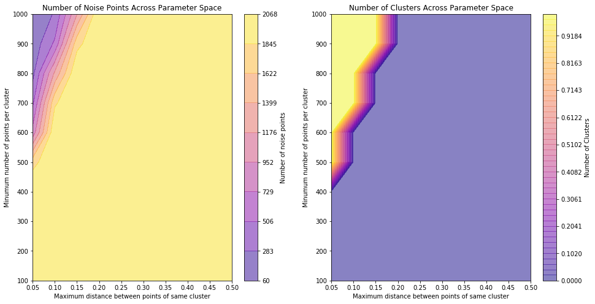
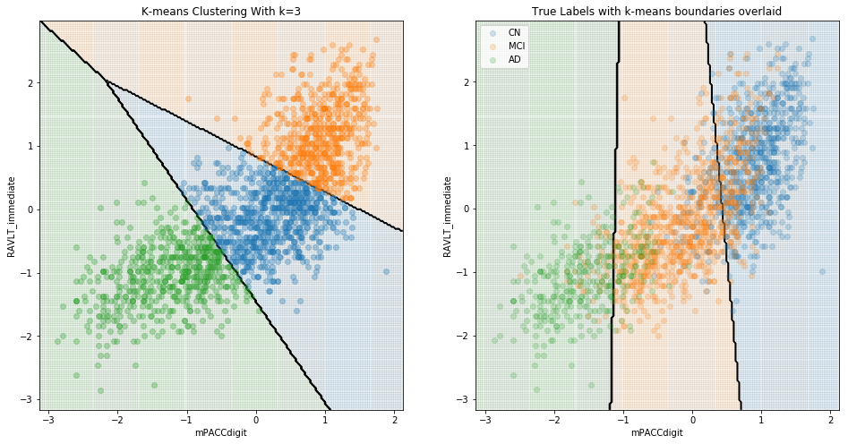
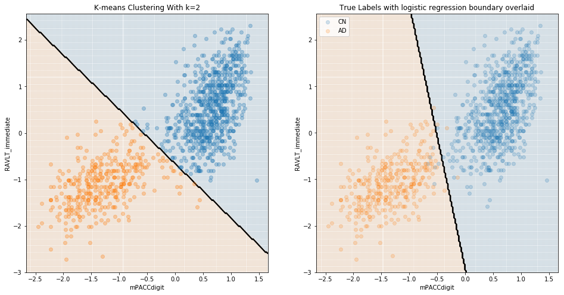
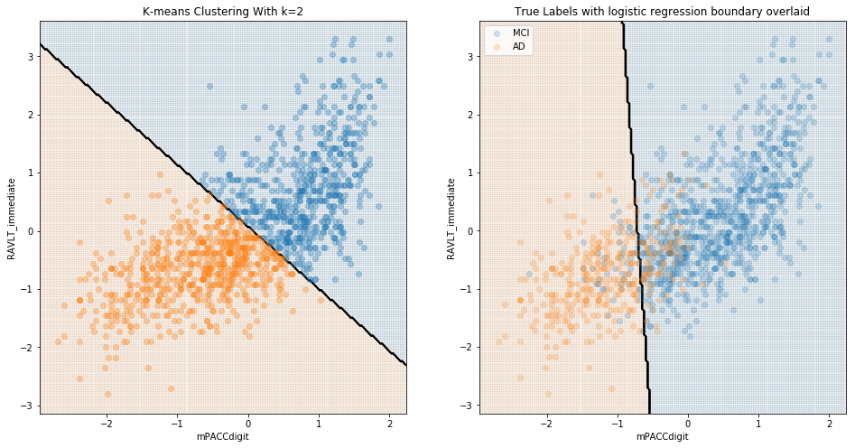
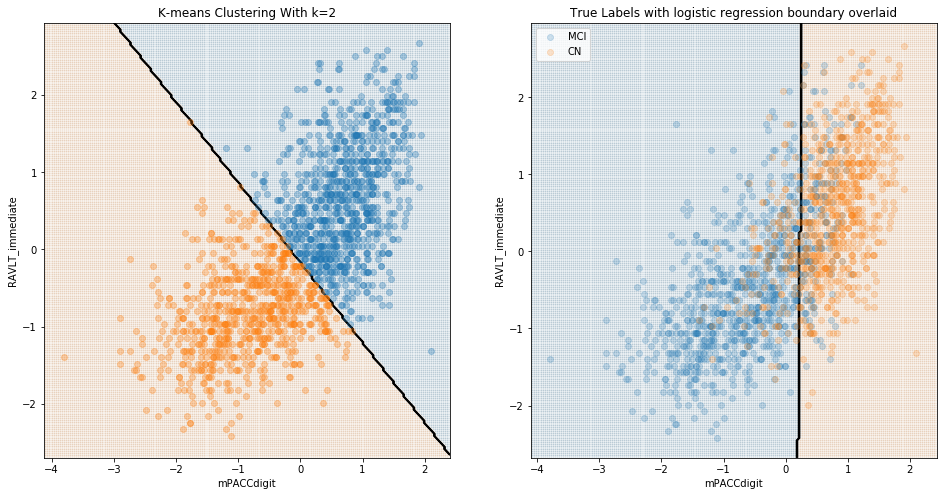

## Contents
{:.no_toc}
*  
{: toc}

## Data Processing

### Subsetting our Data

We use the ADNI 1 phase for our cross-sectional models. The justification for using one of the four phases is that we've noticed that there are certain predictors that are entirely missing for certain phases of the study. For example, Everyday Cognition (Ecog) is missing in general for the ADNI 1 phase. Furthermore, there are differences in the ADNI phases with regard to the amount of information collected and the study procedure followed. This means that patient records in ADNI 1 are not directly comparable with patient records in ADNI GO. In addition, our baseline model aims to predict baseline diagnosis, so we only choose records where the patient was visiting for a baseline test. In addition, we drop predictors where the number of missing values is greater than or equal to 90% of the total number of records. In addition, we drop obviously collinear features (such as Month and Year after baseline). Finally, we create dummies (one-hot-encoding) for our categorical variables (such as marital status, Race etc). 

### Dealing with Missing Data

Our EDA also shows us that certain predictors, such as the ones taken from the Cerebrospinal Fluid (CSF) such as Amyloid Beta (ABeta), Tau and Ptau, are missing in large chunks for participants who did not have this procedure done. This means that we could not simply follow a mean or median value imputation since the patients who displayed only minor symptoms of cognitive decline are systemically less likely to have their CSF taken than patients who display a greater degree of cognitive decline. In order to deal with these concerns, we use k-Nearest Neighbors (kNN) with 5 neighbors to impute values that are missing. This appears to be the fairest system of imputing missing values. 

## Model 1: Predicting baseline diagnosis using all baseline features

We began by developing a basic multiclass logistic regression model to predict baseline diagnosis from data available at that initial visit to get a rough understanding of the strength of the available predictors, as well as to compare how well they perform in predicting cross-sectional diagnosis versus longitudinal change in diagnosis. 

The one-versus-all logistic regression classifier achieves a training score of 80.6% and a test score of 78.3% (based on a 25% train-test split stratified by diagnosis). The confusion matrices for the training and test sets show that the model does a good job discerning between the three classes, without always defaulting to -- though clearly biased toward -- the dominant group. (48.8% of observations were classified as MCI, 28.2% as CN, and 23.0% as AD).

## Model 2: Predicting baseline diagnosis only using MMSE and CDRSB

Rather than predicting baseline diagnosis with all available predictors, we also sought to determine the predictive accuracy of two cognitive tests -- the MMSE (Mini-Mental State Examination) and CDRSB (Clinical Dementia Rating Scaled Response) -- that our EDA suggested correlate highly with baseline diagnosis. Importantly, cognitive tests such as the MMSE and CDRSB are very low-cost to administer, and are therefore the first method typically used to identify cognitive decline among patients. This model therefore serves to measure the misdiagnosis rate liable to occur by using these low-cost methods, and to identify any systematic biases that they may suffer from.

This logistic model was therefore purposefully rudimentary, performed without any regularization or boosting. Nevertheless, it achieves a strikingly high training score of 93.4% and a test score of 92.6%. A confusion matrix of its predictions demonstrates the ease with which the three classes are distinguished using just two predictors. Noteably, this parsimonious model performed significantly better than the model with all readily-available predictors that was considered above (not just on the test set, which would have suggested overfitting, but surprisingly on the training set as well), and generated predictions that were less biased toward the dominant MCI class than the previous model as well. 
 
The decision boundaries of this model are illustrated below (using jitter to illustrate density of points belonging to the Cognitively Normal class), and show that there is a clear separability between the three classes based on MMSE and CDRSB scores: Cognitively Normal patients have high MMSE scores and very low (almost always 0) CDRSB scores. 

## Summary of Conclusions from Cross-Sectional Models

The two simple cross-sectional models reveal that cognitive assessment scores are able to account for much of the variability in patient diagnoses, perhaps in large part given the heavy reliance on these exams for the definition of the ADNI diagnosis classes. As a model designed to predict diagnosis involving these exams as predictors seemed of relatively little value, we instead focused on models designed to predict a patient’s prognosis (i.e. change over time) given the information available at baseline (t=0).

---

## Investigating Clustering within the Baseline Data

Alzheimer's disease cannot be measured directly, but instead must itself be "predicted" through proxies such as psychometric exams or a variety of physiological factors like amyloid-beta levels and brain volume that together signal the presence of AD. Thus, the response variable to our models is itself a prediction, and therefore introduces error into the model's accuracy that must be considered. In order to do this, we use several unsupervised clustering methods to identify the degree to which the dependent variable that we chose to model -- diagnosis -- corresponds with the natural progression of AD.

Another rationale for performing unsupervised clustering is to measure what is in effect discretization error from imposing a set of three possible diagnoses to describe what is in actuality a continuous progression. To measure this discretization error, it is necessary to consider the degree to which the diagnoses align with natural discontinuities (if there are any) in the progression of dementia and AD. 

We began by using the DBSCAN (Density-Based Spatial Clustering of Applications with Noise) algorithm, which automatically clusters data into a certain (unspecified) number of groups based on the input parameters *epsilon* (the maximum distance between two samples for them to be considered as in the same neighborhood) and *min_samples* (the number of samples in a group for a point to be considered as a core point, including the point itself). We trained the model on two predictors -- both neuropsychological exam scores -- that we found achieved high levels of accuracy: the Digit Symbol Substitution Test from the Preclinical Alzheimer Cognitive Composite (PACC) (*mPACCdigit*), and immediate recall scores from Rey's Auditory Verbal Learning Test (RAVLT) (*RAVLT_immediate*). These predictors had comparable performance to the two other exams considered for the second cross-sectional model (the MMSE and CDRSB), though had a wider range of scores, and therefore were better for visualization purposes.

    DBSCAN results:
    ==================
    
    Estimated number of clusters: 1
    Estimated number of noise points: 45
    Homogeneity: 0.001
    Completeness: 0.005
    V-measure: 0.002
    Adjusted Rand Index: -0.010
    Adjusted Mutual Information: 0.001
    Silhouette Coefficient: 0.332

The results of the DBSCAN algorithm suggest that these two predictors, which in EDA appeared to be amongst the best for splitting the response variable categories in truth do not create distinct clusters. To confirm this, we re-ran the dbscan algorithm across a range of input parameters and examined the output to see whether the results were parameter-dependent.

These plots show that for a large range of the chosen sample space, clustering cannot be performed properly (no clusters identified and all points assigned as noise) and when clustering is achieved, it does not predict more than one cluster being present for any parameter input - again confirming that, for these predictors, the data does not segregate well. 

To further explore, we carried out K-means clustering and enforced three clusters, to see whether the chosen clustered groups look similar to the true group distributions.

Here, we can see that although the boundaries predicted by this clustering algorithm capture aspects of the different distributions of the groups, it is certainly true that the groups do not clearly cluster, and the unlabeled clustering category boundaries are substantially different to the boundaries determined by logistic regression of labelled data. When considering just cognitively normal and Alzheimer's disease, clustering is far more successful:

These results are to be expected; it is presumably quite easy to differentiate cognitively-normal patients from those with diagnosed Alzheimer's. The value of a model in identifying Alzheimer's should instead be evaluated in terms of its ability to differentiate between CN and MCI, and/or between MCI and AD patients. We see below that, when considering MCI, there was little natural distinction between MCI and either CN or diagnosed AD.

Comparing MCI and AD:

Comparing MCI and CN:

## Summary of Conclusions from Cluster Analysis

In sum, there appears to be little natural division between patients diagnosed as MCI and those diagnosed either as CN or AD. A model designed to differentiate among the three groups is therefore trained on an artificial construct, and therefore provides limited real-world value; such a model may perform well for the majority of patients who fall relatively far from the "decision boundaries" between the three diagnoses, though may fail to detect the borderline cases that are more critical for the purposes of real-world diagnoses. This conclusion further motivated our interest in considering *change* in diagnosis, which is less subject to this limitation.
