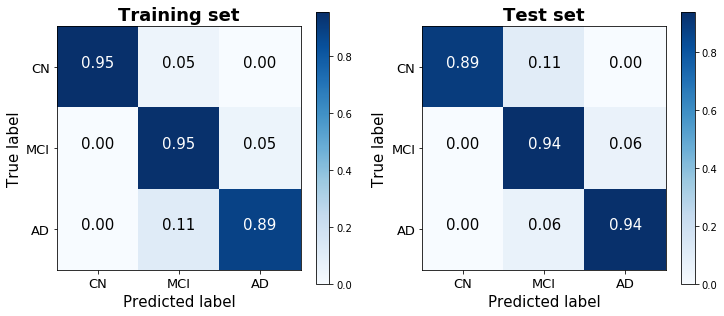

## Contents
{:.no_toc}
*  
{: toc}

## Data Processing

### Subsetting our Data

We use the ADNI 1 phase for our cross-sectional models. The justification for using one of the four phases is that we've noticed that there are certain predictors that are entirely missing for certain phases of the study. For example, Everyday Cognition (Ecog) is missing in general for the ADNI 1 phase. Furthermore, there are differences in the ADNI phases with regard to the amount of information collected and the study procedure followed. This means that patient records in ADNI 1 are not directly comparable with patient records in ADNI GO. In addition, our baseline model aims to predict baseline diagnosis, so we only choose records where the patient was visiting for a baseline test. In addition, we drop predictors where the number of missing values is greater than or equal to 90% of the total number of records. In addition, we drop obviously collinear features (such as Month and Year after baseline). Finally, we create dummies (one-hot-encoding) for our categorical variables (such as marital status, Race etc).

### Dealing with Missing Data

Our EDA also shows us that certain predictors, such as the ones taken from the Cerebrospinal Fluid (CSF) such as Amyloid Beta (ABeta), Tau and Ptau, are missing in large chunks for participants who did not have this procedure done. This means that we could not simply follow a mean or median value imputation since the patients who displayed only minor symptoms of cognitive decline are systemically less likely to have their CSF taken than patients who display a greater degree of cognitive decline. In order to deal with these concerns, we use k-Nearest Neighbors (kNN) with 5 neighbors to impute values that are missing. This appears to be the fairest system of imputing missing values.

## Model 1: Predicting baseline diagnosis using all baseline features

We began by developing a basic multiclass logistic regression model to predict baseline diagnosis from data available at that initial visit to get a rough understanding of the strength of the available predictors, as well as to compare how well they perform in predicting cross-sectional diagnosis versus longitudinal change in diagnosis.

The one-versus-all logistic regression classifier achieves a training score of 80.6% and a test score of 78.3% (based on a 25% train-test split stratified by diagnosis). The confusion matrices for the training and test sets show that the model does a good job discerning between the three classes, without always defaulting to -- though clearly biased toward -- the dominant group. (48.8% of observations were classified as MCI, 28.2% as CN, and 23.0% as AD).

  
  

## Model 2: Predicting baseline diagnosis only using MMSE and CDRSB

Rather than predicting baseline diagnosis with all available predictors, we also sought to determine the predictive accuracy of two cognitive tests -- the MMSE (Mini-Mental State Examination) and CDRSB (Clinical Dementia Rating Scaled Response) -- that our EDA suggested correlate highly with baseline diagnosis. Importantly, cognitive tests such as the MMSE and CDRSB are very low-cost to administer, and are therefore the first method typically used to identify cognitive decline among patients. This model therefore serves to measure the misdiagnosis rate liable to occur by using these low-cost methods, and to identify any systematic biases that they may suffer from.

This logistic model was therefore purposefully rudimentary, performed without any regularization or boosting. Nevertheless, it achieves a strikingly high training score of 93.4% and a test score of 92.6%. A confusion matrix of its predictions demonstrates the ease with which the three classes are distinguished using just two predictors. Noteably, this parsimonious model performed significantly better than the model with all readily-available predictors that was considered above (not just on the test set, which would have suggested overfitting, but surprisingly on the training set as well), and generated predictions that were less biased toward the dominant MCI class than the previous model as well.

The decision boundaries of this model are illustrated below (using jitter to illustrate density of points belonging to the Cognitively Normal class), and show that there is a clear separability between the three classes based on MMSE and CDRSB scores: Cognitively Normal patients have high MMSE scores and very low (almost always 0) CDRSB scores.

## Summary

The two simple cross-sectional models reveal that cognitive assessment scores are able to account for much of the variability in patient diagnoses, perhaps in large part given the heavy reliance on these exams for the definition of the ADNI diagnosis classes. As a model designed to predict diagnosis involving these exams as predictors seemed of relatively little value, we instead focused on models designed to predict a patient’s prognosis (i.e. change over time) given the information available at baseline (t=0).
