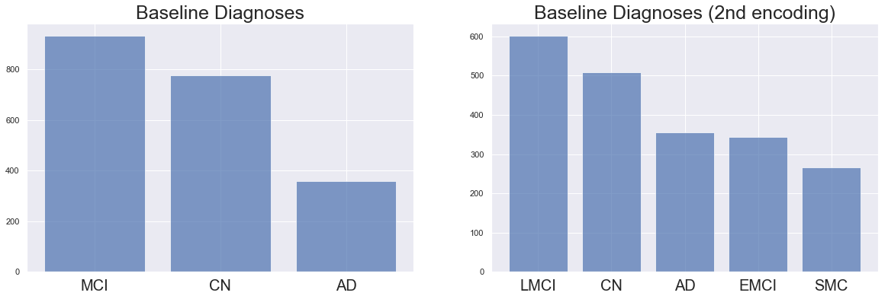
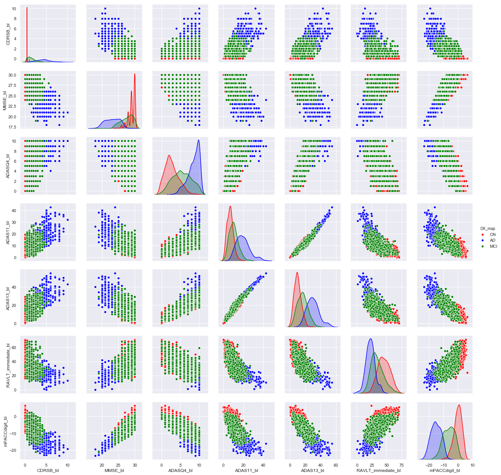
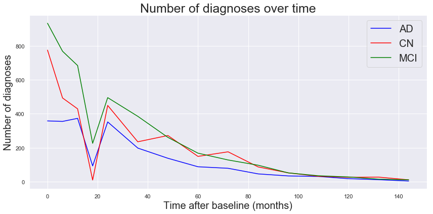

## Contents
{:.no_toc}
*  
{: toc}


## Description of Data

### Description of ADNI Merge


```python

```


Data Table Here

### Missing Values

Visualization Here


## Demographic Information

The patient demographics helped shape some of our goals and research questions. First, we noticed that all participants were at or above the age of 55. This means that our ability to make an "early" diagnosis is limited, since many of the participants got a screening done since they exhibited symptoms of cognitive impairment of some form. Second, we notice that a majority of our population is white and married. We understand that this means that our findings do not extend to a larger population.


## Initial Diagnoses

The baseline diagnoses are encoded in two ways in the ADNI Merge Dataset. The first encoding is as follows:

1. CN: Cognitively Normal
2. MCI: Mild Cognitive Impairment
3. Dementia: Alzheimer's Disease or other Dementia.

The second encoding is as follows:

1. CN: Cognitively Normal
2. EMCI: Early Mild Cognitive Impairment
3. LMCI: Late Mild Cognitive Impairment
4. SMC: Significant Memory Concerns
5. AD: Alzheimer's Disease

We choose the first encoding, changing 'Dementia' to 'AD' since there is an equivalency in the encoding of these categories. The second encoding is present only in the baseline diagnoses and not in the subsequent diagnoses, and part of our modeling is to predict future decline, so we choose the first encoding to remain consistent between diagnoses at different points of time.





### Important Predictors for Initial Diagnosis

From a histogram of baseline values for all predictors in our dataset conditional on initial diagnosis, a few predictors stood out to us, as being promising indicators of baseline diagnosis. These pertained to examination scores, which doctors heavily rely on to make their initial diagnoses. This influenced our decision to explore one such heavily influential examination, the MMSE (Mini-Mental State Examination) in particular.

The histograms below correspond to four cognitive tests that show a promising separability between the three classes at baseline levels. We further explore these four cognitive tests and three tests from the ADAS (Alzheimer's Disease Assessment Scale) test in a pair plot that also shows promise in a combination of cognitive tests being used to predict initial diagnoses.


    <seaborn.axisgrid.PairGrid at 0x1a20987e48>





## Diagnoses Over Time

In addition to being able to predict initial diagnosis, we also aim to predict future decline i.e. patients who were initially diagnosed as Cognitively Normal and later were diagnosed with Mild Cognitive Impairment, or patients who were initially diagnosed with Mild Cognitive Impairment and later became diagnosed with Alzheimer's Disease. In order to do this, we have a few different visuals to get a sense of the distribution of diagnoses over time and how MMSE scores (an important determiner of diagnosis) vary over time for patients.





We observe that the total number of diagnoses of each kind drops over time, which may perhaps be a result of patients not carrying out a follow up study for a number of different reasons.

### MMSE scores over time

Next, we show how MMSE scores vary over time for participants. We plot trajectories of MMSE scores for each of the three diagnosis types. We anticipate there to be a gradual decline in MMSE scores for the AD and MCI categories and perhaps a smaller decline for the CN category but this plot helps discern between the different groups based on rate of dropoff of MMSE scores.


As hypothesized, the dropoff of MMSE scores for the MCI group is faster and larger than that for the CN group. It is striking to observe that many patients initially diagnosed with AD have no observations after 3 years.

### Change in Diagnosis Between First Visit and Most Recent Visit

Using our plots above, we turn to the question of predicting change in diagnoses between first and most recent visit for a particular patient. We subset our dataset to include only patients who have multiple observations and show the number of diagnoses of each kind at baseline and at patients' most recent visit. One extremely important caveat is that the most recent visit can be 2 years later or 12 years later, and the time between first and last visit is an extremely important predictor that we keep in mind when modeling.


    (1648, 3)


A general pattern seems to be that the total number of MCI and CN diagnoses has decreased while the number of AD diagnoses has increased over time, which is unsurprising.

We create a table, with each entry representing a participant's initial and most recent diagnoses. A majority of participants start and end with the same diagnoses, however a subset of participants do decline, especially from MCI to AD. A non-trivial number of participants move from MCI to CN, which is worth noting. Of the 1648 participants with multiple observations, only 204 decline, which is about **12.3%** of our total sample. This is an important finding that suggests that we should perform classification with balanced class weights in our modeling phase.

The Sankey Diagram below illustrates changes in diagnoses and highlights some major trends: that a majority of patients have the same initial and most recent diagnoses.


<div>
<style scoped>
    .dataframe tbody tr th:only-of-type {
        vertical-align: middle;
    }

    .dataframe tbody tr th {
        vertical-align: top;
    }

    .dataframe thead th {
        text-align: right;
    }
</style>
<table border="1" class="dataframe">
  <thead>
    <tr style="text-align: right;">
      <th></th>
      <th>DX</th>
      <th>End CN</th>
      <th>End MCI</th>
      <th>End AD</th>
    </tr>
  </thead>
  <tbody>
    <tr>
      <th>0</th>
      <td>Start CN</td>
      <td>555.0</td>
      <td>48.0</td>
      <td>12.0</td>
    </tr>
    <tr>
      <th>1</th>
      <td>Start MCI</td>
      <td>39.0</td>
      <td>578.0</td>
      <td>156.0</td>
    </tr>
    <tr>
      <th>2</th>
      <td>Start AD</td>
      <td>0.0</td>
      <td>1.0</td>
      <td>259.0</td>
    </tr>
  </tbody>
</table>
</div>


## Deep Dive into MMSE


```python

```
