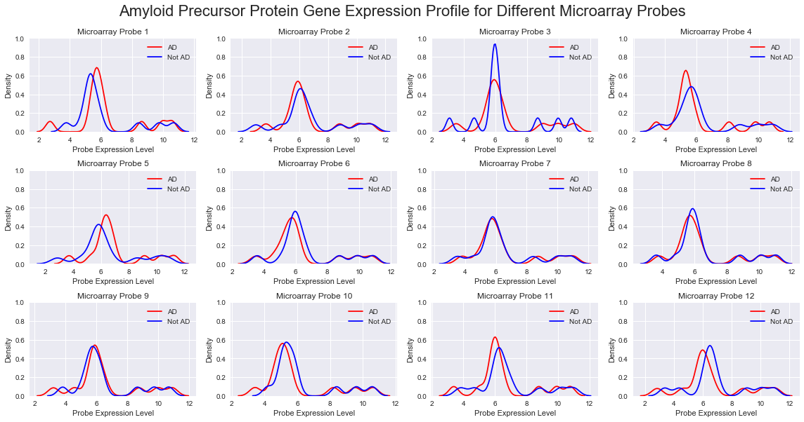
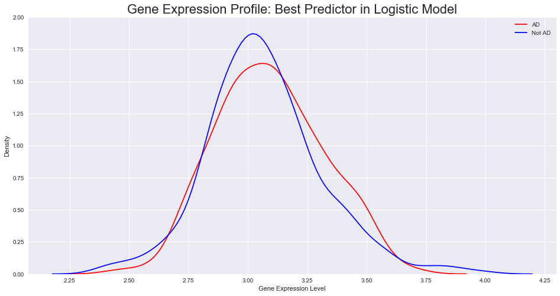

## Gene Expression Profiles

**Consideration of an Alternative Question: Genetic Predictors**

Rather than creating a predictive model of diagnosis using various types of patient information, we had previously considered developing a model from the detailed biological data available to consider the importance of genes on chromosome 21 in Alzheimer’s Disease. Chromosome 21 is known to be very important in the etiology of AD - for example, over half of those born with an extra copy of Chr21 (a condition known as Down’s Syndrome) will go on to develop Alzheimer’s Disease [1]. While it is commonly said that the link between Chr21 and AD is due to the gene for the Amyloid Precursor Protein (APP) [2], there are many other genes on this chromosome that have also been linked to Alzheimer’s disease [3].

Of the wealth of genetic data that ADNI publishes, we drew primarily on the microarray gene expression profile dataset, which used ~50,000 genetic probes to assess the activity of genes across the genome. The outcome for each patient in the gene profile dataset was determined using the ADNIMerge dataset. To identify only chromosome 21 genes, the Affymetrix gene annotation dataset was used to annotate the gene expression data set with chromosomal location of the target gene for every probe. The combination of these three datasets created the possibility of building a model based on the genes of any chromosome to predict any clinical outcome. The preliminary models (discussed below) suggested little promise of interesting results to be derived from considering gene expression data in isolation, so we ultimately decided to focus on a more general predictive model involving more feature types instead.

To determine the chromosomal location and biological role of any gene, we used this [gene annotation database provided by affymetrix](http://www.affymetrix.com/support/technical/byproduct.affx?product=HG-U219). Using this database, we can add columns to the gene expression profile dataset for the chromosomal column and gene name of every gene. From this, we can isolate genes based on their chromosomal location.

    Chromosome 21 genes present in gene expression profile dataset:  609

## Using the Chromosome 21 Dataset

<table border="1" class="dataframe">
  <thead>
    <tr style="text-align: right;">
      <th>SubjectID</th>
      <th>LocusLink</th>
      <th>Symbol</th>
      <th>116_S_1249</th>
      <th>037_S_4410</th>
      <th>006_S_4153</th>
      <th>116_S_1232</th>
      <th>099_S_4205</th>
      <th>007_S_4467</th>
      <th>128_S_0205</th>
      <th>003_S_2374</th>
      <th>...</th>
      <th>014_S_4668</th>
      <th>130_S_0289</th>
      <th>141_S_4456</th>
      <th>009_S_2381</th>
      <th>053_S_4557</th>
      <th>073_S_4300</th>
      <th>041_S_4014</th>
      <th>007_S_0101</th>
      <th>Biological Name</th>
      <th>Chromosome</th>
    </tr>
    <tr>
      <th>Gene_PSID</th>
      <th></th>
      <th></th>
      <th></th>
      <th></th>
      <th></th>
      <th></th>
      <th></th>
      <th></th>
      <th></th>
      <th></th>
      <th></th>
      <th></th>
      <th></th>
      <th></th>
      <th></th>
      <th></th>
      <th></th>
      <th></th>
      <th></th>
      <th></th>
      <th></th>
    </tr>
  </thead>
  <tbody>
    <tr>
      <th>Visit</th>
      <td>NaN</td>
      <td>NaN</td>
      <td>m48</td>
      <td>v03</td>
      <td>v03</td>
      <td>m48</td>
      <td>v03</td>
      <td>v03</td>
      <td>v06</td>
      <td>bl</td>
      <td>...</td>
      <td>v03</td>
      <td>m60</td>
      <td>v03</td>
      <td>bl</td>
      <td>v03</td>
      <td>v03</td>
      <td>v03</td>
      <td>v06</td>
      <td>NaN</td>
      <td>NaN</td>
    </tr>
    <tr>
      <th>Phase</th>
      <td>NaN</td>
      <td>NaN</td>
      <td>ADNIGO</td>
      <td>ADNI2</td>
      <td>ADNI2.1</td>
      <td>ADNIGO.1</td>
      <td>ADNI2.2</td>
      <td>ADNI2.3</td>
      <td>ADNI2.4</td>
      <td>ADNIGO.2</td>
      <td>...</td>
      <td>ADNI2.443</td>
      <td>ADNIGO.293</td>
      <td>ADNI2.444</td>
      <td>ADNIGO.294</td>
      <td>ADNI2.445</td>
      <td>ADNI2.446</td>
      <td>ADNI2.447</td>
      <td>ADNI2.448</td>
      <td>Unnamed: 747</td>
      <td>NaN</td>
    </tr>
    <tr>
      <th>260/280</th>
      <td>NaN</td>
      <td>NaN</td>
      <td>2.05</td>
      <td>2.07</td>
      <td>2.04</td>
      <td>2.03</td>
      <td>2.01</td>
      <td>2.05</td>
      <td>1.95</td>
      <td>1.99</td>
      <td>...</td>
      <td>2.05</td>
      <td>1.98</td>
      <td>2.09</td>
      <td>1.87</td>
      <td>2.03</td>
      <td>2.11</td>
      <td>1.94</td>
      <td>2.06</td>
      <td>NaN</td>
      <td>NaN</td>
    </tr>
    <tr>
      <th>260/230</th>
      <td>NaN</td>
      <td>NaN</td>
      <td>0.55</td>
      <td>1.54</td>
      <td>2.1</td>
      <td>1.52</td>
      <td>1.6</td>
      <td>1.91</td>
      <td>1.47</td>
      <td>2.07</td>
      <td>...</td>
      <td>2.05</td>
      <td>1.65</td>
      <td>1.56</td>
      <td>1.45</td>
      <td>1.33</td>
      <td>0.27</td>
      <td>1.72</td>
      <td>1.35</td>
      <td>NaN</td>
      <td>NaN</td>
    </tr>
    <tr>
      <th>RIN</th>
      <td>NaN</td>
      <td>NaN</td>
      <td>7.7</td>
      <td>7.6</td>
      <td>7.2</td>
      <td>6.8</td>
      <td>7.9</td>
      <td>7</td>
      <td>7.9</td>
      <td>7.2</td>
      <td>...</td>
      <td>6.5</td>
      <td>6.3</td>
      <td>6.4</td>
      <td>6.6</td>
      <td>6.8</td>
      <td>6.2</td>
      <td>5.8</td>
      <td>6.7</td>
      <td>NaN</td>
      <td>NaN</td>
    </tr>
    <tr>
      <th>Affy Plate</th>
      <td>NaN</td>
      <td>NaN</td>
      <td>7</td>
      <td>3</td>
      <td>6</td>
      <td>7</td>
      <td>9</td>
      <td>4</td>
      <td>3</td>
      <td>8</td>
      <td>...</td>
      <td>6</td>
      <td>9</td>
      <td>3</td>
      <td>8</td>
      <td>5</td>
      <td>3</td>
      <td>1</td>
      <td>4</td>
      <td>NaN</td>
      <td>NaN</td>
    </tr>
    <tr>
      <th>YearofCollection</th>
      <td>NaN</td>
      <td>NaN</td>
      <td>2011</td>
      <td>2012</td>
      <td>2011</td>
      <td>2011</td>
      <td>2011</td>
      <td>2012</td>
      <td>2011</td>
      <td>2011</td>
      <td>...</td>
      <td>2012</td>
      <td>2011</td>
      <td>2012</td>
      <td>2011</td>
      <td>2012</td>
      <td>2011</td>
      <td>2011</td>
      <td>2012</td>
      <td>NaN</td>
      <td>NaN</td>
    </tr>
    <tr>
      <th>ProbeSet</th>
      <td>LocusLink</td>
      <td>Symbol</td>
      <td>NaN</td>
      <td>NaN</td>
      <td>NaN</td>
      <td>NaN</td>
      <td>NaN</td>
      <td>NaN</td>
      <td>NaN</td>
      <td>NaN</td>
      <td>...</td>
      <td>NaN</td>
      <td>NaN</td>
      <td>NaN</td>
      <td>NaN</td>
      <td>NaN</td>
      <td>NaN</td>
      <td>NaN</td>
      <td>NaN</td>
      <td>NaN</td>
      <td>NaN</td>
    </tr>
    <tr>
      <th>11715130_s_at</th>
      <td>LOC337967</td>
      <td>KRTAP6-2</td>
      <td>2.424</td>
      <td>2.623</td>
      <td>2.501</td>
      <td>3.103</td>
      <td>2.567</td>
      <td>2.992</td>
      <td>2.249</td>
      <td>2.63</td>
      <td>...</td>
      <td>3.074</td>
      <td>2.763</td>
      <td>2.89</td>
      <td>3.155</td>
      <td>2.526</td>
      <td>2.452</td>
      <td>2.822</td>
      <td>2.651</td>
      <td>[KRTAP6-2] keratin associated protein 6-2</td>
      <td>21</td>
    </tr>
    <tr>
      <th>11715131_s_at</th>
      <td>LOC337975</td>
      <td>KRTAP20-1</td>
      <td>1.826</td>
      <td>2.306</td>
      <td>2.735</td>
      <td>2.777</td>
      <td>2.897</td>
      <td>2.631</td>
      <td>2.613</td>
      <td>2.481</td>
      <td>...</td>
      <td>2.46</td>
      <td>2.374</td>
      <td>2.074</td>
      <td>3.121</td>
      <td>2.725</td>
      <td>2.21</td>
      <td>2.828</td>
      <td>2.444</td>
      <td>[KRTAP20-1] keratin associated protein 20-1</td>
      <td>21</td>
    </tr>
    <tr>
      <th>11715144_s_at</th>
      <td>LOC337974</td>
      <td>KRTAP19-7</td>
      <td>3.256</td>
      <td>3.404</td>
      <td>4.112</td>
      <td>3.279</td>
      <td>3.67</td>
      <td>3.279</td>
      <td>3.257</td>
      <td>3.86</td>
      <td>...</td>
      <td>3.856</td>
      <td>3.64</td>
      <td>3.642</td>
      <td>3.772</td>
      <td>4.187</td>
      <td>3.579</td>
      <td>4.542</td>
      <td>3.92</td>
      <td>[KRTAP19-7] keratin associated protein 19-7</td>
      <td>21</td>
    </tr>
    <tr>
      <th>11715145_s_at</th>
      <td>LOC337976</td>
      <td>KRTAP20-2</td>
      <td>3.529</td>
      <td>4.029</td>
      <td>4.254</td>
      <td>4.094</td>
      <td>3.629</td>
      <td>3.632</td>
      <td>3.614</td>
      <td>4.021</td>
      <td>...</td>
      <td>4.026</td>
      <td>3.808</td>
      <td>3.966</td>
      <td>4.134</td>
      <td>3.881</td>
      <td>3.833</td>
      <td>4.112</td>
      <td>3.945</td>
      <td>[KRTAP20-2] keratin associated protein 20-2</td>
      <td>21</td>
    </tr>
    <tr>
      <th>11715156_s_at</th>
      <td>LOC337966</td>
      <td>KRTAP6-1</td>
      <td>3.855</td>
      <td>3.9</td>
      <td>4.124</td>
      <td>4.428</td>
      <td>3.947</td>
      <td>4.371</td>
      <td>4.14</td>
      <td>4.129</td>
      <td>...</td>
      <td>4.783</td>
      <td>3.961</td>
      <td>4.035</td>
      <td>4.428</td>
      <td>3.972</td>
      <td>4.208</td>
      <td>4.622</td>
      <td>4.147</td>
      <td>[KRTAP6-1] keratin associated protein 6-1</td>
      <td>21</td>
    </tr>
    <tr>
      <th>11715157_s_at</th>
      <td>LOC337969</td>
      <td>KRTAP19-2</td>
      <td>2</td>
      <td>2.162</td>
      <td>2.135</td>
      <td>2.144</td>
      <td>2.144</td>
      <td>2.147</td>
      <td>1.938</td>
      <td>2.27</td>
      <td>...</td>
      <td>2.19</td>
      <td>2.045</td>
      <td>2.545</td>
      <td>2.222</td>
      <td>2.332</td>
      <td>1.998</td>
      <td>2.133</td>
      <td>2.238</td>
      <td>[KRTAP19-2] keratin associated protein 19-2</td>
      <td>21</td>
    </tr>
    <tr>
      <th>11715158_s_at</th>
      <td>LOC337971</td>
      <td>KRTAP19-4</td>
      <td>2.682</td>
      <td>2.993</td>
      <td>2.778</td>
      <td>2.904</td>
      <td>2.714</td>
      <td>2.672</td>
      <td>2.837</td>
      <td>2.578</td>
      <td>...</td>
      <td>2.617</td>
      <td>2.877</td>
      <td>2.944</td>
      <td>2.612</td>
      <td>2.729</td>
      <td>2.7</td>
      <td>2.837</td>
      <td>2.582</td>
      <td>[KRTAP19-4] Keratin associated protein 19-4</td>
      <td>21</td>
    </tr>
  </tbody>
</table>

15 rows × 748 columns

From this dataset, we find 13 features corresponding to probes of the APP gene, a major implicated gene in Alzheimer's Disease.

To analyse the role of different genes on chromosome 21 in the etiology of Alzheimer's Disease, a good baseline model would be to use these 13 features in a simple baseline model, so we fitted a simple logistic regression to an X data set of these 13 features.

To ensure that imbalance in the data was not an issue, we used Synthetic Minority Over-sampling Technique (SMOTE) using the imblearn package.

The cross-validation and test scores for this baseline model are:

    Cross-validation score  0.5798706240487063
    Test score  0.5178571428571429

Both appear only marginally better than random. APP gene expression profile appears to be a very poor predictor of AD.

Next, we looked to build a similar simplistic model using all genes on chromosome 21 to see whether there was anything in particular that stood out as interesting.

The results of this are:

    Cross-validation score  0.8115677321156773
    Test score  0.6965041721563461

These results are slightly more promising, and warrant an investigation into the details of the model: what are the genes with the largest magnitude associated coefficient?

    Biggest positive coefficient:

<table border="1" class="dataframe">
  <thead>
    <tr style="text-align: right;">
      <th></th>
      <th>Probe Set ID</th>
      <th>UniGene ID</th>
      <th>Alignments</th>
      <th>Gene Title</th>
      <th>Gene Symbol</th>
      <th>Chromosomal Location</th>
      <th>Entrez Gene</th>
      <th>SwissProt</th>
      <th>RefSeq Protein ID</th>
      <th>RefSeq Transcript ID</th>
      <th>Gene Ontology Biological Process</th>
      <th>Gene Ontology Cellular Component</th>
      <th>Gene Ontology Molecular Function</th>
      <th>Pathway</th>
      <th>InterPro</th>
      <th>Trans Membrane</th>
      <th>Chromosome</th>
    </tr>
  </thead>
  <tbody>
    <tr>
      <th>133</th>
      <td>11715233_s_at</td>
      <td>Hs.381214</td>
      <td>chr21:47581062-47604373 (-) // 95.94 // q22.3</td>
      <td>spermatogenesis and centriole associated 1-like</td>
      <td>SPATC1L</td>
      <td>chr21q22.3</td>
      <td>84221</td>
      <td>Q9H0A9</td>
      <td>NP_001136326 /// NP_115637 /// XP_005261245 //...</td>
      <td>NM_001142854 /// NM_032261 /// XM_005261188 //...</td>
      <td>---</td>
      <td>---</td>
      <td>0005515 // protein binding // inferred from ph...</td>
      <td>---</td>
      <td>IPR029384 // Speriolin, C-terminal // 1.0E-75 ...</td>
      <td>---</td>
      <td>21</td>
    </tr>
  </tbody>
</table>

    Biggest negative coefficient:

<table border="1" class="dataframe">
  <thead>
    <tr style="text-align: right;">
      <th></th>
      <th>Probe Set ID</th>
      <th>UniGene ID</th>
      <th>Alignments</th>
      <th>Gene Title</th>
      <th>Gene Symbol</th>
      <th>Chromosomal Location</th>
      <th>Entrez Gene</th>
      <th>SwissProt</th>
      <th>RefSeq Protein ID</th>
      <th>RefSeq Transcript ID</th>
      <th>Gene Ontology Biological Process</th>
      <th>Gene Ontology Cellular Component</th>
      <th>Gene Ontology Molecular Function</th>
      <th>Pathway</th>
      <th>InterPro</th>
      <th>Trans Membrane</th>
      <th>Chromosome</th>
    </tr>
  </thead>
  <tbody>
    <tr>
      <th>8325</th>
      <td>11723425_at</td>
      <td>Hs.529400</td>
      <td>chr21:34697208-34732236 (+) // 82.3 // q22.11</td>
      <td>interferon (alpha, beta and omega) receptor 1</td>
      <td>IFNAR1</td>
      <td>chr21q22.11</td>
      <td>3454</td>
      <td>P17181</td>
      <td>NP_000620 /// XP_005261021 /// XP_011527854</td>
      <td>NM_000629 /// XM_005260964 /// XM_011529552</td>
      <td>0007166 // cell surface receptor signaling pat...</td>
      <td>0005622 // intracellular // traceable author s...</td>
      <td>0004904 // interferon receptor activity // inf...</td>
      <td>---</td>
      <td>IPR003961 // Fibronectin type III // 2.1E-35 /...</td>
      <td>---</td>
      <td>21</td>
    </tr>
  </tbody>
</table>

Here, the gene with the largest positive coefficient in this model has no identified link with cognitive function, autophagy, protein synthesis, calcium signalling, immune system, inflammation or any other process linked with neurodegenerative disease - and is only moderately expressed in the brain. Moreover, the gene with the strongest negative coefficient has actually been previously been positively linked with amyloidogenesis in mice, contrary to what our model might imply.

This suggests that there may be limited immediate benefit to using gene expression profile data. To further consider this, we plotted the gene expression distribution for all 13 APP gene probes and also the gene probe found to be the strongest predictor for our model - we see no clear difference in distribution between AD and non-AD, implying again that gene expression data may not be as useful as first thought.

    /anaconda3/lib/python3.6/site-packages/scipy/stats/stats.py:1713: FutureWarning: Using a non-tuple sequence for multidimensional indexing is deprecated; use `arr[tuple(seq)]` instead of `arr[seq]`. In the future this will be interpreted as an array index, `arr[np.array(seq)]`, which will result either in an error or a different result.
      return np.add.reduce(sorted[indexer] * weights, axis=axis) / sumval

    /anaconda3/lib/python3.6/site-packages/scipy/stats/stats.py:1713: FutureWarning: Using a non-tuple sequence for multidimensional indexing is deprecated; use `arr[tuple(seq)]` instead of `arr[seq]`. In the future this will be interpreted as an array index, `arr[np.array(seq)]`, which will result either in an error or a different result.
      return np.add.reduce(sorted[indexer] * weights, axis=axis) / sumval

When researching details of the gene expression dataset, it was found the the samples from which the data is derived were taken from blood, not the central nervous system. This means that the gene expression profiles are not indicative of the cellular environment in the brain, as the gene expression profiles of different tissues varies hugely and the central nervous system is separated from the rest of the body by a near-impervious blood-brain-barrier. As such, even though other models could be tested and different chromosomes could be examined, it was decided that the chance of finding valuable data was too low, and as such the group focussed on other aims.

## Sources

[1] https://www.nia.nih.gov/health/alzheimers-disease-people-down-syndrome

[2] https://www.alz.org/alzheimers-dementia/what-is-dementia/types-of-dementia/down-syndrome

[3] https://www.ncbi.nlm.nih.gov/pmc/articles/PMC4019841/

https://www.ncbi.nlm.nih.gov/pubmed/18199027

http://www.bbc.com/future/story/20181022-there-is-mounting-evidence-that-herpes-leads-to-alzheimers
