## Contents
{:.no_toc}
*  
{: toc}


 Disease progression defined as diagnosis on last visit being worse than the baseline diagnosis


```python
import pandas as pd
import numpy as np
import matplotlib
import matplotlib.pyplot as plt
import seaborn as sns
from sklearn.model_selection import train_test_split
from sklearn.neighbors import KNeighborsRegressor
from sklearn.linear_model import LogisticRegression
from sklearn.metrics import confusion_matrix
import itertools
pd.options.display.max_columns = None
import warnings
warnings.filterwarnings("ignore")
sns.set()

from sklearn.model_selection import StratifiedKFold
from sklearn.metrics import accuracy_score
from sklearn.metrics import roc_auc_score, precision_score, recall_score, f1_score, average_precision_score, precision_recall_curve, auc, roc_curve
from sklearn.model_selection import GridSearchCV
from collections import Counter
from sklearn.base import clone

from sklearn.neighbors import KNeighborsClassifier
from sklearn.linear_model import LogisticRegression
from sklearn.tree import DecisionTreeClassifier
from sklearn.ensemble import RandomForestClassifier, GradientBoostingClassifier
from sklearn.naive_bayes import GaussianNB
from sklearn.svm import SVC
from sklearn.neural_network import MLPClassifier
from xgboost import XGBClassifier
from lightgbm.sklearn import LGBMClassifier

plt.rc('font', size=11)          # controls default text sizes
plt.rc('axes', titlesize=14)     # fontsize of the axes title
plt.rc('axes', labelsize=12)    # fontsize of the x and y labels
plt.rc('xtick', labelsize=11)    # fontsize of the tick labels
plt.rc('ytick', labelsize=11)    # fontsize of the tick labels
plt.rc('legend', fontsize=11)    # legend fontsize
plt.rc('figure', titlesize=14)  # fontsize of the figure title
```


```python
adni_df = pd.read_csv("ADNIMERGE.csv")
print(adni_df.shape)
adni_df.head(3)
```


    (13673, 113)


<div>
<style scoped>
    .dataframe tbody tr th:only-of-type {
        vertical-align: middle;
    }

    .dataframe tbody tr th {
        vertical-align: top;
    }

    .dataframe thead th {
        text-align: right;
    }
</style>
<table border="1" class="dataframe">
  <thead>
    <tr style="text-align: right;">
      <th></th>
      <th>RID</th>
      <th>PTID</th>
      <th>VISCODE</th>
      <th>SITE</th>
      <th>COLPROT</th>
      <th>ORIGPROT</th>
      <th>EXAMDATE</th>
      <th>DX_bl</th>
      <th>AGE</th>
      <th>PTGENDER</th>
      <th>PTEDUCAT</th>
      <th>PTETHCAT</th>
      <th>PTRACCAT</th>
      <th>PTMARRY</th>
      <th>APOE4</th>
      <th>FDG</th>
      <th>PIB</th>
      <th>AV45</th>
      <th>ABETA</th>
      <th>TAU</th>
      <th>PTAU</th>
      <th>CDRSB</th>
      <th>ADAS11</th>
      <th>ADAS13</th>
      <th>ADASQ4</th>
      <th>MMSE</th>
      <th>RAVLT_immediate</th>
      <th>RAVLT_learning</th>
      <th>RAVLT_forgetting</th>
      <th>RAVLT_perc_forgetting</th>
      <th>LDELTOTAL</th>
      <th>DIGITSCOR</th>
      <th>TRABSCOR</th>
      <th>FAQ</th>
      <th>MOCA</th>
      <th>EcogPtMem</th>
      <th>EcogPtLang</th>
      <th>EcogPtVisspat</th>
      <th>EcogPtPlan</th>
      <th>EcogPtOrgan</th>
      <th>EcogPtDivatt</th>
      <th>EcogPtTotal</th>
      <th>EcogSPMem</th>
      <th>EcogSPLang</th>
      <th>EcogSPVisspat</th>
      <th>EcogSPPlan</th>
      <th>EcogSPOrgan</th>
      <th>EcogSPDivatt</th>
      <th>EcogSPTotal</th>
      <th>FLDSTRENG</th>
      <th>FSVERSION</th>
      <th>IMAGEUID</th>
      <th>Ventricles</th>
      <th>Hippocampus</th>
      <th>WholeBrain</th>
      <th>Entorhinal</th>
      <th>Fusiform</th>
      <th>MidTemp</th>
      <th>ICV</th>
      <th>DX</th>
      <th>mPACCdigit</th>
      <th>mPACCtrailsB</th>
      <th>EXAMDATE_bl</th>
      <th>CDRSB_bl</th>
      <th>ADAS11_bl</th>
      <th>ADAS13_bl</th>
      <th>ADASQ4_bl</th>
      <th>MMSE_bl</th>
      <th>RAVLT_immediate_bl</th>
      <th>RAVLT_learning_bl</th>
      <th>RAVLT_forgetting_bl</th>
      <th>RAVLT_perc_forgetting_bl</th>
      <th>LDELTOTAL_BL</th>
      <th>DIGITSCOR_bl</th>
      <th>TRABSCOR_bl</th>
      <th>FAQ_bl</th>
      <th>mPACCdigit_bl</th>
      <th>mPACCtrailsB_bl</th>
      <th>FLDSTRENG_bl</th>
      <th>FSVERSION_bl</th>
      <th>Ventricles_bl</th>
      <th>Hippocampus_bl</th>
      <th>WholeBrain_bl</th>
      <th>Entorhinal_bl</th>
      <th>Fusiform_bl</th>
      <th>MidTemp_bl</th>
      <th>ICV_bl</th>
      <th>MOCA_bl</th>
      <th>EcogPtMem_bl</th>
      <th>EcogPtLang_bl</th>
      <th>EcogPtVisspat_bl</th>
      <th>EcogPtPlan_bl</th>
      <th>EcogPtOrgan_bl</th>
      <th>EcogPtDivatt_bl</th>
      <th>EcogPtTotal_bl</th>
      <th>EcogSPMem_bl</th>
      <th>EcogSPLang_bl</th>
      <th>EcogSPVisspat_bl</th>
      <th>EcogSPPlan_bl</th>
      <th>EcogSPOrgan_bl</th>
      <th>EcogSPDivatt_bl</th>
      <th>EcogSPTotal_bl</th>
      <th>ABETA_bl</th>
      <th>TAU_bl</th>
      <th>PTAU_bl</th>
      <th>FDG_bl</th>
      <th>PIB_bl</th>
      <th>AV45_bl</th>
      <th>Years_bl</th>
      <th>Month_bl</th>
      <th>Month</th>
      <th>M</th>
      <th>update_stamp</th>
    </tr>
  </thead>
  <tbody>
    <tr>
      <th>0</th>
      <td>2</td>
      <td>011_S_0002</td>
      <td>bl</td>
      <td>11</td>
      <td>ADNI1</td>
      <td>ADNI1</td>
      <td>2005-09-08</td>
      <td>CN</td>
      <td>74.3</td>
      <td>Male</td>
      <td>16</td>
      <td>Not Hisp/Latino</td>
      <td>White</td>
      <td>Married</td>
      <td>0.0</td>
      <td>1.36665</td>
      <td>NaN</td>
      <td>NaN</td>
      <td>NaN</td>
      <td>NaN</td>
      <td>NaN</td>
      <td>0.0</td>
      <td>10.67</td>
      <td>18.67</td>
      <td>5.0</td>
      <td>28.0</td>
      <td>44.0</td>
      <td>4.0</td>
      <td>6.0</td>
      <td>54.5455</td>
      <td>10.0</td>
      <td>34.0</td>
      <td>112.0</td>
      <td>0.0</td>
      <td>NaN</td>
      <td>NaN</td>
      <td>NaN</td>
      <td>NaN</td>
      <td>NaN</td>
      <td>NaN</td>
      <td>NaN</td>
      <td>NaN</td>
      <td>NaN</td>
      <td>NaN</td>
      <td>NaN</td>
      <td>NaN</td>
      <td>NaN</td>
      <td>NaN</td>
      <td>NaN</td>
      <td>NaN</td>
      <td>Cross-Sectional FreeSurfer (FreeSurfer Version...</td>
      <td>35475.0</td>
      <td>118233.0</td>
      <td>8336.0</td>
      <td>1229740.0</td>
      <td>4177.0</td>
      <td>16559.0</td>
      <td>27936.0</td>
      <td>1984660.0</td>
      <td>CN</td>
      <td>-4.35795</td>
      <td>-4.15975</td>
      <td>2005-09-08</td>
      <td>0.0</td>
      <td>10.67</td>
      <td>18.67</td>
      <td>5.0</td>
      <td>28</td>
      <td>44.0</td>
      <td>4.0</td>
      <td>6.0</td>
      <td>54.5455</td>
      <td>10.0</td>
      <td>34.0</td>
      <td>112.0</td>
      <td>0.0</td>
      <td>-4.35795</td>
      <td>-4.15975</td>
      <td>NaN</td>
      <td>Cross-Sectional FreeSurfer (FreeSurfer Version...</td>
      <td>118233.0</td>
      <td>8336.0</td>
      <td>1229740.0</td>
      <td>4177.0</td>
      <td>16559.0</td>
      <td>27936.0</td>
      <td>1984660.0</td>
      <td>NaN</td>
      <td>NaN</td>
      <td>NaN</td>
      <td>NaN</td>
      <td>NaN</td>
      <td>NaN</td>
      <td>NaN</td>
      <td>NaN</td>
      <td>NaN</td>
      <td>NaN</td>
      <td>NaN</td>
      <td>NaN</td>
      <td>NaN</td>
      <td>NaN</td>
      <td>NaN</td>
      <td>NaN</td>
      <td>NaN</td>
      <td>NaN</td>
      <td>1.36665</td>
      <td>NaN</td>
      <td>NaN</td>
      <td>0.000000</td>
      <td>0.00000</td>
      <td>0</td>
      <td>0</td>
      <td>2018-11-08 22:51:22.0</td>
    </tr>
    <tr>
      <th>1</th>
      <td>3</td>
      <td>011_S_0003</td>
      <td>bl</td>
      <td>11</td>
      <td>ADNI1</td>
      <td>ADNI1</td>
      <td>2005-09-12</td>
      <td>AD</td>
      <td>81.3</td>
      <td>Male</td>
      <td>18</td>
      <td>Not Hisp/Latino</td>
      <td>White</td>
      <td>Married</td>
      <td>1.0</td>
      <td>1.08355</td>
      <td>NaN</td>
      <td>NaN</td>
      <td>741.5</td>
      <td>239.7</td>
      <td>22.83</td>
      <td>4.5</td>
      <td>22.00</td>
      <td>31.00</td>
      <td>8.0</td>
      <td>20.0</td>
      <td>22.0</td>
      <td>1.0</td>
      <td>4.0</td>
      <td>100.0000</td>
      <td>2.0</td>
      <td>25.0</td>
      <td>148.0</td>
      <td>10.0</td>
      <td>NaN</td>
      <td>NaN</td>
      <td>NaN</td>
      <td>NaN</td>
      <td>NaN</td>
      <td>NaN</td>
      <td>NaN</td>
      <td>NaN</td>
      <td>NaN</td>
      <td>NaN</td>
      <td>NaN</td>
      <td>NaN</td>
      <td>NaN</td>
      <td>NaN</td>
      <td>NaN</td>
      <td>NaN</td>
      <td>Cross-Sectional FreeSurfer (FreeSurfer Version...</td>
      <td>32237.0</td>
      <td>84599.0</td>
      <td>5319.0</td>
      <td>1129830.0</td>
      <td>1791.0</td>
      <td>15506.0</td>
      <td>18422.0</td>
      <td>1920690.0</td>
      <td>Dementia</td>
      <td>-16.58450</td>
      <td>-16.16580</td>
      <td>2005-09-12</td>
      <td>4.5</td>
      <td>22.00</td>
      <td>31.00</td>
      <td>8.0</td>
      <td>20</td>
      <td>22.0</td>
      <td>1.0</td>
      <td>4.0</td>
      <td>100.0000</td>
      <td>2.0</td>
      <td>25.0</td>
      <td>148.0</td>
      <td>10.0</td>
      <td>-16.58450</td>
      <td>-16.16580</td>
      <td>NaN</td>
      <td>Cross-Sectional FreeSurfer (FreeSurfer Version...</td>
      <td>84599.0</td>
      <td>5319.0</td>
      <td>1129830.0</td>
      <td>1791.0</td>
      <td>15506.0</td>
      <td>18422.0</td>
      <td>1920690.0</td>
      <td>NaN</td>
      <td>NaN</td>
      <td>NaN</td>
      <td>NaN</td>
      <td>NaN</td>
      <td>NaN</td>
      <td>NaN</td>
      <td>NaN</td>
      <td>NaN</td>
      <td>NaN</td>
      <td>NaN</td>
      <td>NaN</td>
      <td>NaN</td>
      <td>NaN</td>
      <td>NaN</td>
      <td>741.5</td>
      <td>239.7</td>
      <td>22.83</td>
      <td>1.08355</td>
      <td>NaN</td>
      <td>NaN</td>
      <td>0.000000</td>
      <td>0.00000</td>
      <td>0</td>
      <td>0</td>
      <td>2018-11-08 22:51:22.0</td>
    </tr>
    <tr>
      <th>2</th>
      <td>3</td>
      <td>011_S_0003</td>
      <td>m06</td>
      <td>11</td>
      <td>ADNI1</td>
      <td>ADNI1</td>
      <td>2006-03-13</td>
      <td>AD</td>
      <td>81.3</td>
      <td>Male</td>
      <td>18</td>
      <td>Not Hisp/Latino</td>
      <td>White</td>
      <td>Married</td>
      <td>1.0</td>
      <td>1.05803</td>
      <td>NaN</td>
      <td>NaN</td>
      <td>NaN</td>
      <td>NaN</td>
      <td>NaN</td>
      <td>6.0</td>
      <td>19.00</td>
      <td>30.00</td>
      <td>10.0</td>
      <td>24.0</td>
      <td>19.0</td>
      <td>2.0</td>
      <td>6.0</td>
      <td>100.0000</td>
      <td>NaN</td>
      <td>19.0</td>
      <td>135.0</td>
      <td>12.0</td>
      <td>NaN</td>
      <td>NaN</td>
      <td>NaN</td>
      <td>NaN</td>
      <td>NaN</td>
      <td>NaN</td>
      <td>NaN</td>
      <td>NaN</td>
      <td>NaN</td>
      <td>NaN</td>
      <td>NaN</td>
      <td>NaN</td>
      <td>NaN</td>
      <td>NaN</td>
      <td>NaN</td>
      <td>NaN</td>
      <td>Cross-Sectional FreeSurfer (FreeSurfer Version...</td>
      <td>31863.0</td>
      <td>88580.0</td>
      <td>5446.0</td>
      <td>1100060.0</td>
      <td>2427.0</td>
      <td>14400.0</td>
      <td>16972.0</td>
      <td>1906430.0</td>
      <td>Dementia</td>
      <td>-15.02030</td>
      <td>-13.38660</td>
      <td>2005-09-12</td>
      <td>4.5</td>
      <td>22.00</td>
      <td>31.00</td>
      <td>8.0</td>
      <td>20</td>
      <td>22.0</td>
      <td>1.0</td>
      <td>4.0</td>
      <td>100.0000</td>
      <td>2.0</td>
      <td>25.0</td>
      <td>148.0</td>
      <td>10.0</td>
      <td>-16.58450</td>
      <td>-16.16580</td>
      <td>NaN</td>
      <td>Cross-Sectional FreeSurfer (FreeSurfer Version...</td>
      <td>84599.0</td>
      <td>5319.0</td>
      <td>1129830.0</td>
      <td>1791.0</td>
      <td>15506.0</td>
      <td>18422.0</td>
      <td>1920690.0</td>
      <td>NaN</td>
      <td>NaN</td>
      <td>NaN</td>
      <td>NaN</td>
      <td>NaN</td>
      <td>NaN</td>
      <td>NaN</td>
      <td>NaN</td>
      <td>NaN</td>
      <td>NaN</td>
      <td>NaN</td>
      <td>NaN</td>
      <td>NaN</td>
      <td>NaN</td>
      <td>NaN</td>
      <td>741.5</td>
      <td>239.7</td>
      <td>22.83</td>
      <td>1.08355</td>
      <td>NaN</td>
      <td>NaN</td>
      <td>0.498289</td>
      <td>5.96721</td>
      <td>6</td>
      <td>6</td>
      <td>2018-11-08 22:51:22.0</td>
    </tr>
  </tbody>
</table>
</div>


```python
adni_df['DX_bl'].fillna('NONE', inplace=True)
adni_df['DX'].fillna('NONE', inplace=True)
display(adni_df['DX_bl'].value_counts())
display(adni_df['DX'].value_counts())
```


    LMCI    4819
    CN      4125
    EMCI    2488
    AD      1576
    SMC      648
    NONE      17
    Name: DX_bl, dtype: int64


    MCI         4288
    NONE        3982
    CN          3223
    Dementia    2180
    Name: DX, dtype: int64


```python
adni1_df = adni_df[adni_df['ORIGPROT'] == 'ADNI1'].copy()
df = adni1_df.copy()
print(df['DX_bl'].unique())
print(df['DX'].unique())
```


    ['CN' 'AD' 'LMCI']
    ['CN' 'Dementia' 'MCI' 'NONE']


```python
print('Before dropping: ' , df.shape)
df['DX'] = df['DX'].replace(to_replace='NONE', value=np.nan)
df=df.dropna(axis=0, subset=['DX'])
print('After dropping: ' , df.shape)
print(df['DX'].unique())
```


    Before dropping:  (7066, 113)
    After dropping:  (5059, 113)
    ['CN' 'Dementia' 'MCI']


## 1.1 Limit your data for each individual to their last visit and baseline information


```python
df[df.PTID=='011_S_0002' ]['M']
```


    0          0
    5109       6
    5110      36
    5111      60
    11174    120
    11177     96
    11179     84
    11181     72
    11445    132
    11446    144
    Name: M, dtype: int64


```python
len(df.PTID.unique())
```


    819


```python
df.M.unique()
```


    array([  0,   6,  12,  24,  18,  36,  48,  60,  72, 108,  96,  84, 120,
           132, 144, 156])


```python
indexes_last_visit=[]
for patient_ids in df.PTID.unique():
  latest_visit_M=df[df.PTID==patient_ids]['M'].max()
  d=df[ df.PTID==patient_ids ]['M']== latest_visit_M
  ind=d.index[-1]
  indexes_last_visit.append(ind);

df_last=df.loc[indexes_last_visit]
```


```python
diction_last_DX={}
for D in df_last['DX'].unique():
  diction_last_DX[D]=df_last[df_last['DX']==D]['M']/12

diction_first_DX={}
for D in df_last['DX_bl'].unique():
  diction_first_DX[D]=df_last[df_last['DX_bl']==D]['M']/12
```


```python
fig, axs= plt.subplots(1,2, figsize=(13,4))
ax=axs.ravel()
for key, val in diction_first_DX.items():
  sns.kdeplot(val, label=key, ax= ax[0])
  ax[0].set_title('Time till last visit for each group of Diagnosis on first visit')
  ax[0].set_xlabel('Years till last visit')
  ax[0].set_ylabel('Normalised probability')
  ax[0].legend()
for key, val in diction_last_DX.items():
  sns.kdeplot(val, label=key, ax= ax[1])
  ax[1].set_title('Time till last visit for each group of Diagnosis on last visit')
  ax[1].set_xlabel('Years till last visit')
  ax[1].set_ylabel('Normalised probability')
  ax[1].legend()
plt.tight_layout()
```


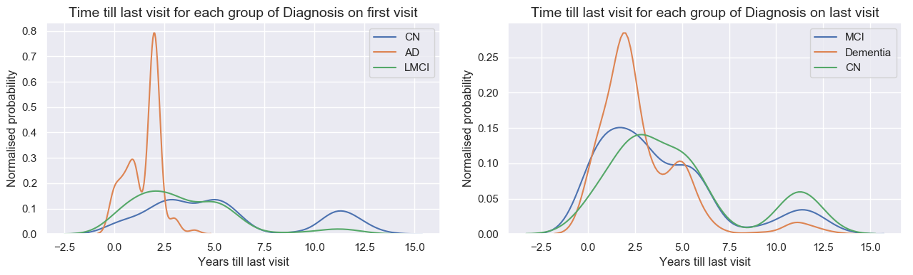


## 1.2 Dropping duplicates and last visit measurements except time and diagnosis
- Dropping meaningless/duplicate features
- Keep all features of baseline visit
- Drop all features of the last visist except time till last visit and diagnosis


```python
df=df_last
df.head()

genes = ['TAU_bl', 'ABETA_bl', 'PTAU_bl']
for val in genes:
    all_vals = df[val].values
    df = df.drop(val, axis=1)
    df[val] = [float(str(x).replace('<','').replace('>','')) for x in all_vals]

collinear = ['VISCODE', 'update_stamp', 'Month', 'Month_bl', 'Years_bl']
unrelated = ['RID', 'PTID', 'SITE', 'ORIGPROT', 'COLPROT', 'FSVERSION','FSVERSION_bl', 'IMAGEUID', 'FLDSTRENG','FLDSTRENG_bl', 'EXAMDATE' ,  'EXAMDATE_bl']
baselines = []
nulls = dict(df.isna().sum().sort_values())
null_cols = []
drop_non_bl=['FDG', 'PIB', 'AV45', 'ABETA',
             'TAU', 'PTAU', 'CDRSB', 'ADAS11', 'ADAS13', 'ADASQ4', 'MMSE',
             'RAVLT_immediate', 'RAVLT_learning', 'RAVLT_forgetting',
             'RAVLT_perc_forgetting', 'LDELTOTAL', 'DIGITSCOR', 'TRABSCOR',
             'FAQ', 'MOCA', 'EcogPtMem', 'EcogPtLang', 'EcogPtVisspat',
             'EcogPtPlan', 'EcogPtOrgan', 'EcogPtDivatt', 'EcogPtTotal',
             'EcogSPMem', 'EcogSPLang', 'EcogSPVisspat', 'EcogSPPlan',
             'EcogSPOrgan', 'EcogSPDivatt', 'EcogSPTotal', 'FLDSTRENG',
             'FSVERSION', 'IMAGEUID', 'Ventricles', 'Hippocampus', 'WholeBrain',
             'Entorhinal', 'Fusiform', 'MidTemp', 'ICV', 'mPACCdigit',
             'mPACCtrailsB']

empty=['MOCA_bl', 'EcogSPTotal_bl', 'EcogPtVisspat_bl', 'EcogPtPlan_bl','EcogPtOrgan_bl','EcogPtDivatt_bl',
       'EcogPtTotal_bl','EcogSPMem_bl','EcogSPLang_bl','EcogSPVisspat_bl',
       'EcogSPPlan_bl','EcogSPOrgan_bl','EcogSPDivatt_bl', 'AV45_bl', 'EcogPtMem_bl', 'EcogPtLang_bl']

for i in df.columns.values:
    if '_bl' in i or '_BL' in i:
        baselines.append(i)
    elif nulls[i] > df.shape[0]/1.1:
        baselines.append(i)

df = df.drop(collinear + unrelated + null_cols + drop_non_bl + empty, axis=1)

df['PTGENDER'] = (df['PTGENDER'] == 'Female')*1

categoricals = ['PTETHCAT', 'PTRACCAT', 'PTMARRY']
dummies = pd.get_dummies(df[categoricals])
df = pd.concat([df, dummies], axis=1)

df = df.rename(index=str, columns={"PTGENDER": "PTGENDER_Female"})

df = df.drop(categoricals, axis=1)

df['DX'] = df['DX'].map({'CN': 1, 'MCI': 2, 'Dementia': 3})
df['DX_bl'] = df['DX_bl'].map({'CN': 1, 'LMCI': 2, 'AD': 3})

df = df.dropna(subset=['DX'])
df = df.dropna(subset=['DX_bl'])

display(df.shape)
df.head()
```


    (819, 47)


<div>
<style scoped>
    .dataframe tbody tr th:only-of-type {
        vertical-align: middle;
    }

    .dataframe tbody tr th {
        vertical-align: top;
    }

    .dataframe thead th {
        text-align: right;
    }
</style>
<table border="1" class="dataframe">
  <thead>
    <tr style="text-align: right;">
      <th></th>
      <th>DX_bl</th>
      <th>AGE</th>
      <th>PTGENDER_Female</th>
      <th>PTEDUCAT</th>
      <th>APOE4</th>
      <th>DX</th>
      <th>CDRSB_bl</th>
      <th>ADAS11_bl</th>
      <th>ADAS13_bl</th>
      <th>ADASQ4_bl</th>
      <th>MMSE_bl</th>
      <th>RAVLT_immediate_bl</th>
      <th>RAVLT_learning_bl</th>
      <th>RAVLT_forgetting_bl</th>
      <th>RAVLT_perc_forgetting_bl</th>
      <th>LDELTOTAL_BL</th>
      <th>DIGITSCOR_bl</th>
      <th>TRABSCOR_bl</th>
      <th>FAQ_bl</th>
      <th>mPACCdigit_bl</th>
      <th>mPACCtrailsB_bl</th>
      <th>Ventricles_bl</th>
      <th>Hippocampus_bl</th>
      <th>WholeBrain_bl</th>
      <th>Entorhinal_bl</th>
      <th>Fusiform_bl</th>
      <th>MidTemp_bl</th>
      <th>ICV_bl</th>
      <th>FDG_bl</th>
      <th>PIB_bl</th>
      <th>M</th>
      <th>TAU_bl</th>
      <th>ABETA_bl</th>
      <th>PTAU_bl</th>
      <th>PTETHCAT_Hisp/Latino</th>
      <th>PTETHCAT_Not Hisp/Latino</th>
      <th>PTETHCAT_Unknown</th>
      <th>PTRACCAT_Am Indian/Alaskan</th>
      <th>PTRACCAT_Asian</th>
      <th>PTRACCAT_Black</th>
      <th>PTRACCAT_More than one</th>
      <th>PTRACCAT_White</th>
      <th>PTMARRY_Divorced</th>
      <th>PTMARRY_Married</th>
      <th>PTMARRY_Never married</th>
      <th>PTMARRY_Unknown</th>
      <th>PTMARRY_Widowed</th>
    </tr>
  </thead>
  <tbody>
    <tr>
      <th>11446</th>
      <td>1</td>
      <td>74.3</td>
      <td>0</td>
      <td>16</td>
      <td>0.0</td>
      <td>2</td>
      <td>0.0</td>
      <td>10.67</td>
      <td>18.67</td>
      <td>5.0</td>
      <td>28</td>
      <td>44.0</td>
      <td>4.0</td>
      <td>6.0</td>
      <td>54.5455</td>
      <td>10.0</td>
      <td>34.0</td>
      <td>112.0</td>
      <td>0.0</td>
      <td>-4.35795</td>
      <td>-4.15975</td>
      <td>118233.0</td>
      <td>8336.0</td>
      <td>1229740.0</td>
      <td>4177.0</td>
      <td>16559.0</td>
      <td>27936.0</td>
      <td>1984660.0</td>
      <td>1.36665</td>
      <td>NaN</td>
      <td>144</td>
      <td>NaN</td>
      <td>NaN</td>
      <td>NaN</td>
      <td>0</td>
      <td>1</td>
      <td>0</td>
      <td>0</td>
      <td>0</td>
      <td>0</td>
      <td>0</td>
      <td>1</td>
      <td>0</td>
      <td>1</td>
      <td>0</td>
      <td>0</td>
      <td>0</td>
    </tr>
    <tr>
      <th>4</th>
      <td>3</td>
      <td>81.3</td>
      <td>0</td>
      <td>18</td>
      <td>1.0</td>
      <td>3</td>
      <td>4.5</td>
      <td>22.00</td>
      <td>31.00</td>
      <td>8.0</td>
      <td>20</td>
      <td>22.0</td>
      <td>1.0</td>
      <td>4.0</td>
      <td>100.0000</td>
      <td>2.0</td>
      <td>25.0</td>
      <td>148.0</td>
      <td>10.0</td>
      <td>-16.58450</td>
      <td>-16.16580</td>
      <td>84599.0</td>
      <td>5319.0</td>
      <td>1129830.0</td>
      <td>1791.0</td>
      <td>15506.0</td>
      <td>18422.0</td>
      <td>1920690.0</td>
      <td>1.08355</td>
      <td>NaN</td>
      <td>24</td>
      <td>239.7</td>
      <td>741.5</td>
      <td>22.83</td>
      <td>0</td>
      <td>1</td>
      <td>0</td>
      <td>0</td>
      <td>0</td>
      <td>0</td>
      <td>0</td>
      <td>1</td>
      <td>0</td>
      <td>1</td>
      <td>0</td>
      <td>0</td>
      <td>0</td>
    </tr>
    <tr>
      <th>9</th>
      <td>2</td>
      <td>67.5</td>
      <td>0</td>
      <td>10</td>
      <td>0.0</td>
      <td>2</td>
      <td>1.0</td>
      <td>14.33</td>
      <td>21.33</td>
      <td>6.0</td>
      <td>27</td>
      <td>37.0</td>
      <td>7.0</td>
      <td>4.0</td>
      <td>36.3636</td>
      <td>4.0</td>
      <td>25.0</td>
      <td>271.0</td>
      <td>0.0</td>
      <td>-8.49902</td>
      <td>-9.52048</td>
      <td>39605.0</td>
      <td>6869.0</td>
      <td>1154980.0</td>
      <td>3983.0</td>
      <td>19036.0</td>
      <td>19615.0</td>
      <td>1679440.0</td>
      <td>NaN</td>
      <td>NaN</td>
      <td>36</td>
      <td>153.1</td>
      <td>1501.0</td>
      <td>13.29</td>
      <td>1</td>
      <td>0</td>
      <td>0</td>
      <td>0</td>
      <td>0</td>
      <td>0</td>
      <td>0</td>
      <td>1</td>
      <td>0</td>
      <td>1</td>
      <td>0</td>
      <td>0</td>
      <td>0</td>
    </tr>
    <tr>
      <th>14</th>
      <td>1</td>
      <td>73.7</td>
      <td>0</td>
      <td>16</td>
      <td>0.0</td>
      <td>1</td>
      <td>0.0</td>
      <td>8.67</td>
      <td>14.67</td>
      <td>4.0</td>
      <td>29</td>
      <td>37.0</td>
      <td>4.0</td>
      <td>4.0</td>
      <td>44.4444</td>
      <td>12.0</td>
      <td>38.0</td>
      <td>90.0</td>
      <td>0.0</td>
      <td>-1.90246</td>
      <td>-1.57826</td>
      <td>34062.0</td>
      <td>7075.0</td>
      <td>1116630.0</td>
      <td>4433.0</td>
      <td>24788.0</td>
      <td>21614.0</td>
      <td>1640770.0</td>
      <td>1.29343</td>
      <td>NaN</td>
      <td>36</td>
      <td>337.0</td>
      <td>547.3</td>
      <td>33.43</td>
      <td>0</td>
      <td>1</td>
      <td>0</td>
      <td>0</td>
      <td>0</td>
      <td>0</td>
      <td>0</td>
      <td>1</td>
      <td>0</td>
      <td>1</td>
      <td>0</td>
      <td>0</td>
      <td>0</td>
    </tr>
    <tr>
      <th>5122</th>
      <td>2</td>
      <td>80.4</td>
      <td>1</td>
      <td>13</td>
      <td>0.0</td>
      <td>2</td>
      <td>0.5</td>
      <td>18.67</td>
      <td>25.67</td>
      <td>7.0</td>
      <td>25</td>
      <td>30.0</td>
      <td>1.0</td>
      <td>5.0</td>
      <td>83.3333</td>
      <td>3.0</td>
      <td>34.0</td>
      <td>168.0</td>
      <td>0.0</td>
      <td>-10.29260</td>
      <td>-11.05750</td>
      <td>39826.0</td>
      <td>5348.0</td>
      <td>927510.0</td>
      <td>2277.0</td>
      <td>17963.0</td>
      <td>17802.0</td>
      <td>1485830.0</td>
      <td>NaN</td>
      <td>NaN</td>
      <td>24</td>
      <td>NaN</td>
      <td>NaN</td>
      <td>NaN</td>
      <td>0</td>
      <td>1</td>
      <td>0</td>
      <td>0</td>
      <td>0</td>
      <td>0</td>
      <td>0</td>
      <td>1</td>
      <td>0</td>
      <td>1</td>
      <td>0</td>
      <td>0</td>
      <td>0</td>
    </tr>
  </tbody>
</table>
</div>


## 1.3 Missing value imputation by 5 KNN


```python

null_df = pd.DataFrame(df.isna().sum().sort_values(), columns=['Nulls'])
new_nulls = null_df[null_df['Nulls'] > 0].to_dict()['Nulls']
nulls = new_nulls.keys()
not_nulls = df.columns.difference(nulls).values
ind_dict = {}

weird_value = -247
df = df.fillna(weird_value)

for n, col in enumerate(nulls):
  # Training set: all the rows for which the entry in the corresponding column does not contain a '0'
  pseudo_train = df[df[col] != weird_value]
  pseudo_x = pseudo_train[pseudo_train.columns.difference([col, 'DX'])]
  pseudo_y = pseudo_train[col]

  # Doing the same for the "test" set
  pseudo_test = df[df[col] == weird_value]
  pseudo_x_tes = pseudo_test[pseudo_test.columns.difference([col, 'DX'])]
  pseudo_y_tes = pseudo_test[col]

  # Fitting a kNN model with N=5
  chosen_model = KNeighborsRegressor(n_neighbors=5).fit(pseudo_x, pseudo_y)

  # Saving the indices into a dictionary
  ind = df[df[col] == weird_value][col].index.values
  ind_dict[col] = chosen_model.predict(pseudo_x_tes)

for col in nulls:
  ind = df[df[col] == weird_value][col].index.values
  df.loc[ind, col] = ind_dict[col]
```


```python
df['DX_bl'].unique()
```


    array([1, 3, 2])


```python
display(df.shape)

```


    (819, 47)


```python
df_1 = df[df['DX_bl']==1]  # Patients with normal diagnosis at baseline
df_2 = df[df['DX_bl']==2]  # Patients with MCI diagnosis at baseline

y_1 = ( df_1['DX'] > df_1['DX_bl'] ) # if Dx went from 1 (Dx_bl )to 2/3 (Dx) -> y =1  if DX did change y=0
X_1 = df_1[df_1.columns.difference(['DX'])]

y_2 = ( df_2['DX'] > df_2['DX_bl'] ) # if Dx went from 2 (Dx_bl )to 3 (Dx) -> y =1  otherwhise y=0
X_2 = df_2[df_2.columns.difference(['DX'])]

X_train1, X_test1, y_train1, y_test1 = train_test_split(X_1, y_1, test_size=0.2, random_state=209)
X_train2, X_test2, y_train2, y_test2 = train_test_split(X_2, y_2, test_size=0.2, random_state=209)

print(X_train1.shape, y_train1.shape, X_test1.shape, y_test1.shape)
print(X_train2.shape, y_train2.shape, X_test2.shape, y_test2.shape)
```


    (183, 46) (183,) (46, 46) (46,)
    (321, 46) (321,) (81, 46) (81,)


## 2.1 Basic Logistic model only taking into account time till last visit


```python
fig, ax = plt.subplots(nrows=1, ncols=2, figsize=(13,5.5))
ax1, ax2 = ax.ravel()

pd.crosstab(X_1['M']/12,y_1).plot(kind='bar', ax=ax1)
ax1.set_title('Disease progression Normal to MCI/AD versus last visit timing')
ax1.set_xlabel('Timing of last visit (years)')
ax1.set_ylabel('People')
ax1.legend(title='Disease Progression from Normal BL to MCI/AD last visit')

pd.crosstab(X_2['M']/12,y_2).plot(kind='bar', ax=ax2)
ax2.set_title('Disease progression MCI to AD versus last visit timing')
ax2.set_xlabel('Timing of last visit (years)')
ax2.set_ylabel('People')
ax1.legend(title='Disease Progression from MCI BL to AD last visit')

fig.tight_layout()
```


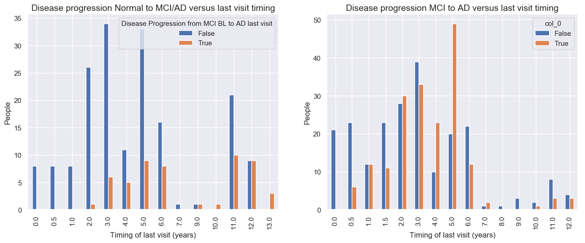


```python
def plot_confusion_matrix(ax, cm, classes,
                          normalize=False,
                          title='Confusion matrix',
                          cmap=plt.cm.Blues):
    cm_original=cm.copy()
    if normalize:
        cm = cm.astype('float') / cm.sum(axis=1)[:, np.newaxis]
    img = ax.imshow(cm, interpolation='nearest', cmap=cmap)
    plt.colorbar(img, ax=ax)
    tick_marks = np.arange(len(classes))
    ax.set(xticks=tick_marks, yticks=tick_marks)
    ax.set_xticklabels(classes, rotation=0, fontsize=13)
    ax.set_yticklabels(classes, fontsize=13)

    fmt = '.2f' if normalize else 'd'
    thresh = cm.max() / 2.
    thresh = 1 / 2.
    for i, j in itertools.product(range(cm.shape[0]), range(cm.shape[1])):
        ax.text(j, i, format(cm[i, j]*100, '.0f') +  '%  (' +format(cm_original[i, j], 'd') + ')',
                 horizontalalignment="center",
                 color="white" if cm[i, j] > thresh else "black", fontsize=15)

    ax.set_title(title, fontsize=15)
    ax.set_ylabel('True label', fontsize=15)
    ax.set_xlabel('Predicted label', fontsize=15)
    ax.grid('off')
```


### 2.1.1 Modelling non-balanced, Normal Baseline, progressing to MCI/AD only based on time till last visit


```python
print('\nSimple logistic regression modeling with the CLASS WEIGHTS NON BALANCED')

baseline_logreg_1 = LogisticRegression(solver='liblinear').fit(X_train1['M'].values.reshape(-1,1), y_train1)
print('\nLogistic Regresssion predicting desease progression from Normal Baseline to MCI or AD at last visit')
print('Training accuracy: \t{:.2f} , Test accuracy: \t{:.2f}\n'.format(baseline_logreg_1.score(X_train1['M'].values.reshape(-1,1), y_train1), baseline_logreg_1.score(X_test1['M'].values.reshape(-1,1), y_test1)))
fig, ax = plt.subplots(nrows=1, ncols=2, figsize=(16.5,5))
ax1, ax2 = ax.ravel()
cnf_matrix_tr = confusion_matrix(y_train1 , baseline_logreg_1.predict(X_train1['M'].values.reshape(-1,1)))
cnf_matrix_ts = confusion_matrix(y_test1 , baseline_logreg_1.predict(X_test1['M'].values.reshape(-1,1)))
plot_confusion_matrix(ax1, cnf_matrix_tr, classes=['Normal->Normal','Normal->MCI/AD'], normalize=True, title='Training set')
plot_confusion_matrix(ax2, cnf_matrix_ts, classes=['Normal->Normal','Normal->MCI/AD'], normalize=True, title='Test set')
fig.tight_layout()
```


    Simple logistic regression modeling with the CLASS WEIGHTS NON BALANCED

    Logistic Regresssion predicting desease progression from Normal Baseline to MCI or AD at last visit
    Training accuracy: 	0.80 , Test accuracy: 	0.63


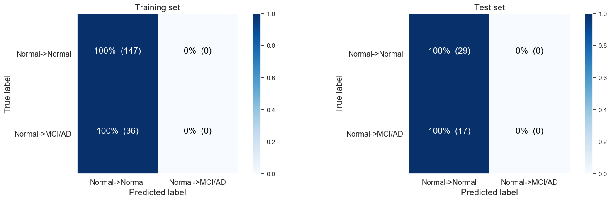


### 2.1.2 Modelling balanced, Normal Baseline , progressing to MCI/AD only based on time till last visit


```python
print('\nSimple logistic regression modeling with the CLASS WEIGHTS  BALANCED')

baseline_logreg_1 = LogisticRegression(solver='liblinear', class_weight='balanced').fit(X_train1['M'].values.reshape(-1,1), y_train1)
print('\nLogistic Regresssion predicting desease progression from Normal Baseline to MCI or AD at last visit')
print('Training accuracy: \t{:.2f} , Test accuracy: \t{:.2f}\n'.format(baseline_logreg_1.score(X_train1['M'].values.reshape(-1,1), y_train1), baseline_logreg_1.score(X_test1['M'].values.reshape(-1,1), y_test1)))
fig, ax = plt.subplots(nrows=1, ncols=2, figsize=(16.5,5))
ax1, ax2 = ax.ravel()
cnf_matrix_tr = confusion_matrix(y_train1 , baseline_logreg_1.predict(X_train1['M'].values.reshape(-1,1)))
cnf_matrix_ts = confusion_matrix(y_test1 , baseline_logreg_1.predict(X_test1['M'].values.reshape(-1,1)))
plot_confusion_matrix(ax1, cnf_matrix_tr, classes=['Normal->Normal','Normal->MCI/AD'], normalize=True, title='Training set')
plot_confusion_matrix(ax2, cnf_matrix_ts, classes=['Normal->Normal','Normal->MCI/AD'], normalize=True, title='Test set')
fig.tight_layout()
```


    Simple logistic regression modeling with the CLASS WEIGHTS  BALANCED

    Logistic Regresssion predicting desease progression from Normal Baseline to MCI or AD at last visit
    Training accuracy: 	0.70 , Test accuracy: 	0.70


### 2.1.3 Modelling non-balanced, MCI Baseline, progressing to AD only based on time till last visit


```python
print('\nSimple logistic regression modeling with the CLASS WEIGHTS NON BALANCED')
baseline_logreg_2 = LogisticRegression(solver='liblinear').fit(X_train2['M'].values.reshape(-1,1), y_train2)
print('\nLogistic Regresssion predicting desease progression from MCI Baseline to AD at last visit')
print('Training accuracy: \t{:.2f} , Test accuracy: \t{:.2f}\n'.format(baseline_logreg_2.score(X_train2['M'].values.reshape(-1,1), y_train2), baseline_logreg_2.score(X_test2['M'].values.reshape(-1,1), y_test2)))
fig, ax = plt.subplots(nrows=1, ncols=2, figsize=(16.5,5))
ax1, ax2 = ax.ravel()
cnf_matrix_tr2 = confusion_matrix(y_train2 , baseline_logreg_2.predict(X_train2['M'].values.reshape(-1,1)))
cnf_matrix_ts2 = confusion_matrix(y_test2 , baseline_logreg_2.predict(X_test2['M'].values.reshape(-1,1)))
plot_confusion_matrix(ax1, cnf_matrix_tr2, classes=['MCI->MCI/Normal','MCI->AD'], normalize=True, title='Training set')
plot_confusion_matrix(ax2, cnf_matrix_ts2, classes=['MCI->MCI/Normal','MCI->AD'], normalize=True, title='Test set')
fig.tight_layout()
```


    Simple logistic regression modeling with the CLASS WEIGHTS NON BALANCED

    Logistic Regresssion predicting desease progression from MCI Baseline to AD at last visit
    Training accuracy: 	0.58 , Test accuracy: 	0.49


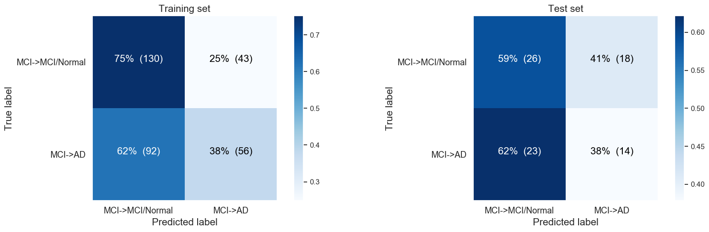


### 2.1.4 Modelling balanced, MCI Baseline, progressing to AD only based on time till last visit


```python
print('\nSimple logistic regression modeling with the CLASS WEIGHTS BALANCED')
baseline_logreg_2 = LogisticRegression(solver='liblinear', class_weight='balanced').fit(X_train2['M'].values.reshape(-1,1), y_train2)
print('\nLogistic Regresssion predicting desease progression from MCI Baseline to AD at last visit')
print('Training accuracy: \t{:.2f} , Test accuracy: \t{:.2f}\n'.format(baseline_logreg_2.score(X_train2['M'].values.reshape(-1,1), y_train2), baseline_logreg_2.score(X_test2['M'].values.reshape(-1,1), y_test2)))
fig, ax = plt.subplots(nrows=1, ncols=2, figsize=(16.5,5))
ax1, ax2 = ax.ravel()
cnf_matrix_tr2 = confusion_matrix(y_train2 , baseline_logreg_2.predict(X_train2['M'].values.reshape(-1,1)))
cnf_matrix_ts2 = confusion_matrix(y_test2 , baseline_logreg_2.predict(X_test2['M'].values.reshape(-1,1)))
plot_confusion_matrix(ax1, cnf_matrix_tr2, classes=['MCI->MCI/Normal','MCI->AD'], normalize=True, title='Training set')
plot_confusion_matrix(ax2, cnf_matrix_ts2, classes=['MCI->MCI/Normal','MCI->AD'], normalize=True, title='Test set')
fig.tight_layout()
```


    Simple logistic regression modeling with the CLASS WEIGHTS BALANCED

    Logistic Regresssion predicting desease progression from MCI Baseline to AD at last visit
    Training accuracy: 	0.61 , Test accuracy: 	0.54


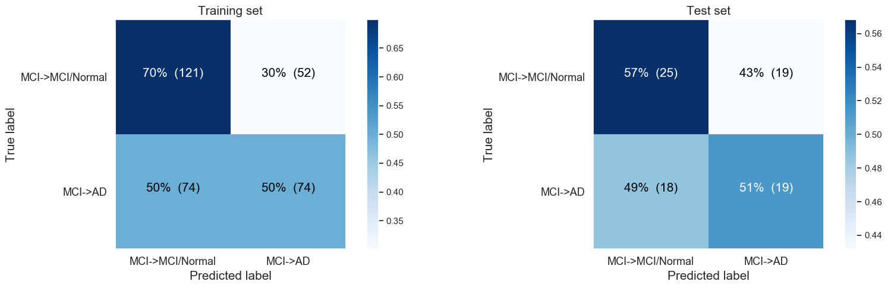


```python
baseline_logreg_1 = LogisticRegression(solver='liblinear').fit(X_train1['M'].values.reshape(-1,1), y_train1)
baseline_logreg_2 = LogisticRegression(solver='liblinear').fit(X_train2['M'].values.reshape(-1,1), y_train2)

age= np.linspace(start=40, stop=90, num=50)
pred1= baseline_logreg_1.predict_proba(age.reshape(-1,1))[:,1]
pred2= baseline_logreg_2.predict_proba(age.reshape(-1,1))[:,1]

plt.figure(figsize=(9,4))
plt.plot(age, pred1, label='Disease progression from Normal (baseline) to worse')
plt.plot(age, pred2, label='Disease progression from MCI (baseline) to worse')
plt.legend()
plt.title('Disease progression between 1st and last visit (NON-balanced logistic regression)')
plt.xlabel('Age (y)')
plt.ylabel('Probability of negative disease progression');
plt.tight_layout()
```


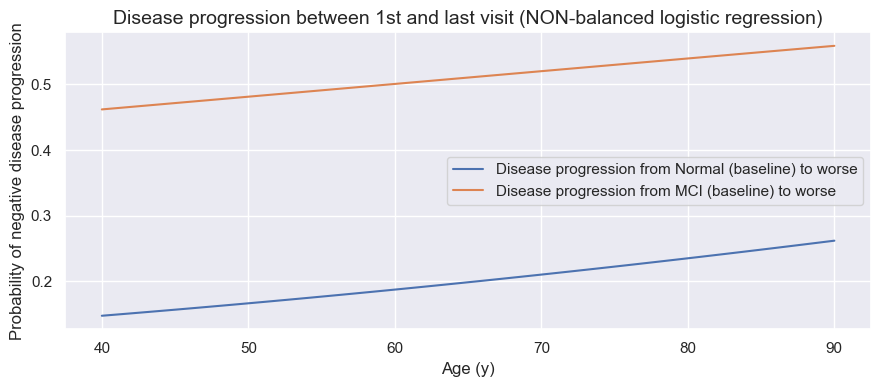


```python
baseline_logreg_1 = LogisticRegression(solver='liblinear', class_weight='balanced').fit(X_train1['M'].values.reshape(-1,1), y_train1)
baseline_logreg_2 = LogisticRegression(solver='liblinear', class_weight='balanced').fit(X_train2['M'].values.reshape(-1,1), y_train2)

age= np.linspace(start=40, stop=90, num=50)
pred1= baseline_logreg_1.predict_proba(age.reshape(-1,1))[:,1]
pred2= baseline_logreg_2.predict_proba(age.reshape(-1,1))[:,1]

plt.figure(figsize=(9,4))
plt.plot(age, pred1, label='Disease progression from Normal (baseline) to worse')
plt.plot(age, pred2, label='Disease progression from MCI (baseline) to worse')
plt.legend()
plt.title('Disease progression between 1st and last visit (balanced logistic regression)')
plt.xlabel('Age (y)')
plt.ylabel('Probability of negative disease progression');
plt.tight_layout()
```


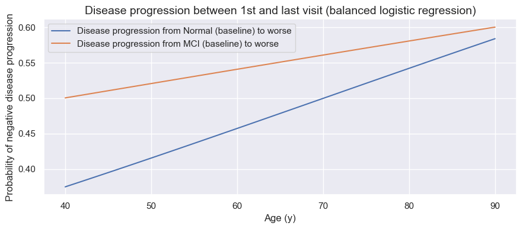


## 2.2 Logistic model  taking into account all baseline measurements and time till last visit

### 2.2.1 Modelling balanced, Normal Baseline , progressing to MCI/AD taking into account all baseline measurements and time till last visit


```python
print('\nSimple logistic regression modeling with the CLASS WEIGHTS NON BALANCED')

baseline_logreg_1 = LogisticRegression(solver='liblinear', class_weight='balanced').fit(X_train1.values, y_train1)
print('\nLogistic Regresssion predicting desease progression from Normal Baseline to MCI or AD at last visit')
print('Training accuracy: \t{:.2f} , Test accuracy: \t{:.2f}\n'.format(baseline_logreg_1.score(X_train1.values, y_train1), baseline_logreg_1.score(X_test1.values, y_test1)))
fig, ax = plt.subplots(nrows=1, ncols=2, figsize=(16.5,5))
ax1, ax2 = ax.ravel()
cnf_matrix_tr = confusion_matrix(y_train1 , baseline_logreg_1.predict(X_train1.values))
cnf_matrix_ts = confusion_matrix(y_test1 , baseline_logreg_1.predict(X_test1.values))
plot_confusion_matrix(ax1, cnf_matrix_tr, classes=['Normal->Normal','Normal->MCI/AD'], normalize=True, title='Training set')
plot_confusion_matrix(ax2, cnf_matrix_ts, classes=['Normal->Normal','Normal->MCI/AD'], normalize=True, title='Test set')
fig.tight_layout()
```


    Simple logistic regression modeling with the CLASS WEIGHTS NON BALANCED

    Logistic Regresssion predicting desease progression from Normal Baseline to MCI or AD at last visit
    Training accuracy: 	0.75 , Test accuracy: 	0.63


```python
feature_importance = abs(baseline_logreg_1.coef_[0])
feature_importance = 100.0 * (feature_importance / feature_importance.max())
sorted_idx = np.argsort(feature_importance)
pos = np.arange(sorted_idx.shape[0]) + .5

featfig = plt.figure(figsize=(10,15))
featax = featfig.add_subplot(1, 1, 1)
featax.barh(pos, feature_importance[sorted_idx], align='center')
featax.set_yticks(pos)
featax.set_yticklabels(np.array(X_train1.columns)[sorted_idx], fontsize=8)
featax.set_xlabel('Relative Feature Importance compared to most important feature (%)')
featax.set_title('Feature Importance for Logistic Regresssion predicting desease progression from Normal Baseline to MCI or AD at last visit')

plt.tight_layout()   
plt.show()
```


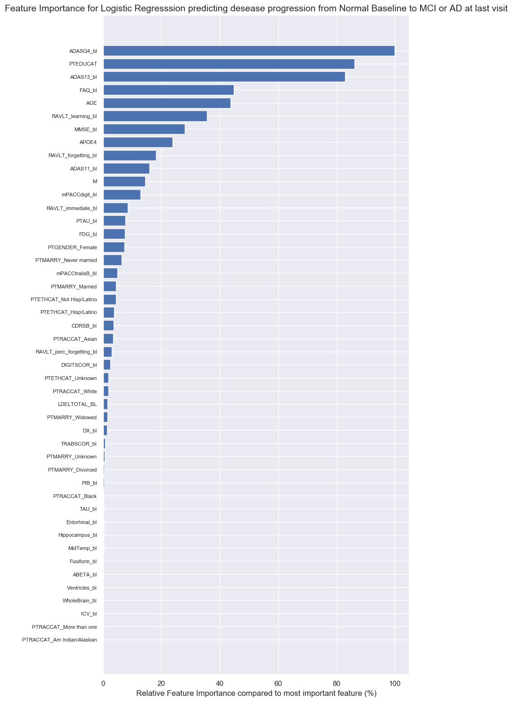


### 2.2.2 Modelling balanced, MCI Baseline , progressing to AD taking into account all baseline measurements and time till last visit


```python
print('\nSimple logistic regression modeling with the CLASS WEIGHTS NON BALANCED')

baseline_logreg_2 = LogisticRegression(solver='liblinear', class_weight='balanced').fit(X_train2.values, y_train2)
print('\nLogistic Regresssion predicting desease progression from Normal Baseline to MCI or AD at last visit')
print('Training accuracy: \t{:.2f} , Test accuracy: \t{:.2f}\n'.format(baseline_logreg_2.score(X_train2.values, y_train2), baseline_logreg_2.score(X_test2.values, y_test2)))
fig, ax = plt.subplots(nrows=1, ncols=2, figsize=(16.5,5))
ax1, ax2 = ax.ravel()
cnf_matrix_tr = confusion_matrix(y_train2 , baseline_logreg_2.predict(X_train2.values))
cnf_matrix_ts = confusion_matrix(y_test2 , baseline_logreg_2.predict(X_test2.values))
plot_confusion_matrix(ax1, cnf_matrix_tr, classes=['Normal->Normal','Normal->MCI/AD'], normalize=True, title='Training set')
plot_confusion_matrix(ax2, cnf_matrix_ts, classes=['Normal->Normal','Normal->MCI/AD'], normalize=True, title='Test set')
fig.tight_layout()
```


    Simple logistic regression modeling with the CLASS WEIGHTS NON BALANCED

    Logistic Regresssion predicting desease progression from Normal Baseline to MCI or AD at last visit
    Training accuracy: 	0.76 , Test accuracy: 	0.63


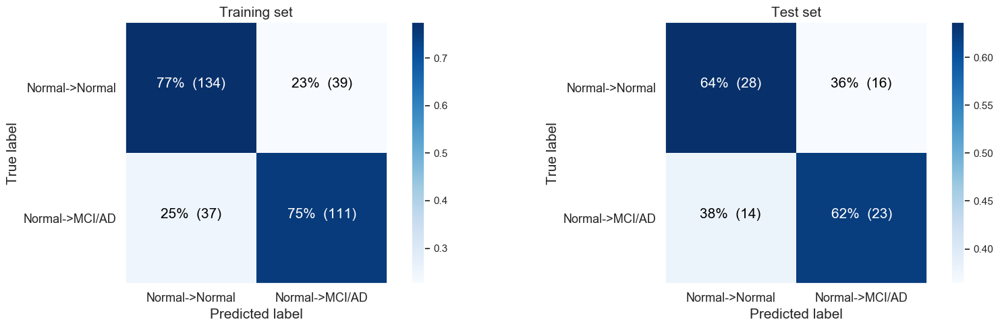


```python
print('1. M: \t\t\t Months after BL')
print('2. RAVLT_perc_forget: \t Percentage forgetting during Reys Auditory Verbal Learning Test')
print('3. FAQ_bl: \t\t Functinoal Activities Questionnaire score at BL\n')

feature_importance = abs(baseline_logreg_2.coef_[0])
feature_importance = 100.0 * (feature_importance / feature_importance.max())
sorted_idx = np.argsort(feature_importance)
pos = np.arange(sorted_idx.shape[0]) + .5

featfig = plt.figure(figsize=(10,15))
featax = featfig.add_subplot(1, 1, 1)
featax.barh(pos, feature_importance[sorted_idx], align='center')
featax.set_yticks(pos)
featax.set_yticklabels(np.array(X_train2.columns)[sorted_idx], fontsize=8)
featax.set_xlabel('Relative Feature Importance compared to most important feature (%)')
featax.set_title('Feature Importance for Logistic Regresssion predicting desease progression from MCI Baseline to AD at last visit')
plt.tight_layout()   
```


    1. M: 			 Months after BL
    2. RAVLT_perc_forget: 	 Percentage forgetting during Reys Auditory Verbal Learning Test
    3. FAQ_bl: 		 Functinoal Activities Questionnaire score at BL


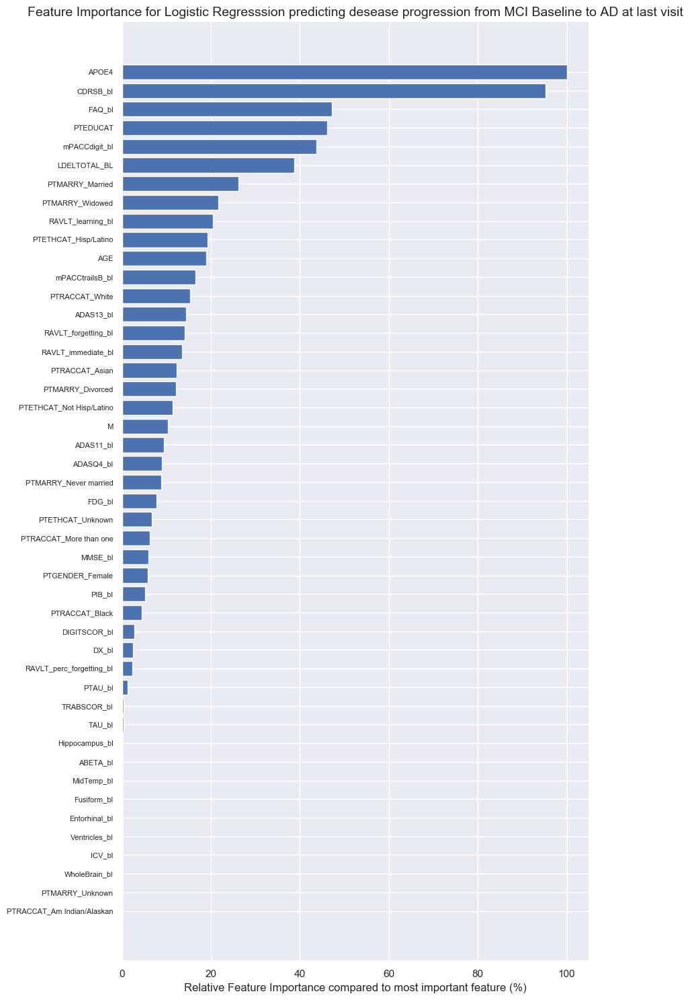


### 3.1 Parameter Optimisation Example
Setting:
- 5-fold cross validation ( so averages on these 5 test sets will be reported )
- Within every training fold of cross validation we do an internal 4-fold CV to optimise the parameters


```python
X_CV=X_2
y_CV=y_2

Estimator_parameters = {'C':[0.001,0.01,0.1,1,10,100,1000] }
Estimator=LogisticRegression(random_state=1, solver='liblinear', class_weight='balanced')
```


```python
splits = 4
print("All {} PARAMETER OPTIMISATIONS AND CROSS VALIDATIONS OF THE \"KNeighborsClassifier\" ALGORITHM".format(splits))
strat_kfold_external = StratifiedKFold(n_splits=splits, shuffle=True, random_state=1)
splitted_indexes_external = strat_kfold_external.split(X_CV, y_CV)

params= [len(Estimator_parameters[param]) for param in Estimator_parameters]
total_params= np.prod(params)

best_index=[]
Sum=[0]*total_params
AP_Score =np.array([])
ROC_Score =np.array([])
Prec_Score =np.array([])
Recall_Score =np.array([])
F1_Score =np.array([])
Sens_Score =np.array([])
Spec_Score =np.array([])
Accuracy_Score =np.array([])

best_predictions_all=np.array([])
test_all=np.array([])
i=1
for train_index_external, test_index_external in splitted_indexes_external:
    i+=1
    print("\nThis is optimisation and CV number {}  \t----------------------------------------------------------------------------".format(i))

    # take i’th fold as test set and the other 3 folds together as training set
    X_train, X_test = X_CV.iloc[train_index_external], X_CV.iloc[test_index_external]
    y_train, y_test = y_CV.iloc[train_index_external], y_CV.iloc[test_index_external]    
    # take the training set and split it randomly (stratified)
    # in an inner training set of 2/3 size and an inner validation set of 1/3 size

    # for each of the ML methods
    # for each combination of parameter values
    # train the ML method with specified parameters on inner training set and validate on inner validation set
    # take the combination of parameter values that yields highest performance (e.g. area under PR curve),
    # also write down this parameter value combination train the ML method with best parameter values on
    # the (outer) training set and test on the (outer) test set

    mod=clone(Estimator)
    optimisation_param_AP = GridSearchCV(estimator=mod, param_grid=Estimator_parameters, cv=3, verbose=0, scoring='accuracy')
    optimisation_param_AP.fit(X_train, y_train)
    print('Mean scores: \t\t\t\t{}'.format((optimisation_param_AP.cv_results_['mean_test_score']).round(2)))
    print('Differences best - other scores:\t{}'.format((optimisation_param_AP.best_score_-optimisation_param_AP.cv_results_['mean_test_score']).round(2)))
    print('The best paremeters set was\t \tSet {}: {}'.format(optimisation_param_AP.best_index_ +1, optimisation_param_AP.best_params_))
    best_index.append(optimisation_param_AP.best_index_+1)
    Sum=Sum+(optimisation_param_AP.cv_results_['mean_test_score']).round(2)

    # Building Random Forest Estimator with best parameters
    best= optimisation_param_AP.best_estimator_
    best.fit(X_train, y_train)
    best_predictions = best.predict_proba(X_test)[:,1]
    best_predictions=best_predictions
    Average_precision_score=average_precision_score(y_test, best_predictions)
    best_predictions_binary =  best.predict(X_test)
    t=confusion_matrix(y_test, best_predictions_binary)
    sensitivity=(t[1][1]/(t[1][0]+t[1][1]))
    specificity=(t[0][0]/(t[0][1]+t[0][0]))
    AP_Score =np.append(AP_Score , Average_precision_score)
    ROC_Score =np.append(ROC_Score , roc_auc_score(y_test, best_predictions))
    Prec_Score =np.append(Prec_Score , precision_score(y_test, best_predictions_binary))
    Recall_Score =np.append(Recall_Score , recall_score(y_test, best_predictions_binary))
    F1_Score =np.append(F1_Score , f1_score(y_test, best_predictions_binary))
    Sens_Score =np.append(Sens_Score , sensitivity)
    Spec_Score =np.append(Spec_Score , specificity)
    Accuracy_Score =np.append(Accuracy_Score , accuracy_score(y_test, best_predictions_binary))

    best_predictions_all=np.append(best_predictions_all,best_predictions)
    test_all=np.append(test_all,y_test)
    print('Validation Accuracy score: \t\t{}'.format(Accuracy_Score .round(2)))
```


    All 4 PARAMETER OPTIMISATIONS AND CROSS VALIDATIONS OF THE "KNeighborsClassifier" ALGORITHM

    This is optimisation and CV number 2  	----------------------------------------------------------------------------
    Mean scores: 				[0.71 0.71 0.72 0.71 0.72 0.71 0.71]
    Differences best - other scores:	[0.01 0.01 0.   0.01 0.   0.01 0.01]
    The best paremeters set was	 	Set 3: {'C': 0.1}
    Validation Accuracy score: 		[0.69]

    This is optimisation and CV number 3  	----------------------------------------------------------------------------
    Mean scores: 				[0.71 0.71 0.7  0.69 0.7  0.69 0.72]
    Differences best - other scores:	[0.01 0.01 0.02 0.03 0.02 0.03 0.  ]
    The best paremeters set was	 	Set 7: {'C': 1000}
    Validation Accuracy score: 		[0.69 0.73]

    This is optimisation and CV number 4  	----------------------------------------------------------------------------
    Mean scores: 				[0.68 0.69 0.69 0.68 0.7  0.68 0.68]
    Differences best - other scores:	[0.02 0.01 0.01 0.02 0.   0.02 0.02]
    The best paremeters set was	 	Set 5: {'C': 10}
    Validation Accuracy score: 		[0.69 0.73 0.72]

    This is optimisation and CV number 5  	----------------------------------------------------------------------------
    Mean scores: 				[0.7  0.71 0.7  0.7  0.69 0.71 0.69]
    Differences best - other scores:	[0.01 0.   0.01 0.01 0.01 0.   0.02]
    The best paremeters set was	 	Set 2: {'C': 0.01}
    Validation Accuracy score: 		[0.69 0.73 0.72 0.7 ]


Note on *Average Precision Score*: scoring='average_precision' = sklearn.metrics.average_precision_score. Compute average precision (AP) from prediction scores AP summarizes a precision-recall curve as the weighted mean of precisions achieved at each threshold.


```python
print('____________________________________________________________________________________________________________________\n')
Avg=Sum/splits
print('Average of {} splits mean_test_score for all 8 parameter sets:\n{}'.format(splits, Avg.round(2)))
print('Differences best Average - Average for all 8 parameter sets:\n{}'.format((Avg.max()-Avg).round(2)))
print('Best Average mean_test_score = {} for the {}th parameter: {}'.format(round(Avg.max(),2), Avg.argmax()+1, optimisation_param_AP.cv_results_['params'][Avg.argmax()]))
print('Best Parameter Set for all {} splits: {}'.format(splits,best_index))
print('Occurences of all 8 parameters as Best Parameter Set in a split: {}'.format(Counter(best_index)))
```


    ____________________________________________________________________________________________________________________

    Average of 4 splits mean_test_score for all 8 parameter sets:
    [0.7 0.7 0.7 0.7 0.7 0.7 0.7]
    Differences best Average - Average for all 8 parameter sets:
    [0.01 0.   0.   0.01 0.   0.01 0.01]
    Best Average mean_test_score = 0.7 for the 2th parameter: {'C': 0.01}
    Best Parameter Set for all 4 splits: [3, 7, 5, 2]
    Occurences of all 8 parameters as Best Parameter Set in a split: Counter({3: 1, 7: 1, 5: 1, 2: 1})


### 3.2 Model Performance and Area Under The Receiver Operating Characteristic Curve


```python
print('____________________________________________________________________________________________________________________\n')
print('Estimator : All {} Accuracy Scores of validation on the outer test set \nwith the estimator with the optimised parameters trained on the inner test set: \n{}'.format(splits, Accuracy_Score))
print('\n\t\tAvg \t(+- STD  )\n\t\t-----------------\nAccuracy: \t{} \t(+- {}) '.format(round(Accuracy_Score.mean(),3), round(Accuracy_Score.std(),3)))
```


    ____________________________________________________________________________________________________________________

    Estimator : All 4 Accuracy Scores of validation on the outer test set
    with the estimator with the optimised parameters trained on the inner test set:
    [0.68627451 0.73       0.72       0.7       ]

    		Avg 	(+- STD  )
    		-----------------
    Accuracy: 	0.709 	(+- 0.017)


```python
d={}
Names=['Average Precision', 'AUROC', 'Precision', 'Recall', 'F1_Score', 'Sensitivity', 'Specificity', 'Accuracy']
d['Logistic_mu'] = [AP_Score.mean(), ROC_Score.mean(), Prec_Score.mean(), Recall_Score.mean(), F1_Score.mean(), Sens_Score.mean(), Spec_Score.mean(), Accuracy_Score.mean()]
d['Logistic_std'] = [AP_Score.std(), ROC_Score.std(), Prec_Score.std(), Recall_Score.std(), F1_Score.std(), Sens_Score.std(), Spec_Score.std(), Accuracy_Score.std()]
df = pd.DataFrame(data=d, index=Names)
#decimals = pd.Series([2, 3], index=['Logistic_mu', 'Logistic_std'])
#df.round(decimals)
df.round(2)
```


<div>
<style scoped>
    .dataframe tbody tr th:only-of-type {
        vertical-align: middle;
    }

    .dataframe tbody tr th {
        vertical-align: top;
    }

    .dataframe thead th {
        text-align: right;
    }
</style>
<table border="1" class="dataframe">
  <thead>
    <tr style="text-align: right;">
      <th></th>
      <th>Logistic_mu</th>
      <th>Logistic_std</th>
    </tr>
  </thead>
  <tbody>
    <tr>
      <th>Average Precision</th>
      <td>0.76</td>
      <td>0.02</td>
    </tr>
    <tr>
      <th>AUROC</th>
      <td>0.78</td>
      <td>0.01</td>
    </tr>
    <tr>
      <th>Precision</th>
      <td>0.68</td>
      <td>0.03</td>
    </tr>
    <tr>
      <th>Recall</th>
      <td>0.70</td>
      <td>0.08</td>
    </tr>
    <tr>
      <th>F1_Score</th>
      <td>0.69</td>
      <td>0.03</td>
    </tr>
    <tr>
      <th>Sensitivity</th>
      <td>0.70</td>
      <td>0.08</td>
    </tr>
    <tr>
      <th>Specificity</th>
      <td>0.72</td>
      <td>0.06</td>
    </tr>
    <tr>
      <th>Accuracy</th>
      <td>0.71</td>
      <td>0.02</td>
    </tr>
  </tbody>
</table>
</div>


```python
fpr = dict()
tpr = dict()
roc_auc = dict()

fpr, tpr, _ = roc_curve(test_all[:], best_predictions_all[:])
roc_auc = auc(fpr, tpr)

plt.figure()
lw = 2
plt.plot(fpr, tpr, color='C1', lw=lw, label='ROC curve (area = %0.2f)' % roc_auc)
plt.plot([0, 1], [0, 1], color='navy', lw=lw, linestyle='--')
plt.xlim([0.0, 1.0])
plt.ylim([0.0, 1.05])
plt.xlabel('False Positive Rate')
plt.ylabel('True Positive Rate')
plt.title('Receiver operating characteristic example')
plt.legend(loc="lower right")
plt.tight_layout()
```


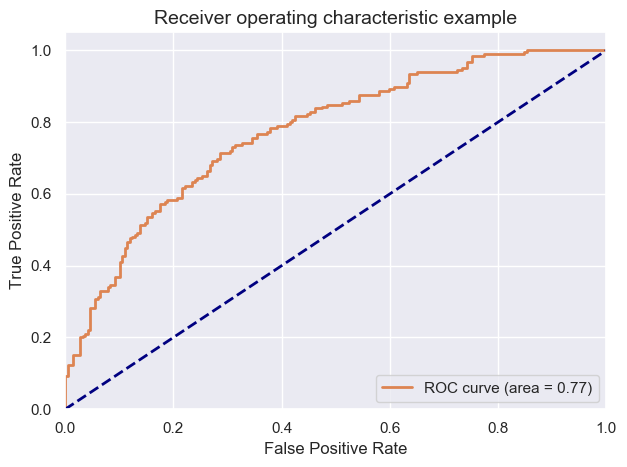


### 3.2bis Parameter Optimisation and 5-fold CV wrapper function


```python
def CV_and_Parameter_Optimization(X_CV, y_CV, splits, Estimator, Estimator_parameters):
  # All 10 parameter optimisations and cross validations of a certain Classifier
  strat_kfold_external = StratifiedKFold(n_splits=splits, shuffle=True, random_state=1)
  splitted_indexes_external = strat_kfold_external.split(X_CV, y_CV)
  params= [len(Estimator_parameters[param]) for param in Estimator_parameters]
  total_params= np.prod(params)
  best_index=[]
  Sum=[0]*total_params
  AP_Score =np.array([])
  ROC_Score =np.array([])
  Prec_Score =np.array([])
  Recall_Score =np.array([])
  F1_Score =np.array([])
  Sens_Score =np.array([])
  Spec_Score =np.array([])
  Accuracy_Score =np.array([])

  best_predictions_all=np.array([])
  test_all=np.array([])
  i=1
  for train_index_external, test_index_external in splitted_indexes_external:
      print("This is parameter optimisation and CV number {} ...".format(i))
      i=i+1
      # take i’th fold as test set and the other 3 folds together as training set
      X_train, X_test = X_CV.iloc[train_index_external], X_CV.iloc[test_index_external]
      y_train, y_test = y_CV.iloc[train_index_external], y_CV.iloc[test_index_external]    
      # take the training set and split it randomly (stratified)
      # in an inner training set of 2/3 size and an inner validation set of 1/3 size

      # for each of the ML methods
      # for each combination of parameter values
      # train the ML method with specified parameters on inner training set and validate on inner validation set
      # take the combination of parameter values that yields highest performance (e.g. area under PR curve),
      # also write down this parameter value combination train the ML method with best parameter values on
      # the (outer) training set and test on the (outer) test set

      mod=clone(Estimator)
      optimisation_param_AP = GridSearchCV(estimator=mod, param_grid=Estimator_parameters, cv=3, verbose=0, scoring='accuracy')
      optimisation_param_AP.fit(X_train, y_train)
      best_index.append(optimisation_param_AP.best_index_+1)
      Sum=Sum+(optimisation_param_AP.cv_results_['mean_test_score']).round(2)

      # Building Estimator with best parameters
      best= optimisation_param_AP.best_estimator_
      best.fit(X_train, y_train)
      best_predictions = best.predict_proba(X_test)[:,1]
      best_predictions=best_predictions
      Average_precision_score=average_precision_score(y_test, best_predictions)
      best_predictions_binary =  best.predict(X_test)
      t=confusion_matrix(y_test, best_predictions_binary)
      sensitivity=(t[1][1]/(t[1][0]+t[1][1]))
      specificity=(t[0][0]/(t[0][1]+t[0][0]))
      AP_Score =np.append(AP_Score , Average_precision_score)
      ROC_Score =np.append(ROC_Score , roc_auc_score(y_test, best_predictions))
      Prec_Score =np.append(Prec_Score , precision_score(y_test, best_predictions_binary))
      Recall_Score =np.append(Recall_Score , recall_score(y_test, best_predictions_binary))
      F1_Score =np.append(F1_Score , f1_score(y_test, best_predictions_binary))
      Sens_Score =np.append(Sens_Score , sensitivity)
      Spec_Score =np.append(Spec_Score , specificity)
      Accuracy_Score =np.append(Accuracy_Score , accuracy_score(y_test, best_predictions_binary))

      best_predictions_all=np.append(best_predictions_all,best_predictions)
      test_all=np.append(test_all,y_test)

  print('Done: Validation Accuracy score: \t\t{}'.format(Accuracy_Score .round(3)))
  return AP_Score,  ROC_Score,  Prec_Score,  Recall_Score,  F1_Score,  Sens_Score, Spec_Score, Accuracy_Score,  best_predictions_all, test_all

```


```python
LOGI_AP=np.array([])    ;  LOGI_ROC=np.array([])     ;  LOGI_Prec=np.array([])
LOGI_Recall=np.array([]);  LOGI_F1=np.array([])      ;  LOGI_Sens=np.array([])
LOGI_Spec=np.array([])  ;  LOGI_Accuracy=np.array([]);  LOGI_binary_mean=np.array([])
LOGI_best_predictions_all=np.array([])               ;  LOGI_test_all=np.array([])

Estimator_parameters = {'C':[1] }
Estimator=LogisticRegression(random_state=1, solver='liblinear', class_weight='balanced')

LOGI_AP,  LOGI_ROC,  LOGI_Prec,  LOGI_Recall,  LOGI_F1,  LOGI_Sens, LOGI_Spec, \
LOGI_Accuracy,  LOGI_best_predictions_all,  LOGI_test_all \
= CV_and_Parameter_Optimization(X_CV, y_CV, splits, Estimator, Estimator_parameters)
```


    This is parameter optimisation and CV number 1 ...
    This is parameter optimisation and CV number 2 ...
    This is parameter optimisation and CV number 3 ...
    This is parameter optimisation and CV number 4 ...
    Done: Validation Accuracy score: 		[0.676 0.73  0.73  0.7  ]


```python
d={} # dictionarry with all the results
Names=['Average Precision', 'AUROC', 'Precision', 'Recall', 'F1_Score', 'Sensitivity', 'Specificity', 'Accuracy']
d['0 Logistic_mu_default'] = [LOGI_AP.mean(),  LOGI_ROC.mean(),  LOGI_Prec.mean(),  LOGI_Recall.mean(),  LOGI_F1.mean(),  LOGI_Sens.mean(), LOGI_Spec.mean(), LOGI_Accuracy.mean()]
d['a Logistic_std_default'] = [LOGI_AP.std(),  LOGI_ROC.std(),  LOGI_Prec.std(),  LOGI_Recall.std(),  LOGI_F1.std(),  LOGI_Sens.std(), LOGI_Spec.std(), LOGI_Accuracy.std()]
df = pd.DataFrame(data=d, index=Names)
df.round(2)
```


<div>
<style scoped>
    .dataframe tbody tr th:only-of-type {
        vertical-align: middle;
    }

    .dataframe tbody tr th {
        vertical-align: top;
    }

    .dataframe thead th {
        text-align: right;
    }
</style>
<table border="1" class="dataframe">
  <thead>
    <tr style="text-align: right;">
      <th></th>
      <th>0 Logistic_mu_default</th>
      <th>a Logistic_std_default</th>
    </tr>
  </thead>
  <tbody>
    <tr>
      <th>Average Precision</th>
      <td>0.75</td>
      <td>0.01</td>
    </tr>
    <tr>
      <th>AUROC</th>
      <td>0.78</td>
      <td>0.01</td>
    </tr>
    <tr>
      <th>Precision</th>
      <td>0.68</td>
      <td>0.03</td>
    </tr>
    <tr>
      <th>Recall</th>
      <td>0.71</td>
      <td>0.08</td>
    </tr>
    <tr>
      <th>F1_Score</th>
      <td>0.69</td>
      <td>0.03</td>
    </tr>
    <tr>
      <th>Sensitivity</th>
      <td>0.71</td>
      <td>0.08</td>
    </tr>
    <tr>
      <th>Specificity</th>
      <td>0.71</td>
      <td>0.06</td>
    </tr>
    <tr>
      <th>Accuracy</th>
      <td>0.71</td>
      <td>0.02</td>
    </tr>
  </tbody>
</table>
</div>


### Preprocessing: Scaling


```python
X_CV  = X_2
y_CV  = y_2
```


```python
X_std = (X_CV - X_CV.min(axis=0)) / (X_CV.max(axis=0) - X_CV.min(axis=0))
X_CV  = X_std.dropna(axis=1).copy()
```


## 3.3 Model Performance testing

#### 3.3.1 KNN
``` class sklearn.neighbors.KNeighborsClassifier(n_neighbors=5, weights='uniform', algorithm='auto',
 leaf_size=30, p=2, metric='minkowski', metric_params=None, n_jobs=1, **kwargs)````

Test parameters:
- n_neighbors: 1, 3, 5, 9
- p: 1, 2 (manhattan and euclidean distance)


```python
KNN_parameters = {'p':[1,2], 'n_neighbors':[1, 3, 5, 9]}
KNN = KNeighborsClassifier(weights='distance')
```


```python
KNN_AP=np.array([])    ;  KNN_ROC=np.array([])     ;  KNN_Prec=np.array([])
KNN_Recall=np.array([]);  KNN_F1=np.array([])      ;  KNN_Sens=np.array([])
KNN_Spec=np.array([])  ;  KNN_Accuracy=np.array([]);  KNN_binary_mean=np.array([])
KNN_best_predictions_all=np.array([])               ;  KNN_test_all=np.array([])

KNN_AP,  KNN_ROC,  KNN_Prec,  KNN_Recall,  KNN_F1,  KNN_Sens, KNN_Spec, \
KNN_Accuracy,  KNN_best_predictions_all,  KNN_test_all \
= CV_and_Parameter_Optimization(X_CV, y_CV, splits, KNN, KNN_parameters)
```


    This is parameter optimisation and CV number 1 ...
    This is parameter optimisation and CV number 2 ...
    This is parameter optimisation and CV number 3 ...
    This is parameter optimisation and CV number 4 ...
    Done: Validation Accuracy score: 		[0.676 0.68  0.76  0.69 ]


```python
d={} # dictionarry with all the results
Names=['Average Precision', 'AUROC', 'Precision', 'Recall', 'F1_Score', 'Sensitivity', 'Specificity', 'Accuracy']
d['1 KNN_mu'] = [KNN_AP.mean(),  KNN_ROC.mean(),  KNN_Prec.mean(),  KNN_Recall.mean(),  KNN_F1.mean(),  KNN_Sens.mean(), KNN_Spec.mean(), KNN_Accuracy.mean()]
d['1 KNN_std'] = [KNN_AP.std(),  KNN_ROC.std(),  KNN_Prec.std(),  KNN_Recall.std(),  KNN_F1.std(),  KNN_Sens.std(), KNN_Spec.std(), KNN_Accuracy.std()]
df = pd.DataFrame(data=d, index=Names)
df.round(2)
```


<div>
<style scoped>
    .dataframe tbody tr th:only-of-type {
        vertical-align: middle;
    }

    .dataframe tbody tr th {
        vertical-align: top;
    }

    .dataframe thead th {
        text-align: right;
    }
</style>
<table border="1" class="dataframe">
  <thead>
    <tr style="text-align: right;">
      <th></th>
      <th>1 KNN_mu</th>
      <th>1 KNN_std</th>
    </tr>
  </thead>
  <tbody>
    <tr>
      <th>Average Precision</th>
      <td>0.69</td>
      <td>0.05</td>
    </tr>
    <tr>
      <th>AUROC</th>
      <td>0.76</td>
      <td>0.06</td>
    </tr>
    <tr>
      <th>Precision</th>
      <td>0.67</td>
      <td>0.07</td>
    </tr>
    <tr>
      <th>Recall</th>
      <td>0.74</td>
      <td>0.07</td>
    </tr>
    <tr>
      <th>F1_Score</th>
      <td>0.70</td>
      <td>0.02</td>
    </tr>
    <tr>
      <th>Sensitivity</th>
      <td>0.74</td>
      <td>0.07</td>
    </tr>
    <tr>
      <th>Specificity</th>
      <td>0.67</td>
      <td>0.11</td>
    </tr>
    <tr>
      <th>Accuracy</th>
      <td>0.70</td>
      <td>0.03</td>
    </tr>
  </tbody>
</table>
</div>


#### 3.3.2 Logistic Regression
```class sklearn.linear_model.LogisticRegression(penalty=’l2’, dual=False, tol=0.0001,  C=1.0, fit_intercept=True, intercept_scaling=1, class_weight=None, random_state=None,  solver=’liblinear’, max_iter=100, multi_class=’ovr’, verbose=0, warm_start=False, n_jobs=1)```

Test parameters:
- solver : {‘newton-cg’, ‘lbfgs’, ‘liblinear’, ‘sag’, ‘saga’},
- C: 0.001,0.01,0.1,1,10,100,1000


```python
LOGI_parameters = {'C':[0.001,0.01,0.1,1,10,100,1000] }
LOGI =LogisticRegression(random_state=1,max_iter=1000,tol=5e-4, solver='liblinear', class_weight='balanced')
```


```python
LOGI_AP,  LOGI_ROC,  LOGI_Prec,  LOGI_Recall,  LOGI_F1,  LOGI_Sens, LOGI_Spec, \
LOGI_Accuracy,  LOGI_best_predictions_all,  LOGI_test_all \
= CV_and_Parameter_Optimization(X_CV, y_CV, splits, LOGI, LOGI_parameters)
```


    This is parameter optimisation and CV number 1 ...
    This is parameter optimisation and CV number 2 ...
    This is parameter optimisation and CV number 3 ...
    This is parameter optimisation and CV number 4 ...
    Done: Validation Accuracy score: 		[0.627 0.66  0.72  0.71 ]


```python
Names=['Average Precision', 'AUROC', 'Precision', 'Recall', 'F1_Score', 'Sensitivity', 'Specificity', 'Accuracy']
d['2 LOGI_mu'] = [LOGI_AP.mean(),  LOGI_ROC.mean(),  LOGI_Prec.mean(),  LOGI_Recall.mean(),  LOGI_F1.mean(),  LOGI_Sens.mean(), LOGI_Spec.mean(), LOGI_Accuracy.mean()]
d['2 LOGI_std'] = [LOGI_AP.std(),  LOGI_ROC.std(),  LOGI_Prec.std(),  LOGI_Recall.std(),  LOGI_F1.std(),  LOGI_Sens.std(), LOGI_Spec.std(), LOGI_Accuracy.std()]
df = pd.DataFrame(data=d, index=Names)
df.round(2)
```


<div>
<style scoped>
    .dataframe tbody tr th:only-of-type {
        vertical-align: middle;
    }

    .dataframe tbody tr th {
        vertical-align: top;
    }

    .dataframe thead th {
        text-align: right;
    }
</style>
<table border="1" class="dataframe">
  <thead>
    <tr style="text-align: right;">
      <th></th>
      <th>1 KNN_mu</th>
      <th>1 KNN_std</th>
      <th>2 LOGI_mu</th>
      <th>2 LOGI_std</th>
    </tr>
  </thead>
  <tbody>
    <tr>
      <th>Average Precision</th>
      <td>0.69</td>
      <td>0.05</td>
      <td>0.74</td>
      <td>0.05</td>
    </tr>
    <tr>
      <th>AUROC</th>
      <td>0.76</td>
      <td>0.06</td>
      <td>0.77</td>
      <td>0.04</td>
    </tr>
    <tr>
      <th>Precision</th>
      <td>0.67</td>
      <td>0.07</td>
      <td>0.65</td>
      <td>0.06</td>
    </tr>
    <tr>
      <th>Recall</th>
      <td>0.74</td>
      <td>0.07</td>
      <td>0.71</td>
      <td>0.09</td>
    </tr>
    <tr>
      <th>F1_Score</th>
      <td>0.70</td>
      <td>0.02</td>
      <td>0.67</td>
      <td>0.03</td>
    </tr>
    <tr>
      <th>Sensitivity</th>
      <td>0.74</td>
      <td>0.07</td>
      <td>0.71</td>
      <td>0.09</td>
    </tr>
    <tr>
      <th>Specificity</th>
      <td>0.67</td>
      <td>0.11</td>
      <td>0.65</td>
      <td>0.12</td>
    </tr>
    <tr>
      <th>Accuracy</th>
      <td>0.70</td>
      <td>0.03</td>
      <td>0.68</td>
      <td>0.04</td>
    </tr>
  </tbody>
</table>
</div>


#### 3.3.3 SVM
``` class sklearn.svm.SVC(C=1.0, kernel=’rbf’, degree=3, gamma=’auto’, coef0=0.0, shrinking=True, probability=False, tol=0.001, cache_size=200, class_weight=None, verbose=False, max_iter=-1, decision_function_shape=’ovr’, random_state=None) ```

Test parameters:
-  C: 0.001,0.01,0.1,1,10,100,1000
- gamma = 0.001,0.01,0.1,1


```python
SVC_parameters = {'C':[0.1,1,10], 'gamma':[0.01,0.1,1] }
svc=SVC(probability=True,random_state=1,class_weight='balanced', cache_size=20000,kernel='rbf')
```


```python
SVC_AP,  SVC_ROC,  SVC_Prec,  SVC_Recall,  SVC_F1,  SVC_Sens, SVC_Spec, \
SVC_Accuracy,  SVC_best_predictions_all,  SVC_test_all \
= CV_and_Parameter_Optimization(X_CV, y_CV, splits, svc, SVC_parameters)
```


    This is parameter optimisation and CV number 1 ...
    This is parameter optimisation and CV number 2 ...
    This is parameter optimisation and CV number 3 ...
    This is parameter optimisation and CV number 4 ...
    Done: Validation Accuracy score: 		[0.716 0.67  0.73  0.71 ]


```python
#d['3 SVC_mu'] = [SVC_AP.mean(),  SVC_ROC.mean(),  SVC_Prec.mean(),  SVC_Recall.mean(),  SVC_F1.mean(),  SVC_Sens.mean(), SVC_Spec.mean(), SVC_Accuracy.mean()]
#d['c SVC_std'] = [SVC_AP.std(),  SVC_ROC.std(),  SVC_Prec.std(),  SVC_Recall.std(),  SVC_F1.std(),  SVC_Sens.std(), SVC_Spec.std(), SVC_Accuracy.std()]
#df = pd.DataFrame(data=d, index=Names)
#df.round(2)

print("SVC never converges...")
```


    SVC never converges...


#### 3.3.4 Decision Tree
```class sklearn.tree.DecisionTreeClassifier(criterion=’gini’, splitter=’best’, max_depth=None, min_samples_split=2, min_samples_leaf=1, min_weight_fraction_leaf=0.0, max_features=None, random_state=None, max_leaf_nodes=None, min_impurity_decrease=0.0, min_impurity_split=None, class_weight=None, presort=False)```

Test parameters:
- max depth = 2, 3, 4, ..., 13, 14, 15


```python
TREE_parameters ={ 'max_depth':range(2,15,2) }    
TREE = DecisionTreeClassifier(random_state=1)
```


```python
TREE_AP,  TREE_ROC,  TREE_Prec,  TREE_Recall,  TREE_F1,  TREE_Sens, TREE_Spec, \
TREE_Accuracy,  TREE_best_predictions_all,  TREE_test_all \
= CV_and_Parameter_Optimization(X_CV, y_CV, splits, TREE, TREE_parameters)
```


    This is parameter optimisation and CV number 1 ...
    This is parameter optimisation and CV number 2 ...
    This is parameter optimisation and CV number 3 ...
    This is parameter optimisation and CV number 4 ...
    Done: Validation Accuracy score: 		[0.647 0.68  0.61  0.61 ]


```python
d['3 TREE_mu'] = [TREE_AP.mean(),  TREE_ROC.mean(),  TREE_Prec.mean(),  TREE_Recall.mean(),  TREE_F1.mean(),  TREE_Sens.mean(), TREE_Spec.mean(), TREE_Accuracy.mean()]
d['3 TREE_std'] = [TREE_AP.std(),  TREE_ROC.std(),  TREE_Prec.std(),  TREE_Recall.std(),  TREE_F1.std(),  TREE_Sens.std(), TREE_Spec.std(), TREE_Accuracy.std()]
df = pd.DataFrame(data=d, index=Names)
df.round(2)
```


<div>
<style scoped>
    .dataframe tbody tr th:only-of-type {
        vertical-align: middle;
    }

    .dataframe tbody tr th {
        vertical-align: top;
    }

    .dataframe thead th {
        text-align: right;
    }
</style>
<table border="1" class="dataframe">
  <thead>
    <tr style="text-align: right;">
      <th></th>
      <th>1 KNN_mu</th>
      <th>1 KNN_std</th>
      <th>2 LOGI_mu</th>
      <th>2 LOGI_std</th>
      <th>3 TREE_mu</th>
      <th>3 TREE_std</th>
    </tr>
  </thead>
  <tbody>
    <tr>
      <th>Average Precision</th>
      <td>0.69</td>
      <td>0.05</td>
      <td>0.74</td>
      <td>0.05</td>
      <td>0.59</td>
      <td>0.04</td>
    </tr>
    <tr>
      <th>AUROC</th>
      <td>0.76</td>
      <td>0.06</td>
      <td>0.77</td>
      <td>0.04</td>
      <td>0.67</td>
      <td>0.03</td>
    </tr>
    <tr>
      <th>Precision</th>
      <td>0.67</td>
      <td>0.07</td>
      <td>0.65</td>
      <td>0.06</td>
      <td>0.61</td>
      <td>0.03</td>
    </tr>
    <tr>
      <th>Recall</th>
      <td>0.74</td>
      <td>0.07</td>
      <td>0.71</td>
      <td>0.09</td>
      <td>0.61</td>
      <td>0.16</td>
    </tr>
    <tr>
      <th>F1_Score</th>
      <td>0.70</td>
      <td>0.02</td>
      <td>0.67</td>
      <td>0.03</td>
      <td>0.59</td>
      <td>0.09</td>
    </tr>
    <tr>
      <th>Sensitivity</th>
      <td>0.74</td>
      <td>0.07</td>
      <td>0.71</td>
      <td>0.09</td>
      <td>0.61</td>
      <td>0.16</td>
    </tr>
    <tr>
      <th>Specificity</th>
      <td>0.67</td>
      <td>0.11</td>
      <td>0.65</td>
      <td>0.12</td>
      <td>0.66</td>
      <td>0.10</td>
    </tr>
    <tr>
      <th>Accuracy</th>
      <td>0.70</td>
      <td>0.03</td>
      <td>0.68</td>
      <td>0.04</td>
      <td>0.64</td>
      <td>0.03</td>
    </tr>
  </tbody>
</table>
</div>


#### 3.3.5 Random Forest

```class sklearn.ensemble.RandomForestClassifier(n_estimators=10->100, criterion='gini',
max_depth=None, min_samples_split=2, min_samples_leaf=1, min_weight_fraction_leaf=0.0,
max_features='auto', max_leaf_nodes=None, min_impurity_split=1e-07, bootstrap=True,
oob_score=False, n_jobs=1, random_state=None, verbose=0, warm_start=False, class_weight=None)```

Test parameters:
- n_estimators: 50, 100, 500
- max_features: sqrt(#features), log2(#features):
    #If “sqrt”, then max_features=sqrt(n_features) (same as “auto”).
    #If “log2”, then max_features=log2(n_features).
- min_samples_leaf: 1, 5


```python
RF_parameters = {'n_estimators':[50, 100, 500], 'max_features':('sqrt', 'log2'), 'min_samples_leaf':[1, 5]}
RF = RandomForestClassifier(random_state=1)
```


```python
RF_AP,  RF_ROC,  RF_Prec,  RF_Recall,  RF_F1,  RF_Sens, RF_Spec, \
RF_Accuracy,  RF_best_predictions_all,  RF_test_all \
= CV_and_Parameter_Optimization(X_CV, y_CV, splits, RF, RF_parameters)
```


    This is parameter optimisation and CV number 1 ...
    This is parameter optimisation and CV number 2 ...
    This is parameter optimisation and CV number 3 ...
    This is parameter optimisation and CV number 4 ...
    Done: Validation Accuracy score: 		[0.735 0.71  0.72  0.69 ]


```python
d['4 RF_mu'] = [RF_AP.mean(),  RF_ROC.mean(),  RF_Prec.mean(),  RF_Recall.mean(),  RF_F1.mean(),  RF_Sens.mean(), RF_Spec.mean(), RF_Accuracy.mean()]
d['4 RF_std'] = [RF_AP.std(),  RF_ROC.std(),  RF_Prec.std(),  RF_Recall.std(),  RF_F1.std(),  RF_Sens.std(), RF_Spec.std(), RF_Accuracy.std()]
df = pd.DataFrame(data=d, index=Names)
df.round(2)
```


<div>
<style scoped>
    .dataframe tbody tr th:only-of-type {
        vertical-align: middle;
    }

    .dataframe tbody tr th {
        vertical-align: top;
    }

    .dataframe thead th {
        text-align: right;
    }
</style>
<table border="1" class="dataframe">
  <thead>
    <tr style="text-align: right;">
      <th></th>
      <th>1 KNN_mu</th>
      <th>1 KNN_std</th>
      <th>2 LOGI_mu</th>
      <th>2 LOGI_std</th>
      <th>3 TREE_mu</th>
      <th>3 TREE_std</th>
      <th>4 RF_mu</th>
      <th>4 RF_std</th>
    </tr>
  </thead>
  <tbody>
    <tr>
      <th>Average Precision</th>
      <td>0.69</td>
      <td>0.05</td>
      <td>0.74</td>
      <td>0.05</td>
      <td>0.59</td>
      <td>0.04</td>
      <td>0.76</td>
      <td>0.02</td>
    </tr>
    <tr>
      <th>AUROC</th>
      <td>0.76</td>
      <td>0.06</td>
      <td>0.77</td>
      <td>0.04</td>
      <td>0.67</td>
      <td>0.03</td>
      <td>0.79</td>
      <td>0.02</td>
    </tr>
    <tr>
      <th>Precision</th>
      <td>0.67</td>
      <td>0.07</td>
      <td>0.65</td>
      <td>0.06</td>
      <td>0.61</td>
      <td>0.03</td>
      <td>0.70</td>
      <td>0.04</td>
    </tr>
    <tr>
      <th>Recall</th>
      <td>0.74</td>
      <td>0.07</td>
      <td>0.71</td>
      <td>0.09</td>
      <td>0.61</td>
      <td>0.16</td>
      <td>0.67</td>
      <td>0.08</td>
    </tr>
    <tr>
      <th>F1_Score</th>
      <td>0.70</td>
      <td>0.02</td>
      <td>0.67</td>
      <td>0.03</td>
      <td>0.59</td>
      <td>0.09</td>
      <td>0.68</td>
      <td>0.03</td>
    </tr>
    <tr>
      <th>Sensitivity</th>
      <td>0.74</td>
      <td>0.07</td>
      <td>0.71</td>
      <td>0.09</td>
      <td>0.61</td>
      <td>0.16</td>
      <td>0.67</td>
      <td>0.08</td>
    </tr>
    <tr>
      <th>Specificity</th>
      <td>0.67</td>
      <td>0.11</td>
      <td>0.65</td>
      <td>0.12</td>
      <td>0.66</td>
      <td>0.10</td>
      <td>0.75</td>
      <td>0.07</td>
    </tr>
    <tr>
      <th>Accuracy</th>
      <td>0.70</td>
      <td>0.03</td>
      <td>0.68</td>
      <td>0.04</td>
      <td>0.64</td>
      <td>0.03</td>
      <td>0.71</td>
      <td>0.02</td>
    </tr>
  </tbody>
</table>
</div>


#### 3.3.6 Gradient boosting
``` class sklearn.ensemble.GradientBoostingClassifier(loss='deviance', learning_rate=0.1, n_estimators=100, subsample=1.0, criterion='friedman_mse', min_samples_split=2, min_samples_leaf=1, min_weight_fraction_leaf=0.0,
 max_depth=3, min_impurity_split=1e-07, init=None, random_state=None, max_features=None, verbose=0, max_leaf_nodes=None, warm_start=False, presort='auto')```

Test parameters:
- n_estimators: 50, 100, 500
- max_leaf_nodes= 2, 4, 8, 16
- learning_rate = 1, 0.5, 0.1, 0.05, 0.01


```python
BOOST_parameters = {'n_estimators':[50,100,500],'max_leaf_nodes':[2,4,8,16],'learning_rate':[1, 0.5, 0.1, 0.05, 0.01]}
BOOST=GradientBoostingClassifier(random_state=1)
```


```python
BOOST_AP,  BOOST_ROC,  BOOST_Prec,  BOOST_Recall,  BOOST_F1,  BOOST_Sens, BOOST_Spec, \
BOOST_Accuracy,  BOOST_best_predictions_all,  BOOST_test_all \
= CV_and_Parameter_Optimization(X_CV, y_CV, splits, BOOST, BOOST_parameters)
```


    This is parameter optimisation and CV number 1 ...
    This is parameter optimisation and CV number 2 ...
    This is parameter optimisation and CV number 3 ...
    This is parameter optimisation and CV number 4 ...
    Done: Validation Accuracy score: 		[0.745 0.68  0.75  0.73 ]


```python
d['5 BOOST_mu'] = [BOOST_AP.mean(),  BOOST_ROC.mean(),  BOOST_Prec.mean(),  BOOST_Recall.mean(),  BOOST_F1.mean(),  BOOST_Sens.mean(), BOOST_Spec.mean(), BOOST_Accuracy.mean()]
d['5 BOOST_std'] = [BOOST_AP.std(),  BOOST_ROC.std(),  BOOST_Prec.std(),  BOOST_Recall.std(),  BOOST_F1.std(),  BOOST_Sens.std(), BOOST_Spec.std(), BOOST_Accuracy.std()]
df = pd.DataFrame(data=d, index=Names)
df.round(2)
```


<div>
<style scoped>
    .dataframe tbody tr th:only-of-type {
        vertical-align: middle;
    }

    .dataframe tbody tr th {
        vertical-align: top;
    }

    .dataframe thead th {
        text-align: right;
    }
</style>
<table border="1" class="dataframe">
  <thead>
    <tr style="text-align: right;">
      <th></th>
      <th>1 KNN_mu</th>
      <th>1 KNN_std</th>
      <th>2 LOGI_mu</th>
      <th>2 LOGI_std</th>
      <th>3 TREE_mu</th>
      <th>3 TREE_std</th>
      <th>4 RF_mu</th>
      <th>4 RF_std</th>
      <th>5 BOOST_mu</th>
      <th>5 BOOST_std</th>
    </tr>
  </thead>
  <tbody>
    <tr>
      <th>Average Precision</th>
      <td>0.69</td>
      <td>0.05</td>
      <td>0.74</td>
      <td>0.05</td>
      <td>0.59</td>
      <td>0.04</td>
      <td>0.76</td>
      <td>0.02</td>
      <td>0.78</td>
      <td>0.05</td>
    </tr>
    <tr>
      <th>AUROC</th>
      <td>0.76</td>
      <td>0.06</td>
      <td>0.77</td>
      <td>0.04</td>
      <td>0.67</td>
      <td>0.03</td>
      <td>0.79</td>
      <td>0.02</td>
      <td>0.80</td>
      <td>0.03</td>
    </tr>
    <tr>
      <th>Precision</th>
      <td>0.67</td>
      <td>0.07</td>
      <td>0.65</td>
      <td>0.06</td>
      <td>0.61</td>
      <td>0.03</td>
      <td>0.70</td>
      <td>0.04</td>
      <td>0.71</td>
      <td>0.05</td>
    </tr>
    <tr>
      <th>Recall</th>
      <td>0.74</td>
      <td>0.07</td>
      <td>0.71</td>
      <td>0.09</td>
      <td>0.61</td>
      <td>0.16</td>
      <td>0.67</td>
      <td>0.08</td>
      <td>0.70</td>
      <td>0.04</td>
    </tr>
    <tr>
      <th>F1_Score</th>
      <td>0.70</td>
      <td>0.02</td>
      <td>0.67</td>
      <td>0.03</td>
      <td>0.59</td>
      <td>0.09</td>
      <td>0.68</td>
      <td>0.03</td>
      <td>0.70</td>
      <td>0.02</td>
    </tr>
    <tr>
      <th>Sensitivity</th>
      <td>0.74</td>
      <td>0.07</td>
      <td>0.71</td>
      <td>0.09</td>
      <td>0.61</td>
      <td>0.16</td>
      <td>0.67</td>
      <td>0.08</td>
      <td>0.70</td>
      <td>0.04</td>
    </tr>
    <tr>
      <th>Specificity</th>
      <td>0.67</td>
      <td>0.11</td>
      <td>0.65</td>
      <td>0.12</td>
      <td>0.66</td>
      <td>0.10</td>
      <td>0.75</td>
      <td>0.07</td>
      <td>0.75</td>
      <td>0.07</td>
    </tr>
    <tr>
      <th>Accuracy</th>
      <td>0.70</td>
      <td>0.03</td>
      <td>0.68</td>
      <td>0.04</td>
      <td>0.64</td>
      <td>0.03</td>
      <td>0.71</td>
      <td>0.02</td>
      <td>0.73</td>
      <td>0.03</td>
    </tr>
  </tbody>
</table>
</div>


#### 3.3.7. XGBoost
 ``` class xgboost.XGBClassifier(max_depth=3, learning_rate=0.1, n_estimators=100, silent=True, objective='binary:logistic', booster='gbtree', n_jobs=1, nthread=None, gamma=0, min_child_weight=1, max_delta_step=0, subsample=1, colsample_bytree=1, colsample_bylevel=1, reg_alpha=0, reg_lambda=1, scale_pos_weight=1, base_score=0.5, random_state=0, seed=None, missing=None, **kwargs)```

Bases: xgboost.sklearn.XGBModel, object
Implementation of the scikit-learn API for XGBoost classification.

Test parameters:
- max_depth = 3,4,...,9,10
- min_child_weight =  1,3  
- gamma = [0, 0.1,0.2]
- subsample = 0.6, 0,8
- colsample_bytree = 0.6, 0,8
- reg_alpha = [0, 0.005, 0.01, 0.05]


```python
XGB2_parameters ={ 'max_depth':range(3,10,2),'min_child_weight':range(1,3,2),
                   'gamma':[0, 0.1,0.2],'subsample':[i/10.0 for i in range(6,9,2)],
                   'colsample_bytree':[i/10.0 for i in range(6,9,2)], 'reg_alpha':[0, 0.005, 0.01, 0.05]}    
XGB2 = XGBClassifier(random_state=1)
```


```python
XGB2_AP,  XGB2_ROC,  XGB2_Prec,  XGB2_Recall,  XGB2_F1,  XGB2_Sens, XGB2_Spec, \
XGB2_Accuracy,  XGB2_best_predictions_all,  XGB2_test_all \
= CV_and_Parameter_Optimization(X_CV, y_CV, splits, XGB2, XGB2_parameters)
```


    This is parameter optimisation and CV number 1 ...
    This is parameter optimisation and CV number 2 ...
    This is parameter optimisation and CV number 3 ...
    This is parameter optimisation and CV number 4 ...
    Done: Validation Accuracy score: 		[0.725 0.71  0.77  0.71 ]


```python
d['6 XGB2_mu'] = [XGB2_AP.mean(),  XGB2_ROC.mean(),  XGB2_Prec.mean(),  XGB2_Recall.mean(),  XGB2_F1.mean(),  XGB2_Sens.mean(), XGB2_Spec.mean(), XGB2_Accuracy.mean()]
d['6 XGB2_std'] = [XGB2_AP.std(),  XGB2_ROC.std(),  XGB2_Prec.std(),  XGB2_Recall.std(),  XGB2_F1.std(),  XGB2_Sens.std(), XGB2_Spec.std(), XGB2_Accuracy.std()]
df = pd.DataFrame(data=d, index=Names)
df.round(2)
```


<div>
<style scoped>
    .dataframe tbody tr th:only-of-type {
        vertical-align: middle;
    }

    .dataframe tbody tr th {
        vertical-align: top;
    }

    .dataframe thead th {
        text-align: right;
    }
</style>
<table border="1" class="dataframe">
  <thead>
    <tr style="text-align: right;">
      <th></th>
      <th>1 KNN_mu</th>
      <th>1 KNN_std</th>
      <th>2 LOGI_mu</th>
      <th>2 LOGI_std</th>
      <th>3 TREE_mu</th>
      <th>3 TREE_std</th>
      <th>4 RF_mu</th>
      <th>4 RF_std</th>
      <th>5 BOOST_mu</th>
      <th>5 BOOST_std</th>
      <th>6 XGB2_mu</th>
      <th>6 XGB2_std</th>
    </tr>
  </thead>
  <tbody>
    <tr>
      <th>Average Precision</th>
      <td>0.69</td>
      <td>0.05</td>
      <td>0.74</td>
      <td>0.05</td>
      <td>0.59</td>
      <td>0.04</td>
      <td>0.76</td>
      <td>0.02</td>
      <td>0.78</td>
      <td>0.05</td>
      <td>0.79</td>
      <td>0.02</td>
    </tr>
    <tr>
      <th>AUROC</th>
      <td>0.76</td>
      <td>0.06</td>
      <td>0.77</td>
      <td>0.04</td>
      <td>0.67</td>
      <td>0.03</td>
      <td>0.79</td>
      <td>0.02</td>
      <td>0.80</td>
      <td>0.03</td>
      <td>0.80</td>
      <td>0.03</td>
    </tr>
    <tr>
      <th>Precision</th>
      <td>0.67</td>
      <td>0.07</td>
      <td>0.65</td>
      <td>0.06</td>
      <td>0.61</td>
      <td>0.03</td>
      <td>0.70</td>
      <td>0.04</td>
      <td>0.71</td>
      <td>0.05</td>
      <td>0.72</td>
      <td>0.04</td>
    </tr>
    <tr>
      <th>Recall</th>
      <td>0.74</td>
      <td>0.07</td>
      <td>0.71</td>
      <td>0.09</td>
      <td>0.61</td>
      <td>0.16</td>
      <td>0.67</td>
      <td>0.08</td>
      <td>0.70</td>
      <td>0.04</td>
      <td>0.68</td>
      <td>0.01</td>
    </tr>
    <tr>
      <th>F1_Score</th>
      <td>0.70</td>
      <td>0.02</td>
      <td>0.67</td>
      <td>0.03</td>
      <td>0.59</td>
      <td>0.09</td>
      <td>0.68</td>
      <td>0.03</td>
      <td>0.70</td>
      <td>0.02</td>
      <td>0.70</td>
      <td>0.02</td>
    </tr>
    <tr>
      <th>Sensitivity</th>
      <td>0.74</td>
      <td>0.07</td>
      <td>0.71</td>
      <td>0.09</td>
      <td>0.61</td>
      <td>0.16</td>
      <td>0.67</td>
      <td>0.08</td>
      <td>0.70</td>
      <td>0.04</td>
      <td>0.68</td>
      <td>0.01</td>
    </tr>
    <tr>
      <th>Specificity</th>
      <td>0.67</td>
      <td>0.11</td>
      <td>0.65</td>
      <td>0.12</td>
      <td>0.66</td>
      <td>0.10</td>
      <td>0.75</td>
      <td>0.07</td>
      <td>0.75</td>
      <td>0.07</td>
      <td>0.77</td>
      <td>0.05</td>
    </tr>
    <tr>
      <th>Accuracy</th>
      <td>0.70</td>
      <td>0.03</td>
      <td>0.68</td>
      <td>0.04</td>
      <td>0.64</td>
      <td>0.03</td>
      <td>0.71</td>
      <td>0.02</td>
      <td>0.73</td>
      <td>0.03</td>
      <td>0.73</td>
      <td>0.02</td>
    </tr>
  </tbody>
</table>
</div>


#### 3.3.8 MLP

```class sklearn.neural_network.MLPClassifier(hidden_layer_sizes=(100, ), activation='relu', solver='adam', alpha=0.0001, batch_size='auto', learning_rate='constant', learning_rate_init=0.001, power_t=0.5, max_iter=200, shuffle=True, random_state=None, tol=0.0001, verbose=False, warm_start=False, momentum=0.9, nesterovs_momentum=True, early_stopping=False, validation_fraction=0.1, beta_1=0.9, beta_2=0.999, epsilon=1e-08)```

Test parameters:
- hidden_layer_sizes: (3, ), (20, ), (50, ), (100, )
- activation: relu, logistic
- alpha = 0.00001, 0.0001, 0.001, 0.09, 0.1, 0.5 and 0.9 (assuming this is the decay parameter in Weng et al)


```python
MLP_parameters = {'activation':('relu', 'logistic'), 'hidden_layer_sizes':[(3, ),(20, ),(20,20 ),(50, ),(50,50 ),(100, )],
                 'alpha':[0.0001,0.001,0.09,0.1,0.5]}
MLP = MLPClassifier(random_state=1, max_iter=500,solver='adam')
```


```python
MLP_AP,  MLP_ROC,  MLP_Prec,  MLP_Recall,  MLP_F1,  MLP_Sens, MLP_Spec, \
MLP_Accuracy,  MLP_best_predictions_all,  MLP_test_all \
= CV_and_Parameter_Optimization(X_CV, y_CV, splits, MLP, MLP_parameters)
```


    This is parameter optimisation and CV number 1 ...
    This is parameter optimisation and CV number 2 ...
    This is parameter optimisation and CV number 3 ...
    This is parameter optimisation and CV number 4 ...
    Done: Validation Accuracy score: 		[0.716 0.74  0.77  0.68 ]


```python
d['7 MLP_mu'] = [MLP_AP.mean(),  MLP_ROC.mean(),  MLP_Prec.mean(),  MLP_Recall.mean(),  MLP_F1.mean(),  MLP_Sens.mean(), MLP_Spec.mean(), MLP_Accuracy.mean()]
d['7 MLP_std'] = [MLP_AP.std(),  MLP_ROC.std(),  MLP_Prec.std(),  MLP_Recall.std(),  MLP_F1.std(),  MLP_Sens.std(), MLP_Spec.std(), MLP_Accuracy.std()]
df = pd.DataFrame(data=d, index=Names)
df.round(2)
```


<div>
<style scoped>
    .dataframe tbody tr th:only-of-type {
        vertical-align: middle;
    }

    .dataframe tbody tr th {
        vertical-align: top;
    }

    .dataframe thead th {
        text-align: right;
    }
</style>
<table border="1" class="dataframe">
  <thead>
    <tr style="text-align: right;">
      <th></th>
      <th>1 KNN_mu</th>
      <th>1 KNN_std</th>
      <th>2 LOGI_mu</th>
      <th>2 LOGI_std</th>
      <th>3 TREE_mu</th>
      <th>3 TREE_std</th>
      <th>4 RF_mu</th>
      <th>4 RF_std</th>
      <th>5 BOOST_mu</th>
      <th>5 BOOST_std</th>
      <th>6 XGB2_mu</th>
      <th>6 XGB2_std</th>
      <th>7 MLP_mu</th>
      <th>7 MLP_std</th>
    </tr>
  </thead>
  <tbody>
    <tr>
      <th>Average Precision</th>
      <td>0.69</td>
      <td>0.05</td>
      <td>0.74</td>
      <td>0.05</td>
      <td>0.59</td>
      <td>0.04</td>
      <td>0.76</td>
      <td>0.02</td>
      <td>0.78</td>
      <td>0.05</td>
      <td>0.79</td>
      <td>0.02</td>
      <td>0.77</td>
      <td>0.04</td>
    </tr>
    <tr>
      <th>AUROC</th>
      <td>0.76</td>
      <td>0.06</td>
      <td>0.77</td>
      <td>0.04</td>
      <td>0.67</td>
      <td>0.03</td>
      <td>0.79</td>
      <td>0.02</td>
      <td>0.80</td>
      <td>0.03</td>
      <td>0.80</td>
      <td>0.03</td>
      <td>0.79</td>
      <td>0.03</td>
    </tr>
    <tr>
      <th>Precision</th>
      <td>0.67</td>
      <td>0.07</td>
      <td>0.65</td>
      <td>0.06</td>
      <td>0.61</td>
      <td>0.03</td>
      <td>0.70</td>
      <td>0.04</td>
      <td>0.71</td>
      <td>0.05</td>
      <td>0.72</td>
      <td>0.04</td>
      <td>0.72</td>
      <td>0.05</td>
    </tr>
    <tr>
      <th>Recall</th>
      <td>0.74</td>
      <td>0.07</td>
      <td>0.71</td>
      <td>0.09</td>
      <td>0.61</td>
      <td>0.16</td>
      <td>0.67</td>
      <td>0.08</td>
      <td>0.70</td>
      <td>0.04</td>
      <td>0.68</td>
      <td>0.01</td>
      <td>0.68</td>
      <td>0.08</td>
    </tr>
    <tr>
      <th>F1_Score</th>
      <td>0.70</td>
      <td>0.02</td>
      <td>0.67</td>
      <td>0.03</td>
      <td>0.59</td>
      <td>0.09</td>
      <td>0.68</td>
      <td>0.03</td>
      <td>0.70</td>
      <td>0.02</td>
      <td>0.70</td>
      <td>0.02</td>
      <td>0.69</td>
      <td>0.05</td>
    </tr>
    <tr>
      <th>Sensitivity</th>
      <td>0.74</td>
      <td>0.07</td>
      <td>0.71</td>
      <td>0.09</td>
      <td>0.61</td>
      <td>0.16</td>
      <td>0.67</td>
      <td>0.08</td>
      <td>0.70</td>
      <td>0.04</td>
      <td>0.68</td>
      <td>0.01</td>
      <td>0.68</td>
      <td>0.08</td>
    </tr>
    <tr>
      <th>Specificity</th>
      <td>0.67</td>
      <td>0.11</td>
      <td>0.65</td>
      <td>0.12</td>
      <td>0.66</td>
      <td>0.10</td>
      <td>0.75</td>
      <td>0.07</td>
      <td>0.75</td>
      <td>0.07</td>
      <td>0.77</td>
      <td>0.05</td>
      <td>0.77</td>
      <td>0.05</td>
    </tr>
    <tr>
      <th>Accuracy</th>
      <td>0.70</td>
      <td>0.03</td>
      <td>0.68</td>
      <td>0.04</td>
      <td>0.64</td>
      <td>0.03</td>
      <td>0.71</td>
      <td>0.02</td>
      <td>0.73</td>
      <td>0.03</td>
      <td>0.73</td>
      <td>0.02</td>
      <td>0.73</td>
      <td>0.03</td>
    </tr>
  </tbody>
</table>
</div>


#### 3.3.9 LGM

```lass lightgbm.Dataset(data, label=None, reference=None, weight=None, group=None, init_score=None, silent=False, feature_name='auto', categorical_feature='auto', params=None, free_raw_data=True)```

Test parameters:
- max_depth = 2, 3, 4, 5, 6, 7, 8, 9,10, 30
- n_estimators = 5, 25, 50


```python
LGBM_params = {'max_depth' : [2,3,4,5,6,7,8,9,10, 30],
                'n_estimators': [5, 25, 50]}
lgbm=LGBMClassifier(random_state=1)
```


```python
LGBM_AP,  LGBM_ROC,  LGBM_Prec,  LGBM_Recall,  LGBM_F1,  LGBM_Sens, LGBM_Spec, \
LGBM_Accuracy,  LGBM_best_predictions_all,  LGBM_test_all \
= CV_and_Parameter_Optimization(X_CV, y_CV, splits, lgbm, LGBM_params)
```


    This is parameter optimisation and CV number 1 ...
    This is parameter optimisation and CV number 2 ...
    This is parameter optimisation and CV number 3 ...
    This is parameter optimisation and CV number 4 ...
    Done: Validation Accuracy score: 		[0.735 0.71  0.77  0.76 ]


```python
d['8 LGBM_mu'] = [LGBM_AP.mean(),  LGBM_ROC.mean(),  LGBM_Prec.mean(),  LGBM_Recall.mean(),  LGBM_F1.mean(),  LGBM_Sens.mean(), LGBM_Spec.mean(), LGBM_Accuracy.mean()]
d['8 LGBM_std'] = [LGBM_AP.std(),  LGBM_ROC.std(),  LGBM_Prec.std(),  LGBM_Recall.std(),  LGBM_F1.std(),  LGBM_Sens.std(), LGBM_Spec.std(), LGBM_Accuracy.std()]
df = pd.DataFrame(data=d, index=Names)
df.round(2)
```


<div>
<style scoped>
    .dataframe tbody tr th:only-of-type {
        vertical-align: middle;
    }

    .dataframe tbody tr th {
        vertical-align: top;
    }

    .dataframe thead th {
        text-align: right;
    }
</style>
<table border="1" class="dataframe">
  <thead>
    <tr style="text-align: right;">
      <th></th>
      <th>1 KNN_mu</th>
      <th>1 KNN_std</th>
      <th>2 LOGI_mu</th>
      <th>2 LOGI_std</th>
      <th>3 TREE_mu</th>
      <th>3 TREE_std</th>
      <th>4 RF_mu</th>
      <th>4 RF_std</th>
      <th>5 BOOST_mu</th>
      <th>5 BOOST_std</th>
      <th>6 XGB2_mu</th>
      <th>6 XGB2_std</th>
      <th>7 MLP_mu</th>
      <th>7 MLP_std</th>
      <th>8 LGBM_mu</th>
      <th>8 LGBM_std</th>
    </tr>
  </thead>
  <tbody>
    <tr>
      <th>Average Precision</th>
      <td>0.69</td>
      <td>0.05</td>
      <td>0.74</td>
      <td>0.05</td>
      <td>0.59</td>
      <td>0.04</td>
      <td>0.76</td>
      <td>0.02</td>
      <td>0.78</td>
      <td>0.05</td>
      <td>0.79</td>
      <td>0.02</td>
      <td>0.77</td>
      <td>0.04</td>
      <td>0.79</td>
      <td>0.03</td>
    </tr>
    <tr>
      <th>AUROC</th>
      <td>0.76</td>
      <td>0.06</td>
      <td>0.77</td>
      <td>0.04</td>
      <td>0.67</td>
      <td>0.03</td>
      <td>0.79</td>
      <td>0.02</td>
      <td>0.80</td>
      <td>0.03</td>
      <td>0.80</td>
      <td>0.03</td>
      <td>0.79</td>
      <td>0.03</td>
      <td>0.81</td>
      <td>0.03</td>
    </tr>
    <tr>
      <th>Precision</th>
      <td>0.67</td>
      <td>0.07</td>
      <td>0.65</td>
      <td>0.06</td>
      <td>0.61</td>
      <td>0.03</td>
      <td>0.70</td>
      <td>0.04</td>
      <td>0.71</td>
      <td>0.05</td>
      <td>0.72</td>
      <td>0.04</td>
      <td>0.72</td>
      <td>0.05</td>
      <td>0.73</td>
      <td>0.04</td>
    </tr>
    <tr>
      <th>Recall</th>
      <td>0.74</td>
      <td>0.07</td>
      <td>0.71</td>
      <td>0.09</td>
      <td>0.61</td>
      <td>0.16</td>
      <td>0.67</td>
      <td>0.08</td>
      <td>0.70</td>
      <td>0.04</td>
      <td>0.68</td>
      <td>0.01</td>
      <td>0.68</td>
      <td>0.08</td>
      <td>0.71</td>
      <td>0.01</td>
    </tr>
    <tr>
      <th>F1_Score</th>
      <td>0.70</td>
      <td>0.02</td>
      <td>0.67</td>
      <td>0.03</td>
      <td>0.59</td>
      <td>0.09</td>
      <td>0.68</td>
      <td>0.03</td>
      <td>0.70</td>
      <td>0.02</td>
      <td>0.70</td>
      <td>0.02</td>
      <td>0.69</td>
      <td>0.05</td>
      <td>0.72</td>
      <td>0.02</td>
    </tr>
    <tr>
      <th>Sensitivity</th>
      <td>0.74</td>
      <td>0.07</td>
      <td>0.71</td>
      <td>0.09</td>
      <td>0.61</td>
      <td>0.16</td>
      <td>0.67</td>
      <td>0.08</td>
      <td>0.70</td>
      <td>0.04</td>
      <td>0.68</td>
      <td>0.01</td>
      <td>0.68</td>
      <td>0.08</td>
      <td>0.71</td>
      <td>0.01</td>
    </tr>
    <tr>
      <th>Specificity</th>
      <td>0.67</td>
      <td>0.11</td>
      <td>0.65</td>
      <td>0.12</td>
      <td>0.66</td>
      <td>0.10</td>
      <td>0.75</td>
      <td>0.07</td>
      <td>0.75</td>
      <td>0.07</td>
      <td>0.77</td>
      <td>0.05</td>
      <td>0.77</td>
      <td>0.05</td>
      <td>0.77</td>
      <td>0.04</td>
    </tr>
    <tr>
      <th>Accuracy</th>
      <td>0.70</td>
      <td>0.03</td>
      <td>0.68</td>
      <td>0.04</td>
      <td>0.64</td>
      <td>0.03</td>
      <td>0.71</td>
      <td>0.02</td>
      <td>0.73</td>
      <td>0.03</td>
      <td>0.73</td>
      <td>0.02</td>
      <td>0.73</td>
      <td>0.03</td>
      <td>0.74</td>
      <td>0.02</td>
    </tr>
  </tbody>
</table>
</div>


```python
df.round(2)
```


<div>
<style scoped>
    .dataframe tbody tr th:only-of-type {
        vertical-align: middle;
    }

    .dataframe tbody tr th {
        vertical-align: top;
    }

    .dataframe thead th {
        text-align: right;
    }
</style>
<table border="1" class="dataframe">
  <thead>
    <tr style="text-align: right;">
      <th></th>
      <th>1 KNN_mu</th>
      <th>1 KNN_std</th>
      <th>2 LOGI_mu</th>
      <th>2 LOGI_std</th>
      <th>3 TREE_mu</th>
      <th>3 TREE_std</th>
      <th>4 RF_mu</th>
      <th>4 RF_std</th>
      <th>5 BOOST_mu</th>
      <th>5 BOOST_std</th>
      <th>6 XGB2_mu</th>
      <th>6 XGB2_std</th>
      <th>7 MLP_mu</th>
      <th>7 MLP_std</th>
      <th>8 LGBM_mu</th>
      <th>8 LGBM_std</th>
    </tr>
  </thead>
  <tbody>
    <tr>
      <th>Average Precision</th>
      <td>0.69</td>
      <td>0.05</td>
      <td>0.74</td>
      <td>0.05</td>
      <td>0.59</td>
      <td>0.04</td>
      <td>0.76</td>
      <td>0.02</td>
      <td>0.78</td>
      <td>0.05</td>
      <td>0.79</td>
      <td>0.02</td>
      <td>0.77</td>
      <td>0.04</td>
      <td>0.79</td>
      <td>0.03</td>
    </tr>
    <tr>
      <th>AUROC</th>
      <td>0.76</td>
      <td>0.06</td>
      <td>0.77</td>
      <td>0.04</td>
      <td>0.67</td>
      <td>0.03</td>
      <td>0.79</td>
      <td>0.02</td>
      <td>0.80</td>
      <td>0.03</td>
      <td>0.80</td>
      <td>0.03</td>
      <td>0.79</td>
      <td>0.03</td>
      <td>0.81</td>
      <td>0.03</td>
    </tr>
    <tr>
      <th>Precision</th>
      <td>0.67</td>
      <td>0.07</td>
      <td>0.65</td>
      <td>0.06</td>
      <td>0.61</td>
      <td>0.03</td>
      <td>0.70</td>
      <td>0.04</td>
      <td>0.71</td>
      <td>0.05</td>
      <td>0.72</td>
      <td>0.04</td>
      <td>0.72</td>
      <td>0.05</td>
      <td>0.73</td>
      <td>0.04</td>
    </tr>
    <tr>
      <th>Recall</th>
      <td>0.74</td>
      <td>0.07</td>
      <td>0.71</td>
      <td>0.09</td>
      <td>0.61</td>
      <td>0.16</td>
      <td>0.67</td>
      <td>0.08</td>
      <td>0.70</td>
      <td>0.04</td>
      <td>0.68</td>
      <td>0.01</td>
      <td>0.68</td>
      <td>0.08</td>
      <td>0.71</td>
      <td>0.01</td>
    </tr>
    <tr>
      <th>F1_Score</th>
      <td>0.70</td>
      <td>0.02</td>
      <td>0.67</td>
      <td>0.03</td>
      <td>0.59</td>
      <td>0.09</td>
      <td>0.68</td>
      <td>0.03</td>
      <td>0.70</td>
      <td>0.02</td>
      <td>0.70</td>
      <td>0.02</td>
      <td>0.69</td>
      <td>0.05</td>
      <td>0.72</td>
      <td>0.02</td>
    </tr>
    <tr>
      <th>Sensitivity</th>
      <td>0.74</td>
      <td>0.07</td>
      <td>0.71</td>
      <td>0.09</td>
      <td>0.61</td>
      <td>0.16</td>
      <td>0.67</td>
      <td>0.08</td>
      <td>0.70</td>
      <td>0.04</td>
      <td>0.68</td>
      <td>0.01</td>
      <td>0.68</td>
      <td>0.08</td>
      <td>0.71</td>
      <td>0.01</td>
    </tr>
    <tr>
      <th>Specificity</th>
      <td>0.67</td>
      <td>0.11</td>
      <td>0.65</td>
      <td>0.12</td>
      <td>0.66</td>
      <td>0.10</td>
      <td>0.75</td>
      <td>0.07</td>
      <td>0.75</td>
      <td>0.07</td>
      <td>0.77</td>
      <td>0.05</td>
      <td>0.77</td>
      <td>0.05</td>
      <td>0.77</td>
      <td>0.04</td>
    </tr>
    <tr>
      <th>Accuracy</th>
      <td>0.70</td>
      <td>0.03</td>
      <td>0.68</td>
      <td>0.04</td>
      <td>0.64</td>
      <td>0.03</td>
      <td>0.71</td>
      <td>0.02</td>
      <td>0.73</td>
      <td>0.03</td>
      <td>0.73</td>
      <td>0.02</td>
      <td>0.73</td>
      <td>0.03</td>
      <td>0.74</td>
      <td>0.02</td>
    </tr>
  </tbody>
</table>
</div>


#### Plot of the AUROC curve for all the classifiers


```python
tableau20 = [ (188, 189, 34), (127, 127, 127),(255, 127, 14),(44, 160, 44),(214, 39, 40),  (148, 103, 189),
             (31, 119, 180), (23, 190, 207), (158, 218, 229), (174, 199, 232), (247, 182, 210),
             (127, 127, 127), (199, 199, 199), (219, 219, 141), (23, 190, 207), (158, 218, 229)]

for i in range(len(tableau20)):    
    r, g, b = tableau20[i]    
    tableau20[i] = (r / 255., g / 255., b / 255.)    

ax = plt.subplot(111)
ax.set_prop_cycle('color', tableau20)
plot.tick_params(axis='both', which='major', labelsize=9)
lw = 1.3
plt.plot([0, 1], [0, 1], lw=lw, color='black', alpha=0.15, label='Random Guess')

ll= [ [LOGI_test_all, LOGI_best_predictions_all],
     [KNN_test_all,KNN_best_predictions_all],
     [TREE_test_all,TREE_best_predictions_all],
     [RF_test_all,RF_best_predictions_all],
     [BOOST_test_all,BOOST_best_predictions_all],
     [XGB2_test_all,XGB2_best_predictions_all],
     [MLP_test_all,MLP_best_predictions_all],
     [LGBM_test_all,LGBM_best_predictions_all]]
names=['LOGI', 'KNN', 'TREE',  'RF',  'BOOST',  'XGB2',  'MLP',  'LGBM']
for i,l in enumerate(ll):
  fpr = dict; tpr = dict; roc_auc = dict;
  fpr, tpr, _ = roc_curve(l[0][:], l[1][:]) # Calculating false positive rate and false negative rate
  roc_auc = auc(fpr, tpr)
  plt.plot(fpr, tpr, lw=lw, label=names[i]+' ROC  (area = %0.2f)' % roc_auc)

plt.xlim([0.0, 1.0])
plt.ylim([0.0, 1.0])
plt.xlabel('False Positive Rate', fontsize=10)
plt.ylabel('True Positive Rate',fontsize=10)
plt.title('Receiver operating characteristic Curve', fontsize=12)
plt.legend(loc="lower right", fontsize=9)
plt.show()
```


#### Plot of the Precision-Recall curve for all the classifiers


```python
ax = plt.subplot(111)
ax.set_prop_cycle('color', tableau20)
f_scores = np.linspace(0.1, 0.8, num=8)
lines = []
labels = []
lw = 1.3

for f_score in f_scores:
    x = np.linspace(0.001, 1, num=100)
    y = f_score * x / (2 * x - f_score)
    l, = plt.plot(x[y >= 0], y[y >= 0], color='gray', alpha=0.15, lw=1)
    plt.annotate('f1 = {0:0.1f}'.format(f_score), xy=(1.05, y[80] + 0.01), fontsize=9)

ll= [ [LOGI_test_all, LOGI_best_predictions_all],
     [KNN_test_all,KNN_best_predictions_all],
     [TREE_test_all,TREE_best_predictions_all],
     [RF_test_all,RF_best_predictions_all],
     [BOOST_test_all,BOOST_best_predictions_all],
     [XGB2_test_all,XGB2_best_predictions_all],
     [MLP_test_all,MLP_best_predictions_all],
     [LGBM_test_all,LGBM_best_predictions_all],]

names=['LOGI', 'KNN', 'TREE',  'RF',  'BOOST',  'XGB2',  'MLP',  'LGBM']
for i,l in enumerate(ll):
  precision = dict; recall = dict; average_precision = dict;
  precision, recall, _ = precision_recall_curve(l[0][:], l[1][:])
  average_precision = average_precision_score(l[0][:], l[1][:])
  plt.plot(precision, recall, lw=lw, label=names[i]+r' Average Precision  (APR = %0.2f)' % average_precision)

plt.xlim([0.0, 1.0])
plt.ylim([0.0, 1.0])
plt.xlabel('Recall', fontsize=10)
plt.ylabel('Precision',fontsize=10)
plt.title('Precision-Recall Curve', fontsize=12)
plt.legend(loc="lower left", fontsize=9)
plt.show()
```


```python
df.loc['Accuracy'][0::2]
```


    1 KNN_mu      0.701618
    2 LOGI_mu     0.679363
    3 TREE_mu     0.636765
    4 RF_mu       0.713824
    5 BOOST_mu    0.726275
    6 XGB2_mu     0.728873
    7 MLP_mu      0.726422
    8 LGBM_mu     0.743824
    Name: Accuracy, dtype: float64


```python
names=['KNN', 'LOGI', 'TREE','RF','BOOST', 'XGB', 'MLP', 'LGBM']
acc_mu=df.loc['Accuracy'][0::2].values
acc_std=df.loc['Accuracy'][1::2].values
dataframe = pd.DataFrame({'mu':acc_mu, 'std':acc_std}, index=names)
dataframe
```


<div>
<style scoped>
    .dataframe tbody tr th:only-of-type {
        vertical-align: middle;
    }

    .dataframe tbody tr th {
        vertical-align: top;
    }

    .dataframe thead th {
        text-align: right;
    }
</style>
<table border="1" class="dataframe">
  <thead>
    <tr style="text-align: right;">
      <th></th>
      <th>mu</th>
      <th>std</th>
    </tr>
  </thead>
  <tbody>
    <tr>
      <th>KNN</th>
      <td>0.701618</td>
      <td>0.034070</td>
    </tr>
    <tr>
      <th>LOGI</th>
      <td>0.679363</td>
      <td>0.037616</td>
    </tr>
    <tr>
      <th>TREE</th>
      <td>0.636765</td>
      <td>0.029189</td>
    </tr>
    <tr>
      <th>RF</th>
      <td>0.713824</td>
      <td>0.016442</td>
    </tr>
    <tr>
      <th>BOOST</th>
      <td>0.726275</td>
      <td>0.027715</td>
    </tr>
    <tr>
      <th>XGB</th>
      <td>0.728873</td>
      <td>0.024573</td>
    </tr>
    <tr>
      <th>MLP</th>
      <td>0.726422</td>
      <td>0.032991</td>
    </tr>
    <tr>
      <th>LGBM</th>
      <td>0.743824</td>
      <td>0.023258</td>
    </tr>
  </tbody>
</table>
</div>


```python
fig, ax= plt.subplots(1,1, figsize=(8,5))
sns.barplot(data=dataframe, x=dataframe.index.values, y=dataframe.mu, ax=ax, yerr=dataframe['std'].values)
ax.set_ylim((0.60, 0.77))
ax.set_title('Test Set Accuracy predicting Disease Progression (Normal Baseline to last visit MCI/AD)', fontsize=13.5)
ax.set_ylabel('Accuracy (%) test set')
ax.set_xlabel('Classifier')
fig.tight_layout()
```


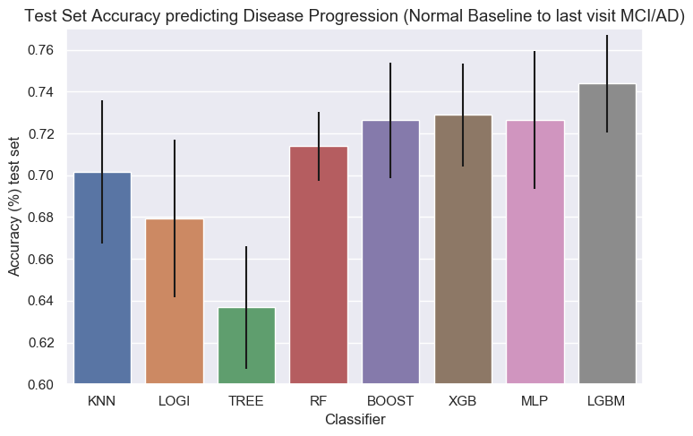


```python

```
