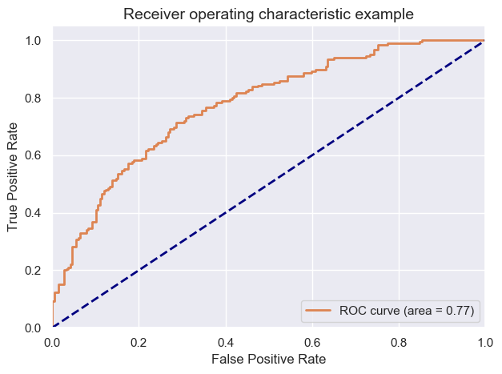
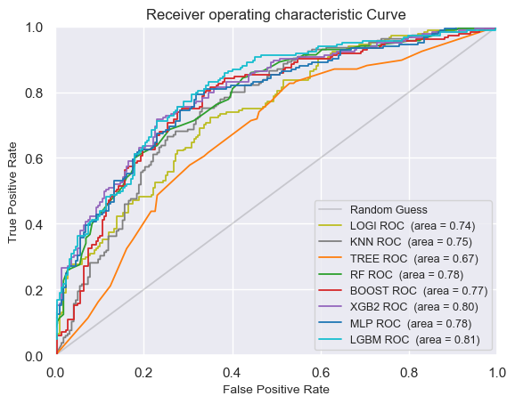
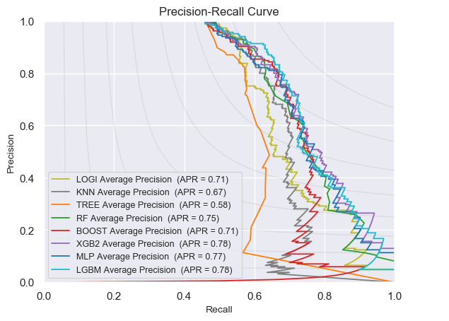

## Contents
{:.no_toc}
*  
{: toc}


# From baseline measurements and time till last visit try to predict disease progression in the future

 Disease progression defined as diagnosis on last visit being worse than the baseline diagnosis


# 1 Data loading, preperation and cleaning


    (13673, 113)


<div>
<style scoped>
    .dataframe tbody tr th:only-of-type {
        vertical-align: middle;
    }

    .dataframe tbody tr th {
        vertical-align: top;
    }

    .dataframe thead th {
        text-align: right;
    }
</style>
<table border="1" class="dataframe">
  <thead>
    <tr style="text-align: right;">
      <th></th>
      <th>RID</th>
      <th>PTID</th>
      <th>VISCODE</th>
      <th>SITE</th>
      <th>COLPROT</th>
      <th>ORIGPROT</th>
      <th>EXAMDATE</th>
      <th>DX_bl</th>
      <th>AGE</th>
      <th>PTGENDER</th>
      <th>PTEDUCAT</th>
      <th>PTETHCAT</th>
      <th>PTRACCAT</th>
      <th>PTMARRY</th>
      <th>APOE4</th>
      <th>FDG</th>
      <th>PIB</th>
      <th>AV45</th>
      <th>ABETA</th>
      <th>TAU</th>
      <th>PTAU</th>
      <th>CDRSB</th>
      <th>ADAS11</th>
      <th>ADAS13</th>
      <th>ADASQ4</th>
      <th>MMSE</th>
      <th>RAVLT_immediate</th>
      <th>RAVLT_learning</th>
      <th>RAVLT_forgetting</th>
      <th>RAVLT_perc_forgetting</th>
      <th>LDELTOTAL</th>
      <th>DIGITSCOR</th>
      <th>TRABSCOR</th>
      <th>FAQ</th>
      <th>MOCA</th>
      <th>EcogPtMem</th>
      <th>EcogPtLang</th>
      <th>EcogPtVisspat</th>
      <th>EcogPtPlan</th>
      <th>EcogPtOrgan</th>
      <th>EcogPtDivatt</th>
      <th>EcogPtTotal</th>
      <th>EcogSPMem</th>
      <th>EcogSPLang</th>
      <th>EcogSPVisspat</th>
      <th>EcogSPPlan</th>
      <th>EcogSPOrgan</th>
      <th>EcogSPDivatt</th>
      <th>EcogSPTotal</th>
      <th>FLDSTRENG</th>
      <th>FSVERSION</th>
      <th>IMAGEUID</th>
      <th>Ventricles</th>
      <th>Hippocampus</th>
      <th>WholeBrain</th>
      <th>Entorhinal</th>
      <th>Fusiform</th>
      <th>MidTemp</th>
      <th>ICV</th>
      <th>DX</th>
      <th>mPACCdigit</th>
      <th>mPACCtrailsB</th>
      <th>EXAMDATE_bl</th>
      <th>CDRSB_bl</th>
      <th>ADAS11_bl</th>
      <th>ADAS13_bl</th>
      <th>ADASQ4_bl</th>
      <th>MMSE_bl</th>
      <th>RAVLT_immediate_bl</th>
      <th>RAVLT_learning_bl</th>
      <th>RAVLT_forgetting_bl</th>
      <th>RAVLT_perc_forgetting_bl</th>
      <th>LDELTOTAL_BL</th>
      <th>DIGITSCOR_bl</th>
      <th>TRABSCOR_bl</th>
      <th>FAQ_bl</th>
      <th>mPACCdigit_bl</th>
      <th>mPACCtrailsB_bl</th>
      <th>FLDSTRENG_bl</th>
      <th>FSVERSION_bl</th>
      <th>Ventricles_bl</th>
      <th>Hippocampus_bl</th>
      <th>WholeBrain_bl</th>
      <th>Entorhinal_bl</th>
      <th>Fusiform_bl</th>
      <th>MidTemp_bl</th>
      <th>ICV_bl</th>
      <th>MOCA_bl</th>
      <th>EcogPtMem_bl</th>
      <th>EcogPtLang_bl</th>
      <th>EcogPtVisspat_bl</th>
      <th>EcogPtPlan_bl</th>
      <th>EcogPtOrgan_bl</th>
      <th>EcogPtDivatt_bl</th>
      <th>EcogPtTotal_bl</th>
      <th>EcogSPMem_bl</th>
      <th>EcogSPLang_bl</th>
      <th>EcogSPVisspat_bl</th>
      <th>EcogSPPlan_bl</th>
      <th>EcogSPOrgan_bl</th>
      <th>EcogSPDivatt_bl</th>
      <th>EcogSPTotal_bl</th>
      <th>ABETA_bl</th>
      <th>TAU_bl</th>
      <th>PTAU_bl</th>
      <th>FDG_bl</th>
      <th>PIB_bl</th>
      <th>AV45_bl</th>
      <th>Years_bl</th>
      <th>Month_bl</th>
      <th>Month</th>
      <th>M</th>
      <th>update_stamp</th>
    </tr>
  </thead>
  <tbody>
    <tr>
      <th>0</th>
      <td>2</td>
      <td>011_S_0002</td>
      <td>bl</td>
      <td>11</td>
      <td>ADNI1</td>
      <td>ADNI1</td>
      <td>2005-09-08</td>
      <td>CN</td>
      <td>74.3</td>
      <td>Male</td>
      <td>16</td>
      <td>Not Hisp/Latino</td>
      <td>White</td>
      <td>Married</td>
      <td>0.0</td>
      <td>1.36665</td>
      <td>NaN</td>
      <td>NaN</td>
      <td>NaN</td>
      <td>NaN</td>
      <td>NaN</td>
      <td>0.0</td>
      <td>10.67</td>
      <td>18.67</td>
      <td>5.0</td>
      <td>28.0</td>
      <td>44.0</td>
      <td>4.0</td>
      <td>6.0</td>
      <td>54.5455</td>
      <td>10.0</td>
      <td>34.0</td>
      <td>112.0</td>
      <td>0.0</td>
      <td>NaN</td>
      <td>NaN</td>
      <td>NaN</td>
      <td>NaN</td>
      <td>NaN</td>
      <td>NaN</td>
      <td>NaN</td>
      <td>NaN</td>
      <td>NaN</td>
      <td>NaN</td>
      <td>NaN</td>
      <td>NaN</td>
      <td>NaN</td>
      <td>NaN</td>
      <td>NaN</td>
      <td>NaN</td>
      <td>Cross-Sectional FreeSurfer (FreeSurfer Version...</td>
      <td>35475.0</td>
      <td>118233.0</td>
      <td>8336.0</td>
      <td>1229740.0</td>
      <td>4177.0</td>
      <td>16559.0</td>
      <td>27936.0</td>
      <td>1984660.0</td>
      <td>CN</td>
      <td>-4.35795</td>
      <td>-4.15975</td>
      <td>2005-09-08</td>
      <td>0.0</td>
      <td>10.67</td>
      <td>18.67</td>
      <td>5.0</td>
      <td>28</td>
      <td>44.0</td>
      <td>4.0</td>
      <td>6.0</td>
      <td>54.5455</td>
      <td>10.0</td>
      <td>34.0</td>
      <td>112.0</td>
      <td>0.0</td>
      <td>-4.35795</td>
      <td>-4.15975</td>
      <td>NaN</td>
      <td>Cross-Sectional FreeSurfer (FreeSurfer Version...</td>
      <td>118233.0</td>
      <td>8336.0</td>
      <td>1229740.0</td>
      <td>4177.0</td>
      <td>16559.0</td>
      <td>27936.0</td>
      <td>1984660.0</td>
      <td>NaN</td>
      <td>NaN</td>
      <td>NaN</td>
      <td>NaN</td>
      <td>NaN</td>
      <td>NaN</td>
      <td>NaN</td>
      <td>NaN</td>
      <td>NaN</td>
      <td>NaN</td>
      <td>NaN</td>
      <td>NaN</td>
      <td>NaN</td>
      <td>NaN</td>
      <td>NaN</td>
      <td>NaN</td>
      <td>NaN</td>
      <td>NaN</td>
      <td>1.36665</td>
      <td>NaN</td>
      <td>NaN</td>
      <td>0.000000</td>
      <td>0.00000</td>
      <td>0</td>
      <td>0</td>
      <td>2018-11-08 22:51:22.0</td>
    </tr>
    <tr>
      <th>1</th>
      <td>3</td>
      <td>011_S_0003</td>
      <td>bl</td>
      <td>11</td>
      <td>ADNI1</td>
      <td>ADNI1</td>
      <td>2005-09-12</td>
      <td>AD</td>
      <td>81.3</td>
      <td>Male</td>
      <td>18</td>
      <td>Not Hisp/Latino</td>
      <td>White</td>
      <td>Married</td>
      <td>1.0</td>
      <td>1.08355</td>
      <td>NaN</td>
      <td>NaN</td>
      <td>741.5</td>
      <td>239.7</td>
      <td>22.83</td>
      <td>4.5</td>
      <td>22.00</td>
      <td>31.00</td>
      <td>8.0</td>
      <td>20.0</td>
      <td>22.0</td>
      <td>1.0</td>
      <td>4.0</td>
      <td>100.0000</td>
      <td>2.0</td>
      <td>25.0</td>
      <td>148.0</td>
      <td>10.0</td>
      <td>NaN</td>
      <td>NaN</td>
      <td>NaN</td>
      <td>NaN</td>
      <td>NaN</td>
      <td>NaN</td>
      <td>NaN</td>
      <td>NaN</td>
      <td>NaN</td>
      <td>NaN</td>
      <td>NaN</td>
      <td>NaN</td>
      <td>NaN</td>
      <td>NaN</td>
      <td>NaN</td>
      <td>NaN</td>
      <td>Cross-Sectional FreeSurfer (FreeSurfer Version...</td>
      <td>32237.0</td>
      <td>84599.0</td>
      <td>5319.0</td>
      <td>1129830.0</td>
      <td>1791.0</td>
      <td>15506.0</td>
      <td>18422.0</td>
      <td>1920690.0</td>
      <td>Dementia</td>
      <td>-16.58450</td>
      <td>-16.16580</td>
      <td>2005-09-12</td>
      <td>4.5</td>
      <td>22.00</td>
      <td>31.00</td>
      <td>8.0</td>
      <td>20</td>
      <td>22.0</td>
      <td>1.0</td>
      <td>4.0</td>
      <td>100.0000</td>
      <td>2.0</td>
      <td>25.0</td>
      <td>148.0</td>
      <td>10.0</td>
      <td>-16.58450</td>
      <td>-16.16580</td>
      <td>NaN</td>
      <td>Cross-Sectional FreeSurfer (FreeSurfer Version...</td>
      <td>84599.0</td>
      <td>5319.0</td>
      <td>1129830.0</td>
      <td>1791.0</td>
      <td>15506.0</td>
      <td>18422.0</td>
      <td>1920690.0</td>
      <td>NaN</td>
      <td>NaN</td>
      <td>NaN</td>
      <td>NaN</td>
      <td>NaN</td>
      <td>NaN</td>
      <td>NaN</td>
      <td>NaN</td>
      <td>NaN</td>
      <td>NaN</td>
      <td>NaN</td>
      <td>NaN</td>
      <td>NaN</td>
      <td>NaN</td>
      <td>NaN</td>
      <td>741.5</td>
      <td>239.7</td>
      <td>22.83</td>
      <td>1.08355</td>
      <td>NaN</td>
      <td>NaN</td>
      <td>0.000000</td>
      <td>0.00000</td>
      <td>0</td>
      <td>0</td>
      <td>2018-11-08 22:51:22.0</td>
    </tr>
    <tr>
      <th>2</th>
      <td>3</td>
      <td>011_S_0003</td>
      <td>m06</td>
      <td>11</td>
      <td>ADNI1</td>
      <td>ADNI1</td>
      <td>2006-03-13</td>
      <td>AD</td>
      <td>81.3</td>
      <td>Male</td>
      <td>18</td>
      <td>Not Hisp/Latino</td>
      <td>White</td>
      <td>Married</td>
      <td>1.0</td>
      <td>1.05803</td>
      <td>NaN</td>
      <td>NaN</td>
      <td>NaN</td>
      <td>NaN</td>
      <td>NaN</td>
      <td>6.0</td>
      <td>19.00</td>
      <td>30.00</td>
      <td>10.0</td>
      <td>24.0</td>
      <td>19.0</td>
      <td>2.0</td>
      <td>6.0</td>
      <td>100.0000</td>
      <td>NaN</td>
      <td>19.0</td>
      <td>135.0</td>
      <td>12.0</td>
      <td>NaN</td>
      <td>NaN</td>
      <td>NaN</td>
      <td>NaN</td>
      <td>NaN</td>
      <td>NaN</td>
      <td>NaN</td>
      <td>NaN</td>
      <td>NaN</td>
      <td>NaN</td>
      <td>NaN</td>
      <td>NaN</td>
      <td>NaN</td>
      <td>NaN</td>
      <td>NaN</td>
      <td>NaN</td>
      <td>Cross-Sectional FreeSurfer (FreeSurfer Version...</td>
      <td>31863.0</td>
      <td>88580.0</td>
      <td>5446.0</td>
      <td>1100060.0</td>
      <td>2427.0</td>
      <td>14400.0</td>
      <td>16972.0</td>
      <td>1906430.0</td>
      <td>Dementia</td>
      <td>-15.02030</td>
      <td>-13.38660</td>
      <td>2005-09-12</td>
      <td>4.5</td>
      <td>22.00</td>
      <td>31.00</td>
      <td>8.0</td>
      <td>20</td>
      <td>22.0</td>
      <td>1.0</td>
      <td>4.0</td>
      <td>100.0000</td>
      <td>2.0</td>
      <td>25.0</td>
      <td>148.0</td>
      <td>10.0</td>
      <td>-16.58450</td>
      <td>-16.16580</td>
      <td>NaN</td>
      <td>Cross-Sectional FreeSurfer (FreeSurfer Version...</td>
      <td>84599.0</td>
      <td>5319.0</td>
      <td>1129830.0</td>
      <td>1791.0</td>
      <td>15506.0</td>
      <td>18422.0</td>
      <td>1920690.0</td>
      <td>NaN</td>
      <td>NaN</td>
      <td>NaN</td>
      <td>NaN</td>
      <td>NaN</td>
      <td>NaN</td>
      <td>NaN</td>
      <td>NaN</td>
      <td>NaN</td>
      <td>NaN</td>
      <td>NaN</td>
      <td>NaN</td>
      <td>NaN</td>
      <td>NaN</td>
      <td>NaN</td>
      <td>741.5</td>
      <td>239.7</td>
      <td>22.83</td>
      <td>1.08355</td>
      <td>NaN</td>
      <td>NaN</td>
      <td>0.498289</td>
      <td>5.96721</td>
      <td>6</td>
      <td>6</td>
      <td>2018-11-08 22:51:22.0</td>
    </tr>
  </tbody>
</table>
</div>


    LMCI    4819
    CN      4125
    EMCI    2488
    AD      1576
    SMC      648
    NONE      17
    Name: DX_bl, dtype: int64


    MCI         4288
    NONE        3982
    CN          3223
    Dementia    2180
    Name: DX, dtype: int64


    ['CN' 'AD' 'LMCI']
    ['CN' 'Dementia' 'MCI' 'NONE']


    Before dropping:  (7066, 113)
    After dropping:  (5059, 113)
    ['CN' 'Dementia' 'MCI']


## 1.1 Limit your data for each individual to their last visit and baseline information


```python
# All the different visits for our first patient ID
df[df.PTID=='011_S_0002' ]['M']
```


    0          0
    5109       6
    5110      36
    5111      60
    11174    120
    11177     96
    11179     84
    11181     72
    11445    132
    11446    144
    Name: M, dtype: int64


    819


    array([  0,   6,  12,  24,  18,  36,  48,  60,  72, 108,  96,  84, 120,
           132, 144, 156])


```python
indexes_last_visit=[]
for patient_ids in df.PTID.unique():
  latest_visit_M=df[df.PTID==patient_ids]['M'].max()
  d=df[ df.PTID==patient_ids ]['M']== latest_visit_M
  ind=d.index[-1]
  indexes_last_visit.append(ind);
  
# Only last visits
df_last=df.loc[indexes_last_visit]
```


## 1.2 Dropping duplicates and last visit measurements except time and diagnosis 
- Dropping meaningless/duplicate features 
- Keep all features of baseline visit
- Drop all features of the last visist except time till last visit and diagnosis


    (819, 47)


<div>
<style scoped>
    .dataframe tbody tr th:only-of-type {
        vertical-align: middle;
    }

    .dataframe tbody tr th {
        vertical-align: top;
    }

    .dataframe thead th {
        text-align: right;
    }
</style>
<table border="1" class="dataframe">
  <thead>
    <tr style="text-align: right;">
      <th></th>
      <th>DX_bl</th>
      <th>AGE</th>
      <th>PTGENDER_Female</th>
      <th>PTEDUCAT</th>
      <th>APOE4</th>
      <th>DX</th>
      <th>CDRSB_bl</th>
      <th>ADAS11_bl</th>
      <th>ADAS13_bl</th>
      <th>ADASQ4_bl</th>
      <th>MMSE_bl</th>
      <th>RAVLT_immediate_bl</th>
      <th>RAVLT_learning_bl</th>
      <th>RAVLT_forgetting_bl</th>
      <th>RAVLT_perc_forgetting_bl</th>
      <th>LDELTOTAL_BL</th>
      <th>DIGITSCOR_bl</th>
      <th>TRABSCOR_bl</th>
      <th>FAQ_bl</th>
      <th>mPACCdigit_bl</th>
      <th>mPACCtrailsB_bl</th>
      <th>Ventricles_bl</th>
      <th>Hippocampus_bl</th>
      <th>WholeBrain_bl</th>
      <th>Entorhinal_bl</th>
      <th>Fusiform_bl</th>
      <th>MidTemp_bl</th>
      <th>ICV_bl</th>
      <th>FDG_bl</th>
      <th>PIB_bl</th>
      <th>M</th>
      <th>TAU_bl</th>
      <th>ABETA_bl</th>
      <th>PTAU_bl</th>
      <th>PTETHCAT_Hisp/Latino</th>
      <th>PTETHCAT_Not Hisp/Latino</th>
      <th>PTETHCAT_Unknown</th>
      <th>PTRACCAT_Am Indian/Alaskan</th>
      <th>PTRACCAT_Asian</th>
      <th>PTRACCAT_Black</th>
      <th>PTRACCAT_More than one</th>
      <th>PTRACCAT_White</th>
      <th>PTMARRY_Divorced</th>
      <th>PTMARRY_Married</th>
      <th>PTMARRY_Never married</th>
      <th>PTMARRY_Unknown</th>
      <th>PTMARRY_Widowed</th>
    </tr>
  </thead>
  <tbody>
    <tr>
      <th>11446</th>
      <td>1</td>
      <td>74.3</td>
      <td>0</td>
      <td>16</td>
      <td>0.0</td>
      <td>2</td>
      <td>0.0</td>
      <td>10.67</td>
      <td>18.67</td>
      <td>5.0</td>
      <td>28</td>
      <td>44.0</td>
      <td>4.0</td>
      <td>6.0</td>
      <td>54.5455</td>
      <td>10.0</td>
      <td>34.0</td>
      <td>112.0</td>
      <td>0.0</td>
      <td>-4.35795</td>
      <td>-4.15975</td>
      <td>118233.0</td>
      <td>8336.0</td>
      <td>1229740.0</td>
      <td>4177.0</td>
      <td>16559.0</td>
      <td>27936.0</td>
      <td>1984660.0</td>
      <td>1.36665</td>
      <td>NaN</td>
      <td>144</td>
      <td>NaN</td>
      <td>NaN</td>
      <td>NaN</td>
      <td>0</td>
      <td>1</td>
      <td>0</td>
      <td>0</td>
      <td>0</td>
      <td>0</td>
      <td>0</td>
      <td>1</td>
      <td>0</td>
      <td>1</td>
      <td>0</td>
      <td>0</td>
      <td>0</td>
    </tr>
    <tr>
      <th>4</th>
      <td>3</td>
      <td>81.3</td>
      <td>0</td>
      <td>18</td>
      <td>1.0</td>
      <td>3</td>
      <td>4.5</td>
      <td>22.00</td>
      <td>31.00</td>
      <td>8.0</td>
      <td>20</td>
      <td>22.0</td>
      <td>1.0</td>
      <td>4.0</td>
      <td>100.0000</td>
      <td>2.0</td>
      <td>25.0</td>
      <td>148.0</td>
      <td>10.0</td>
      <td>-16.58450</td>
      <td>-16.16580</td>
      <td>84599.0</td>
      <td>5319.0</td>
      <td>1129830.0</td>
      <td>1791.0</td>
      <td>15506.0</td>
      <td>18422.0</td>
      <td>1920690.0</td>
      <td>1.08355</td>
      <td>NaN</td>
      <td>24</td>
      <td>239.7</td>
      <td>741.5</td>
      <td>22.83</td>
      <td>0</td>
      <td>1</td>
      <td>0</td>
      <td>0</td>
      <td>0</td>
      <td>0</td>
      <td>0</td>
      <td>1</td>
      <td>0</td>
      <td>1</td>
      <td>0</td>
      <td>0</td>
      <td>0</td>
    </tr>
    <tr>
      <th>9</th>
      <td>2</td>
      <td>67.5</td>
      <td>0</td>
      <td>10</td>
      <td>0.0</td>
      <td>2</td>
      <td>1.0</td>
      <td>14.33</td>
      <td>21.33</td>
      <td>6.0</td>
      <td>27</td>
      <td>37.0</td>
      <td>7.0</td>
      <td>4.0</td>
      <td>36.3636</td>
      <td>4.0</td>
      <td>25.0</td>
      <td>271.0</td>
      <td>0.0</td>
      <td>-8.49902</td>
      <td>-9.52048</td>
      <td>39605.0</td>
      <td>6869.0</td>
      <td>1154980.0</td>
      <td>3983.0</td>
      <td>19036.0</td>
      <td>19615.0</td>
      <td>1679440.0</td>
      <td>NaN</td>
      <td>NaN</td>
      <td>36</td>
      <td>153.1</td>
      <td>1501.0</td>
      <td>13.29</td>
      <td>1</td>
      <td>0</td>
      <td>0</td>
      <td>0</td>
      <td>0</td>
      <td>0</td>
      <td>0</td>
      <td>1</td>
      <td>0</td>
      <td>1</td>
      <td>0</td>
      <td>0</td>
      <td>0</td>
    </tr>
    <tr>
      <th>14</th>
      <td>1</td>
      <td>73.7</td>
      <td>0</td>
      <td>16</td>
      <td>0.0</td>
      <td>1</td>
      <td>0.0</td>
      <td>8.67</td>
      <td>14.67</td>
      <td>4.0</td>
      <td>29</td>
      <td>37.0</td>
      <td>4.0</td>
      <td>4.0</td>
      <td>44.4444</td>
      <td>12.0</td>
      <td>38.0</td>
      <td>90.0</td>
      <td>0.0</td>
      <td>-1.90246</td>
      <td>-1.57826</td>
      <td>34062.0</td>
      <td>7075.0</td>
      <td>1116630.0</td>
      <td>4433.0</td>
      <td>24788.0</td>
      <td>21614.0</td>
      <td>1640770.0</td>
      <td>1.29343</td>
      <td>NaN</td>
      <td>36</td>
      <td>337.0</td>
      <td>547.3</td>
      <td>33.43</td>
      <td>0</td>
      <td>1</td>
      <td>0</td>
      <td>0</td>
      <td>0</td>
      <td>0</td>
      <td>0</td>
      <td>1</td>
      <td>0</td>
      <td>1</td>
      <td>0</td>
      <td>0</td>
      <td>0</td>
    </tr>
    <tr>
      <th>5122</th>
      <td>2</td>
      <td>80.4</td>
      <td>1</td>
      <td>13</td>
      <td>0.0</td>
      <td>2</td>
      <td>0.5</td>
      <td>18.67</td>
      <td>25.67</td>
      <td>7.0</td>
      <td>25</td>
      <td>30.0</td>
      <td>1.0</td>
      <td>5.0</td>
      <td>83.3333</td>
      <td>3.0</td>
      <td>34.0</td>
      <td>168.0</td>
      <td>0.0</td>
      <td>-10.29260</td>
      <td>-11.05750</td>
      <td>39826.0</td>
      <td>5348.0</td>
      <td>927510.0</td>
      <td>2277.0</td>
      <td>17963.0</td>
      <td>17802.0</td>
      <td>1485830.0</td>
      <td>NaN</td>
      <td>NaN</td>
      <td>24</td>
      <td>NaN</td>
      <td>NaN</td>
      <td>NaN</td>
      <td>0</td>
      <td>1</td>
      <td>0</td>
      <td>0</td>
      <td>0</td>
      <td>0</td>
      <td>0</td>
      <td>1</td>
      <td>0</td>
      <td>1</td>
      <td>0</td>
      <td>0</td>
      <td>0</td>
    </tr>
  </tbody>
</table>
</div>


## 1.3 Missing value imputation by 5 KNN


    array([1, 3, 2])


    (819, 47)


# 2 Basic Logistic model


    (183, 46) (183,) (46, 46) (46,)
    (321, 46) (321,) (81, 46) (81,)


## 2.1 Basic Logistic model only taking into account time till last visit


### 2.1.1 Modelling non-balanced, Normal Baseline, progressing to MCI/AD only based on time till last visit


    
    Simple logistic regression modeling with the CLASS WEIGHTS NON BALANCED
    
    Logistic Regresssion predicting desease progression from Normal Baseline to MCI or AD at last visit
    Training accuracy: 	0.80 , Test accuracy: 	0.63
    


### 2.1.2 Modelling balanced, Normal Baseline , progressing to MCI/AD only based on time till last visit


    
    Simple logistic regression modeling with the CLASS WEIGHTS  BALANCED
    
    Logistic Regresssion predicting desease progression from Normal Baseline to MCI or AD at last visit
    Training accuracy: 	0.70 , Test accuracy: 	0.70
    


### 2.1.3 Modelling non-balanced, MCI Baseline, progressing to AD only based on time till last visit


    
    Simple logistic regression modeling with the CLASS WEIGHTS NON BALANCED
    
    Logistic Regresssion predicting desease progression from MCI Baseline to AD at last visit
    Training accuracy: 	0.58 , Test accuracy: 	0.49
    


### 2.1.4 Modelling balanced, MCI Baseline, progressing to AD only based on time till last visit


    
    Simple logistic regression modeling with the CLASS WEIGHTS BALANCED
    
    Logistic Regresssion predicting desease progression from MCI Baseline to AD at last visit
    Training accuracy: 	0.61 , Test accuracy: 	0.54
    


## 2.2 Logistic model  taking into account all baseline measurements and time till last visit

### 2.2.1 Modelling balanced, Normal Baseline , progressing to MCI/AD taking into account all baseline measurements and time till last visit


    
    Simple logistic regression modeling with the CLASS WEIGHTS NON BALANCED
    
    Logistic Regresssion predicting desease progression from Normal Baseline to MCI or AD at last visit
    Training accuracy: 	0.75 , Test accuracy: 	0.63
    


### 2.2.2 Modelling balanced, MCI Baseline , progressing to AD taking into account all baseline measurements and time till last visit


    
    Simple logistic regression modeling with the CLASS WEIGHTS NON BALANCED
    
    Logistic Regresssion predicting desease progression from Normal Baseline to MCI or AD at last visit
    Training accuracy: 	0.76 , Test accuracy: 	0.63
    


    1. M: 			 Months after BL
    2. RAVLT_perc_forget: 	 Percentage forgetting during Reys Auditory Verbal Learning Test
    3. FAQ_bl: 		 Functinoal Activities Questionnaire score at BL
    


# 3 Advanced Model Testing with 4-fold Cross Validation Scoring Reporting with internal CV parameter optimization within training fold

### 3.1 Parameter Optimisation and Cross Validation
**Cross-validation setting:** 
- 5-fold cross validation ( so averages on these 5 test sets will be reported )
- Within every training fold of cross validation we do an internal 4-fold CV to optimise the parameters

**Parameter Optimization example:**
- Model LogisticRegression(random_state=1, solver='liblinear', class_weight='balanced')
- Tested Estimator_parameters = {'C':[0.001,0.01,0.1,1,10,100,1000] }


    All 4 PARAMETER OPTIMISATIONS AND CROSS VALIDATIONS OF THE "KNeighborsClassifier" ALGORITHM
    
    This is optimisation and CV number 2  	----------------------------------------------------------------------------
    Mean scores: 				[0.71 0.71 0.72 0.71 0.72 0.71 0.71]
    Differences best - other scores:	[0.01 0.01 0.   0.01 0.   0.01 0.01]
    The best paremeters set was	 	Set 3: {'C': 0.1}
    Validation Accuracy score: 		[0.69]
    
    This is optimisation and CV number 3  	----------------------------------------------------------------------------
    Mean scores: 				[0.71 0.71 0.7  0.69 0.7  0.69 0.72]
    Differences best - other scores:	[0.01 0.01 0.02 0.03 0.02 0.03 0.  ]
    The best paremeters set was	 	Set 7: {'C': 1000}
    Validation Accuracy score: 		[0.69 0.73]
    
    This is optimisation and CV number 4  	----------------------------------------------------------------------------
    Mean scores: 				[0.68 0.69 0.69 0.68 0.7  0.68 0.68]
    Differences best - other scores:	[0.02 0.01 0.01 0.02 0.   0.02 0.02]
    The best paremeters set was	 	Set 5: {'C': 10}
    Validation Accuracy score: 		[0.69 0.73 0.72]
    
    This is optimisation and CV number 5  	----------------------------------------------------------------------------
    Mean scores: 				[0.7  0.71 0.7  0.7  0.69 0.71 0.69]
    Differences best - other scores:	[0.01 0.   0.01 0.01 0.01 0.   0.02]
    The best paremeters set was	 	Set 2: {'C': 0.01}
    Validation Accuracy score: 		[0.69 0.73 0.72 0.7 ]


Note on *Average Precision Score*: scoring='average_precision' = sklearn.metrics.average_precision_score. Compute average precision (AP) from prediction scores AP summarizes a precision-recall curve as the weighted mean of precisions achieved at each threshold.


    ____________________________________________________________________________________________________________________
    
    Average of 4 splits mean_test_score for all 8 parameter sets:
    [0.7 0.7 0.7 0.7 0.7 0.7 0.7]
    Differences best Average - Average for all 8 parameter sets:
    [0.01 0.   0.   0.01 0.   0.01 0.01]
    Best Average mean_test_score = 0.7 for the 2th parameter: {'C': 0.01}
    Best Parameter Set for all 4 splits: [3, 7, 5, 2]
    Occurences of all 8 parameters as Best Parameter Set in a split: Counter({3: 1, 7: 1, 5: 1, 2: 1})


### 3.2 Model Performance and Area Under The Receiver Operating Characteristic Curve


    ____________________________________________________________________________________________________________________
    
    Estimator : All 4 Accuracy Scores of validation on the outer test set 
    with the estimator with the optimised parameters trained on the inner test set: 
    [0.68627451 0.73       0.72       0.7       ]
    
    		Avg 	(+- STD  )
    		-----------------
    Accuracy: 	0.709 	(+- 0.017) 


<div>
<style scoped>
    .dataframe tbody tr th:only-of-type {
        vertical-align: middle;
    }

    .dataframe tbody tr th {
        vertical-align: top;
    }

    .dataframe thead th {
        text-align: right;
    }
</style>
<table border="1" class="dataframe">
  <thead>
    <tr style="text-align: right;">
      <th></th>
      <th>Logistic_mu</th>
      <th>Logistic_std</th>
    </tr>
  </thead>
  <tbody>
    <tr>
      <th>Average Precision</th>
      <td>0.76</td>
      <td>0.02</td>
    </tr>
    <tr>
      <th>AUROC</th>
      <td>0.78</td>
      <td>0.01</td>
    </tr>
    <tr>
      <th>Precision</th>
      <td>0.68</td>
      <td>0.03</td>
    </tr>
    <tr>
      <th>Recall</th>
      <td>0.70</td>
      <td>0.08</td>
    </tr>
    <tr>
      <th>F1_Score</th>
      <td>0.69</td>
      <td>0.03</td>
    </tr>
    <tr>
      <th>Sensitivity</th>
      <td>0.70</td>
      <td>0.08</td>
    </tr>
    <tr>
      <th>Specificity</th>
      <td>0.72</td>
      <td>0.06</td>
    </tr>
    <tr>
      <th>Accuracy</th>
      <td>0.71</td>
      <td>0.02</td>
    </tr>
  </tbody>
</table>
</div>





### 3.2bis Parameter Optimisation and 5-fold CV wrapper function


```python
def CV_and_Parameter_Optimization(X_CV, y_CV, splits, Estimator, Estimator_parameters):
  # All 10 parameter optimisations and cross validations of a certain Classifier
  strat_kfold_external = StratifiedKFold(n_splits=splits, shuffle=True, random_state=1)
  splitted_indexes_external = strat_kfold_external.split(X_CV, y_CV)
  params= [len(Estimator_parameters[param]) for param in Estimator_parameters]
  total_params= np.prod(params)
  best_index=[]
  Sum=[0]*total_params
  AP_Score =np.array([])
  ROC_Score =np.array([])
  Prec_Score =np.array([])
  Recall_Score =np.array([])
  F1_Score =np.array([])
  Sens_Score =np.array([])
  Spec_Score =np.array([])
  Accuracy_Score =np.array([])

  best_predictions_all=np.array([])
  test_all=np.array([])
  i=1
  for train_index_external, test_index_external in splitted_indexes_external:
      print("This is parameter optimisation and CV number {} ... \t{}".format(i, Accuracy_Score))
      i=i+1
      # take i’th fold as test set and the other 3 folds together as training set
      X_train, X_test = X_CV.iloc[train_index_external], X_CV.iloc[test_index_external]
      y_train, y_test = y_CV.iloc[train_index_external], y_CV.iloc[test_index_external]    
      # take the training set and split it randomly (stratified) 
      # in an inner training set of 2/3 size and an inner validation set of 1/3 size

      # for each of the ML methods
      # for each combination of parameter values
      # train the ML method with specified parameters on inner training set and validate on inner validation set
      # take the combination of parameter values that yields highest performance (e.g. area under PR curve), 
      # also write down this parameter value combination train the ML method with best parameter values on
      # the (outer) training set and test on the (outer) test set

      mod=clone(Estimator)
      optimisation_param_AP = GridSearchCV(estimator=mod, param_grid=Estimator_parameters, cv=3, verbose=0, scoring='accuracy')
      optimisation_param_AP.fit(X_train, y_train)
      best_index.append(optimisation_param_AP.best_index_+1)
      Sum=Sum+(optimisation_param_AP.cv_results_['mean_test_score']).round(2)

      # Building Estimator with best parameters
      best= optimisation_param_AP.best_estimator_
      best.fit(X_train, y_train)
      best_predictions = best.predict_proba(X_test)[:,1]
      best_predictions=best_predictions
      Average_precision_score=average_precision_score(y_test, best_predictions)
      best_predictions_binary =  best.predict(X_test)
      t=confusion_matrix(y_test, best_predictions_binary)
      sensitivity=(t[1][1]/(t[1][0]+t[1][1]))
      specificity=(t[0][0]/(t[0][1]+t[0][0]))
      AP_Score =np.append(AP_Score , Average_precision_score)
      ROC_Score =np.append(ROC_Score , roc_auc_score(y_test, best_predictions))
      Prec_Score =np.append(Prec_Score , precision_score(y_test, best_predictions_binary))
      Recall_Score =np.append(Recall_Score , recall_score(y_test, best_predictions_binary))
      F1_Score =np.append(F1_Score , f1_score(y_test, best_predictions_binary))
      Sens_Score =np.append(Sens_Score , sensitivity)
      Spec_Score =np.append(Spec_Score , specificity)
      Accuracy_Score =np.append(Accuracy_Score , accuracy_score(y_test, best_predictions_binary))

      best_predictions_all=np.append(best_predictions_all,best_predictions)
      test_all=np.append(test_all,y_test)
  
  print('Done: Validation Accuracy score: \t\t\t{}'.format(Accuracy_Score .round(3)))
  return AP_Score,  ROC_Score,  Prec_Score,  Recall_Score,  F1_Score,  Sens_Score, Spec_Score, Accuracy_Score,  best_predictions_all, test_all
```


    This is parameter optimisation and CV number 1 ...
    This is parameter optimisation and CV number 2 ...
    This is parameter optimisation and CV number 3 ...
    This is parameter optimisation and CV number 4 ...
    Done: Validation Accuracy score: 		[0.676 0.73  0.73  0.7  ]


<div>
<style scoped>
    .dataframe tbody tr th:only-of-type {
        vertical-align: middle;
    }

    .dataframe tbody tr th {
        vertical-align: top;
    }

    .dataframe thead th {
        text-align: right;
    }
</style>
<table border="1" class="dataframe">
  <thead>
    <tr style="text-align: right;">
      <th></th>
      <th>0 Logistic_mu_default</th>
      <th>a Logistic_std_default</th>
    </tr>
  </thead>
  <tbody>
    <tr>
      <th>Average Precision</th>
      <td>0.75</td>
      <td>0.01</td>
    </tr>
    <tr>
      <th>AUROC</th>
      <td>0.78</td>
      <td>0.01</td>
    </tr>
    <tr>
      <th>Precision</th>
      <td>0.68</td>
      <td>0.03</td>
    </tr>
    <tr>
      <th>Recall</th>
      <td>0.71</td>
      <td>0.08</td>
    </tr>
    <tr>
      <th>F1_Score</th>
      <td>0.69</td>
      <td>0.03</td>
    </tr>
    <tr>
      <th>Sensitivity</th>
      <td>0.71</td>
      <td>0.08</td>
    </tr>
    <tr>
      <th>Specificity</th>
      <td>0.71</td>
      <td>0.06</td>
    </tr>
    <tr>
      <th>Accuracy</th>
      <td>0.71</td>
      <td>0.02</td>
    </tr>
  </tbody>
</table>
</div>


### Preprocessing: Scaling 


## 3.3 Model Performance testing

#### 3.3.1 KNN
``` class sklearn.neighbors.KNeighborsClassifier(n_neighbors=5, weights='uniform', algorithm='auto', 
 leaf_size=30, p=2, metric='minkowski', metric_params=None, n_jobs=1, **kwargs)````

Test parameters:
- n_neighbors: 1, 3, 5, 9
- p: 1, 2 (manhattan and euclidean distance)


```python
KNN_parameters = {'p':[1,2], 'n_neighbors':[1, 3, 5, 9]}
KNN = KNeighborsClassifier(weights='distance')
```


    This is parameter optimisation and CV number 1 ...
    This is parameter optimisation and CV number 2 ...
    This is parameter optimisation and CV number 3 ...
    This is parameter optimisation and CV number 4 ...
    Done: Validation Accuracy score: 		[0.676 0.68  0.76  0.69 ]


<div>
<style scoped>
    .dataframe tbody tr th:only-of-type {
        vertical-align: middle;
    }

    .dataframe tbody tr th {
        vertical-align: top;
    }

    .dataframe thead th {
        text-align: right;
    }
</style>
<table border="1" class="dataframe">
  <thead>
    <tr style="text-align: right;">
      <th></th>
      <th>1 KNN_mu</th>
      <th>1 KNN_std</th>
    </tr>
  </thead>
  <tbody>
    <tr>
      <th>Average Precision</th>
      <td>0.69</td>
      <td>0.05</td>
    </tr>
    <tr>
      <th>AUROC</th>
      <td>0.76</td>
      <td>0.06</td>
    </tr>
    <tr>
      <th>Precision</th>
      <td>0.67</td>
      <td>0.07</td>
    </tr>
    <tr>
      <th>Recall</th>
      <td>0.74</td>
      <td>0.07</td>
    </tr>
    <tr>
      <th>F1_Score</th>
      <td>0.70</td>
      <td>0.02</td>
    </tr>
    <tr>
      <th>Sensitivity</th>
      <td>0.74</td>
      <td>0.07</td>
    </tr>
    <tr>
      <th>Specificity</th>
      <td>0.67</td>
      <td>0.11</td>
    </tr>
    <tr>
      <th>Accuracy</th>
      <td>0.70</td>
      <td>0.03</td>
    </tr>
  </tbody>
</table>
</div>


#### 3.3.2 Logistic Regression
```class sklearn.linear_model.LogisticRegression(penalty=’l2’, dual=False, tol=0.0001,  C=1.0, fit_intercept=True, intercept_scaling=1, class_weight=None, random_state=None,  solver=’liblinear’, max_iter=100, multi_class=’ovr’, verbose=0, warm_start=False, n_jobs=1)```

Test parameters:
- solver : {‘newton-cg’, ‘lbfgs’, ‘liblinear’, ‘sag’, ‘saga’},
- C: 0.001,0.01,0.1,1,10,100,1000 


```python
LOGI_parameters = {'C':[0.001,0.01,0.1,1,10,100,1000] }
LOGI =LogisticRegression(random_state=1,max_iter=1000,tol=5e-4, solver='liblinear', class_weight='balanced')
```


    This is parameter optimisation and CV number 1 ...
    This is parameter optimisation and CV number 2 ...
    This is parameter optimisation and CV number 3 ...
    This is parameter optimisation and CV number 4 ...
    Done: Validation Accuracy score: 		[0.627 0.66  0.72  0.71 ]


<div>
<style scoped>
    .dataframe tbody tr th:only-of-type {
        vertical-align: middle;
    }

    .dataframe tbody tr th {
        vertical-align: top;
    }

    .dataframe thead th {
        text-align: right;
    }
</style>
<table border="1" class="dataframe">
  <thead>
    <tr style="text-align: right;">
      <th></th>
      <th>1 KNN_mu</th>
      <th>1 KNN_std</th>
      <th>2 LOGI_mu</th>
      <th>2 LOGI_std</th>
    </tr>
  </thead>
  <tbody>
    <tr>
      <th>Average Precision</th>
      <td>0.69</td>
      <td>0.05</td>
      <td>0.74</td>
      <td>0.05</td>
    </tr>
    <tr>
      <th>AUROC</th>
      <td>0.76</td>
      <td>0.06</td>
      <td>0.77</td>
      <td>0.04</td>
    </tr>
    <tr>
      <th>Precision</th>
      <td>0.67</td>
      <td>0.07</td>
      <td>0.65</td>
      <td>0.06</td>
    </tr>
    <tr>
      <th>Recall</th>
      <td>0.74</td>
      <td>0.07</td>
      <td>0.71</td>
      <td>0.09</td>
    </tr>
    <tr>
      <th>F1_Score</th>
      <td>0.70</td>
      <td>0.02</td>
      <td>0.67</td>
      <td>0.03</td>
    </tr>
    <tr>
      <th>Sensitivity</th>
      <td>0.74</td>
      <td>0.07</td>
      <td>0.71</td>
      <td>0.09</td>
    </tr>
    <tr>
      <th>Specificity</th>
      <td>0.67</td>
      <td>0.11</td>
      <td>0.65</td>
      <td>0.12</td>
    </tr>
    <tr>
      <th>Accuracy</th>
      <td>0.70</td>
      <td>0.03</td>
      <td>0.68</td>
      <td>0.04</td>
    </tr>
  </tbody>
</table>
</div>


#### 3.3.3 SVM
``` class sklearn.svm.SVC(C=1.0, kernel=’rbf’, degree=3, gamma=’auto’, coef0=0.0, shrinking=True, probability=False, tol=0.001, cache_size=200, class_weight=None, verbose=False, max_iter=-1, decision_function_shape=’ovr’, random_state=None) ```

Test parameters:
-  C: 0.001,0.01,0.1,1,10,100,1000 
- gamma = 0.001,0.01,0.1,1


```python
SVC_parameters = {'C':[0.1,1,10], 'gamma':[0.01,0.1,1] }
svc=SVC(probability=True,random_state=1,class_weight='balanced', cache_size=20000,kernel='rbf')
```


    This is parameter optimisation and CV number 1 ...
    This is parameter optimisation and CV number 2 ...
    This is parameter optimisation and CV number 3 ...
    This is parameter optimisation and CV number 4 ...
    Done: Validation Accuracy score: 		[0.716 0.67  0.73  0.71 ]


```python
d['3 SVC_mu'] = [SVC_AP.mean(),  SVC_ROC.mean(),  SVC_Prec.mean(),  SVC_Recall.mean(),  SVC_F1.mean(),  SVC_Sens.mean(), SVC_Spec.mean(), SVC_Accuracy.mean()]
d['3 SVC_std'] = [SVC_AP.std(),  SVC_ROC.std(),  SVC_Prec.std(),  SVC_Recall.std(),  SVC_F1.std(),  SVC_Sens.std(), SVC_Spec.std(), SVC_Accuracy.std()]
df = pd.DataFrame(data=d, index=Names)
df.round(2)

print("SVC never converges...")
```


    ---------------------------------------------------------------------------

    NameError                                 Traceback (most recent call last)

    <ipython-input-1-188208e5220b> in <module>
    ----> 1 d['3 SVC_mu'] = [SVC_AP.mean(),  SVC_ROC.mean(),  SVC_Prec.mean(),  SVC_Recall.mean(),  SVC_F1.mean(),  SVC_Sens.mean(), SVC_Spec.mean(), SVC_Accuracy.mean()]
          2 d['3 SVC_std'] = [SVC_AP.std(),  SVC_ROC.std(),  SVC_Prec.std(),  SVC_Recall.std(),  SVC_F1.std(),  SVC_Sens.std(), SVC_Spec.std(), SVC_Accuracy.std()]
          3 df = pd.DataFrame(data=d, index=Names)
          4 df.round(2)
          5 


    NameError: name 'SVC_AP' is not defined


#### 3.3.4 Decision Tree
```class sklearn.tree.DecisionTreeClassifier(criterion=’gini’, splitter=’best’, max_depth=None, min_samples_split=2, min_samples_leaf=1, min_weight_fraction_leaf=0.0, max_features=None, random_state=None, max_leaf_nodes=None, min_impurity_decrease=0.0, min_impurity_split=None, class_weight=None, presort=False)```

Test parameters:
- max depth = 2, 3, 4, ..., 13, 14, 15


```python
TREE_parameters ={ 'max_depth':range(2,15,2) }    
TREE = DecisionTreeClassifier(random_state=1)
```


    This is parameter optimisation and CV number 1 ...
    This is parameter optimisation and CV number 2 ...
    This is parameter optimisation and CV number 3 ...
    This is parameter optimisation and CV number 4 ...
    Done: Validation Accuracy score: 		[0.647 0.68  0.61  0.61 ]


<div>
<style scoped>
    .dataframe tbody tr th:only-of-type {
        vertical-align: middle;
    }

    .dataframe tbody tr th {
        vertical-align: top;
    }

    .dataframe thead th {
        text-align: right;
    }
</style>
<table border="1" class="dataframe">
  <thead>
    <tr style="text-align: right;">
      <th></th>
      <th>1 KNN_mu</th>
      <th>1 KNN_std</th>
      <th>2 LOGI_mu</th>
      <th>2 LOGI_std</th>
      <th>3 TREE_mu</th>
      <th>3 TREE_std</th>
    </tr>
  </thead>
  <tbody>
    <tr>
      <th>Average Precision</th>
      <td>0.69</td>
      <td>0.05</td>
      <td>0.74</td>
      <td>0.05</td>
      <td>0.59</td>
      <td>0.04</td>
    </tr>
    <tr>
      <th>AUROC</th>
      <td>0.76</td>
      <td>0.06</td>
      <td>0.77</td>
      <td>0.04</td>
      <td>0.67</td>
      <td>0.03</td>
    </tr>
    <tr>
      <th>Precision</th>
      <td>0.67</td>
      <td>0.07</td>
      <td>0.65</td>
      <td>0.06</td>
      <td>0.61</td>
      <td>0.03</td>
    </tr>
    <tr>
      <th>Recall</th>
      <td>0.74</td>
      <td>0.07</td>
      <td>0.71</td>
      <td>0.09</td>
      <td>0.61</td>
      <td>0.16</td>
    </tr>
    <tr>
      <th>F1_Score</th>
      <td>0.70</td>
      <td>0.02</td>
      <td>0.67</td>
      <td>0.03</td>
      <td>0.59</td>
      <td>0.09</td>
    </tr>
    <tr>
      <th>Sensitivity</th>
      <td>0.74</td>
      <td>0.07</td>
      <td>0.71</td>
      <td>0.09</td>
      <td>0.61</td>
      <td>0.16</td>
    </tr>
    <tr>
      <th>Specificity</th>
      <td>0.67</td>
      <td>0.11</td>
      <td>0.65</td>
      <td>0.12</td>
      <td>0.66</td>
      <td>0.10</td>
    </tr>
    <tr>
      <th>Accuracy</th>
      <td>0.70</td>
      <td>0.03</td>
      <td>0.68</td>
      <td>0.04</td>
      <td>0.64</td>
      <td>0.03</td>
    </tr>
  </tbody>
</table>
</div>


#### 3.3.5 Random Forest

```class sklearn.ensemble.RandomForestClassifier(n_estimators=10->100, criterion='gini', 
max_depth=None, min_samples_split=2, min_samples_leaf=1, min_weight_fraction_leaf=0.0, 
max_features='auto', max_leaf_nodes=None, min_impurity_split=1e-07, bootstrap=True, 
oob_score=False, n_jobs=1, random_state=None, verbose=0, warm_start=False, class_weight=None)```

Test parameters:
- n_estimators: 50, 100, 500
- max_features: sqrt(#features), log2(#features):
    #If “sqrt”, then max_features=sqrt(n_features) (same as “auto”).
    #If “log2”, then max_features=log2(n_features).
- min_samples_leaf: 1, 5


```python
RF_parameters = {'n_estimators':[50, 100, 500], 'max_features':('sqrt', 'log2'), 'min_samples_leaf':[1, 5]}
RF = RandomForestClassifier(random_state=1)
```


    This is parameter optimisation and CV number 1 ...
    This is parameter optimisation and CV number 2 ...
    This is parameter optimisation and CV number 3 ...
    This is parameter optimisation and CV number 4 ...
    Done: Validation Accuracy score: 		[0.735 0.71  0.72  0.69 ]


<div>
<style scoped>
    .dataframe tbody tr th:only-of-type {
        vertical-align: middle;
    }

    .dataframe tbody tr th {
        vertical-align: top;
    }

    .dataframe thead th {
        text-align: right;
    }
</style>
<table border="1" class="dataframe">
  <thead>
    <tr style="text-align: right;">
      <th></th>
      <th>1 KNN_mu</th>
      <th>1 KNN_std</th>
      <th>2 LOGI_mu</th>
      <th>2 LOGI_std</th>
      <th>3 TREE_mu</th>
      <th>3 TREE_std</th>
      <th>4 RF_mu</th>
      <th>4 RF_std</th>
    </tr>
  </thead>
  <tbody>
    <tr>
      <th>Average Precision</th>
      <td>0.69</td>
      <td>0.05</td>
      <td>0.74</td>
      <td>0.05</td>
      <td>0.59</td>
      <td>0.04</td>
      <td>0.76</td>
      <td>0.02</td>
    </tr>
    <tr>
      <th>AUROC</th>
      <td>0.76</td>
      <td>0.06</td>
      <td>0.77</td>
      <td>0.04</td>
      <td>0.67</td>
      <td>0.03</td>
      <td>0.79</td>
      <td>0.02</td>
    </tr>
    <tr>
      <th>Precision</th>
      <td>0.67</td>
      <td>0.07</td>
      <td>0.65</td>
      <td>0.06</td>
      <td>0.61</td>
      <td>0.03</td>
      <td>0.70</td>
      <td>0.04</td>
    </tr>
    <tr>
      <th>Recall</th>
      <td>0.74</td>
      <td>0.07</td>
      <td>0.71</td>
      <td>0.09</td>
      <td>0.61</td>
      <td>0.16</td>
      <td>0.67</td>
      <td>0.08</td>
    </tr>
    <tr>
      <th>F1_Score</th>
      <td>0.70</td>
      <td>0.02</td>
      <td>0.67</td>
      <td>0.03</td>
      <td>0.59</td>
      <td>0.09</td>
      <td>0.68</td>
      <td>0.03</td>
    </tr>
    <tr>
      <th>Sensitivity</th>
      <td>0.74</td>
      <td>0.07</td>
      <td>0.71</td>
      <td>0.09</td>
      <td>0.61</td>
      <td>0.16</td>
      <td>0.67</td>
      <td>0.08</td>
    </tr>
    <tr>
      <th>Specificity</th>
      <td>0.67</td>
      <td>0.11</td>
      <td>0.65</td>
      <td>0.12</td>
      <td>0.66</td>
      <td>0.10</td>
      <td>0.75</td>
      <td>0.07</td>
    </tr>
    <tr>
      <th>Accuracy</th>
      <td>0.70</td>
      <td>0.03</td>
      <td>0.68</td>
      <td>0.04</td>
      <td>0.64</td>
      <td>0.03</td>
      <td>0.71</td>
      <td>0.02</td>
    </tr>
  </tbody>
</table>
</div>


#### 3.3.6 Gradient boosting
``` class sklearn.ensemble.GradientBoostingClassifier(loss='deviance', learning_rate=0.1, n_estimators=100, subsample=1.0, criterion='friedman_mse', min_samples_split=2, min_samples_leaf=1, min_weight_fraction_leaf=0.0, 
 max_depth=3, min_impurity_split=1e-07, init=None, random_state=None, max_features=None, verbose=0, max_leaf_nodes=None, warm_start=False, presort='auto')```

Test parameters:
- n_estimators: 50, 100, 500 
- max_leaf_nodes= 2, 4, 8, 16 
- learning_rate = 1, 0.5, 0.1, 0.05, 0.01


```python
BOOST_parameters = {'n_estimators':[50,100,500],'max_leaf_nodes':[2,4,8,16],'learning_rate':[1, 0.5, 0.1, 0.05, 0.01]}
BOOST=GradientBoostingClassifier(random_state=1)
```


    This is parameter optimisation and CV number 1 ...
    This is parameter optimisation and CV number 2 ...
    This is parameter optimisation and CV number 3 ...
    This is parameter optimisation and CV number 4 ...
    Done: Validation Accuracy score: 		[0.745 0.68  0.75  0.73 ]


<div>
<style scoped>
    .dataframe tbody tr th:only-of-type {
        vertical-align: middle;
    }

    .dataframe tbody tr th {
        vertical-align: top;
    }

    .dataframe thead th {
        text-align: right;
    }
</style>
<table border="1" class="dataframe">
  <thead>
    <tr style="text-align: right;">
      <th></th>
      <th>1 KNN_mu</th>
      <th>1 KNN_std</th>
      <th>2 LOGI_mu</th>
      <th>2 LOGI_std</th>
      <th>3 TREE_mu</th>
      <th>3 TREE_std</th>
      <th>4 RF_mu</th>
      <th>4 RF_std</th>
      <th>5 BOOST_mu</th>
      <th>5 BOOST_std</th>
    </tr>
  </thead>
  <tbody>
    <tr>
      <th>Average Precision</th>
      <td>0.69</td>
      <td>0.05</td>
      <td>0.74</td>
      <td>0.05</td>
      <td>0.59</td>
      <td>0.04</td>
      <td>0.76</td>
      <td>0.02</td>
      <td>0.78</td>
      <td>0.05</td>
    </tr>
    <tr>
      <th>AUROC</th>
      <td>0.76</td>
      <td>0.06</td>
      <td>0.77</td>
      <td>0.04</td>
      <td>0.67</td>
      <td>0.03</td>
      <td>0.79</td>
      <td>0.02</td>
      <td>0.80</td>
      <td>0.03</td>
    </tr>
    <tr>
      <th>Precision</th>
      <td>0.67</td>
      <td>0.07</td>
      <td>0.65</td>
      <td>0.06</td>
      <td>0.61</td>
      <td>0.03</td>
      <td>0.70</td>
      <td>0.04</td>
      <td>0.71</td>
      <td>0.05</td>
    </tr>
    <tr>
      <th>Recall</th>
      <td>0.74</td>
      <td>0.07</td>
      <td>0.71</td>
      <td>0.09</td>
      <td>0.61</td>
      <td>0.16</td>
      <td>0.67</td>
      <td>0.08</td>
      <td>0.70</td>
      <td>0.04</td>
    </tr>
    <tr>
      <th>F1_Score</th>
      <td>0.70</td>
      <td>0.02</td>
      <td>0.67</td>
      <td>0.03</td>
      <td>0.59</td>
      <td>0.09</td>
      <td>0.68</td>
      <td>0.03</td>
      <td>0.70</td>
      <td>0.02</td>
    </tr>
    <tr>
      <th>Sensitivity</th>
      <td>0.74</td>
      <td>0.07</td>
      <td>0.71</td>
      <td>0.09</td>
      <td>0.61</td>
      <td>0.16</td>
      <td>0.67</td>
      <td>0.08</td>
      <td>0.70</td>
      <td>0.04</td>
    </tr>
    <tr>
      <th>Specificity</th>
      <td>0.67</td>
      <td>0.11</td>
      <td>0.65</td>
      <td>0.12</td>
      <td>0.66</td>
      <td>0.10</td>
      <td>0.75</td>
      <td>0.07</td>
      <td>0.75</td>
      <td>0.07</td>
    </tr>
    <tr>
      <th>Accuracy</th>
      <td>0.70</td>
      <td>0.03</td>
      <td>0.68</td>
      <td>0.04</td>
      <td>0.64</td>
      <td>0.03</td>
      <td>0.71</td>
      <td>0.02</td>
      <td>0.73</td>
      <td>0.03</td>
    </tr>
  </tbody>
</table>
</div>


#### 3.3.7. XGBoost
 ``` class xgboost.XGBClassifier(max_depth=3, learning_rate=0.1, n_estimators=100, silent=True, objective='binary:logistic', booster='gbtree', n_jobs=1, nthread=None, gamma=0, min_child_weight=1, max_delta_step=0, subsample=1, colsample_bytree=1, colsample_bylevel=1, reg_alpha=0, reg_lambda=1, scale_pos_weight=1, base_score=0.5, random_state=0, seed=None, missing=None, **kwargs)```

Bases: xgboost.sklearn.XGBModel, object
Implementation of the scikit-learn API for XGBoost classification.

Test parameters:
- max_depth = 3,4,...,9,10 
- min_child_weight =  1,3  
- gamma = [0, 0.1,0.2]
- subsample = 0.6, 0,8 
- colsample_bytree = 0.6, 0,8 
- reg_alpha = [0, 0.005, 0.01, 0.05]


```python
XGB2_parameters ={ 'max_depth':range(3,10,2),'min_child_weight':range(1,3,2),
                   'gamma':[0, 0.1,0.2],'subsample':[i/10.0 for i in range(6,9,2)],
                   'colsample_bytree':[i/10.0 for i in range(6,9,2)], 'reg_alpha':[0, 0.005, 0.01, 0.05]}    
XGB2 = XGBClassifier(random_state=1)
```


    This is parameter optimisation and CV number 1 ...
    This is parameter optimisation and CV number 2 ...
    This is parameter optimisation and CV number 3 ...
    This is parameter optimisation and CV number 4 ...
    Done: Validation Accuracy score: 		[0.725 0.71  0.77  0.71 ]


<div>
<style scoped>
    .dataframe tbody tr th:only-of-type {
        vertical-align: middle;
    }

    .dataframe tbody tr th {
        vertical-align: top;
    }

    .dataframe thead th {
        text-align: right;
    }
</style>
<table border="1" class="dataframe">
  <thead>
    <tr style="text-align: right;">
      <th></th>
      <th>1 KNN_mu</th>
      <th>1 KNN_std</th>
      <th>2 LOGI_mu</th>
      <th>2 LOGI_std</th>
      <th>3 TREE_mu</th>
      <th>3 TREE_std</th>
      <th>4 RF_mu</th>
      <th>4 RF_std</th>
      <th>5 BOOST_mu</th>
      <th>5 BOOST_std</th>
      <th>6 XGB2_mu</th>
      <th>6 XGB2_std</th>
    </tr>
  </thead>
  <tbody>
    <tr>
      <th>Average Precision</th>
      <td>0.69</td>
      <td>0.05</td>
      <td>0.74</td>
      <td>0.05</td>
      <td>0.59</td>
      <td>0.04</td>
      <td>0.76</td>
      <td>0.02</td>
      <td>0.78</td>
      <td>0.05</td>
      <td>0.79</td>
      <td>0.02</td>
    </tr>
    <tr>
      <th>AUROC</th>
      <td>0.76</td>
      <td>0.06</td>
      <td>0.77</td>
      <td>0.04</td>
      <td>0.67</td>
      <td>0.03</td>
      <td>0.79</td>
      <td>0.02</td>
      <td>0.80</td>
      <td>0.03</td>
      <td>0.80</td>
      <td>0.03</td>
    </tr>
    <tr>
      <th>Precision</th>
      <td>0.67</td>
      <td>0.07</td>
      <td>0.65</td>
      <td>0.06</td>
      <td>0.61</td>
      <td>0.03</td>
      <td>0.70</td>
      <td>0.04</td>
      <td>0.71</td>
      <td>0.05</td>
      <td>0.72</td>
      <td>0.04</td>
    </tr>
    <tr>
      <th>Recall</th>
      <td>0.74</td>
      <td>0.07</td>
      <td>0.71</td>
      <td>0.09</td>
      <td>0.61</td>
      <td>0.16</td>
      <td>0.67</td>
      <td>0.08</td>
      <td>0.70</td>
      <td>0.04</td>
      <td>0.68</td>
      <td>0.01</td>
    </tr>
    <tr>
      <th>F1_Score</th>
      <td>0.70</td>
      <td>0.02</td>
      <td>0.67</td>
      <td>0.03</td>
      <td>0.59</td>
      <td>0.09</td>
      <td>0.68</td>
      <td>0.03</td>
      <td>0.70</td>
      <td>0.02</td>
      <td>0.70</td>
      <td>0.02</td>
    </tr>
    <tr>
      <th>Sensitivity</th>
      <td>0.74</td>
      <td>0.07</td>
      <td>0.71</td>
      <td>0.09</td>
      <td>0.61</td>
      <td>0.16</td>
      <td>0.67</td>
      <td>0.08</td>
      <td>0.70</td>
      <td>0.04</td>
      <td>0.68</td>
      <td>0.01</td>
    </tr>
    <tr>
      <th>Specificity</th>
      <td>0.67</td>
      <td>0.11</td>
      <td>0.65</td>
      <td>0.12</td>
      <td>0.66</td>
      <td>0.10</td>
      <td>0.75</td>
      <td>0.07</td>
      <td>0.75</td>
      <td>0.07</td>
      <td>0.77</td>
      <td>0.05</td>
    </tr>
    <tr>
      <th>Accuracy</th>
      <td>0.70</td>
      <td>0.03</td>
      <td>0.68</td>
      <td>0.04</td>
      <td>0.64</td>
      <td>0.03</td>
      <td>0.71</td>
      <td>0.02</td>
      <td>0.73</td>
      <td>0.03</td>
      <td>0.73</td>
      <td>0.02</td>
    </tr>
  </tbody>
</table>
</div>


#### 3.3.8 MLP

```class sklearn.neural_network.MLPClassifier(hidden_layer_sizes=(100, ), activation='relu', solver='adam', alpha=0.0001, batch_size='auto', learning_rate='constant', learning_rate_init=0.001, power_t=0.5, max_iter=200, shuffle=True, random_state=None, tol=0.0001, verbose=False, warm_start=False, momentum=0.9, nesterovs_momentum=True, early_stopping=False, validation_fraction=0.1, beta_1=0.9, beta_2=0.999, epsilon=1e-08)```

Test parameters:
- hidden_layer_sizes: (3, ), (20, ), (50, ), (100, )
- activation: relu, logistic
- alpha = 0.00001, 0.0001, 0.001, 0.09, 0.1, 0.5 and 0.9 (assuming this is the decay parameter in Weng et al)


```python
MLP_parameters = {'activation':('relu', 'logistic'), 'hidden_layer_sizes':[(3, ),(20, ),(20,20 ),(50, ),(50,50 ),(100, )],
                 'alpha':[0.0001,0.001,0.09,0.1,0.5]}
MLP = MLPClassifier(random_state=1, max_iter=500,solver='adam')
# It will give warnings without the increase of the standard max_iterations (200) to 2000
# Tolerance softening from standard tol (1e-4) to (2e-4)
```


    This is parameter optimisation and CV number 1 ...
    This is parameter optimisation and CV number 2 ...
    This is parameter optimisation and CV number 3 ...
    This is parameter optimisation and CV number 4 ...
    Done: Validation Accuracy score: 		[0.716 0.74  0.77  0.68 ]


<div>
<style scoped>
    .dataframe tbody tr th:only-of-type {
        vertical-align: middle;
    }

    .dataframe tbody tr th {
        vertical-align: top;
    }

    .dataframe thead th {
        text-align: right;
    }
</style>
<table border="1" class="dataframe">
  <thead>
    <tr style="text-align: right;">
      <th></th>
      <th>1 KNN_mu</th>
      <th>1 KNN_std</th>
      <th>2 LOGI_mu</th>
      <th>2 LOGI_std</th>
      <th>3 TREE_mu</th>
      <th>3 TREE_std</th>
      <th>4 RF_mu</th>
      <th>4 RF_std</th>
      <th>5 BOOST_mu</th>
      <th>5 BOOST_std</th>
      <th>6 XGB2_mu</th>
      <th>6 XGB2_std</th>
      <th>7 MLP_mu</th>
      <th>7 MLP_std</th>
    </tr>
  </thead>
  <tbody>
    <tr>
      <th>Average Precision</th>
      <td>0.69</td>
      <td>0.05</td>
      <td>0.74</td>
      <td>0.05</td>
      <td>0.59</td>
      <td>0.04</td>
      <td>0.76</td>
      <td>0.02</td>
      <td>0.78</td>
      <td>0.05</td>
      <td>0.79</td>
      <td>0.02</td>
      <td>0.77</td>
      <td>0.04</td>
    </tr>
    <tr>
      <th>AUROC</th>
      <td>0.76</td>
      <td>0.06</td>
      <td>0.77</td>
      <td>0.04</td>
      <td>0.67</td>
      <td>0.03</td>
      <td>0.79</td>
      <td>0.02</td>
      <td>0.80</td>
      <td>0.03</td>
      <td>0.80</td>
      <td>0.03</td>
      <td>0.79</td>
      <td>0.03</td>
    </tr>
    <tr>
      <th>Precision</th>
      <td>0.67</td>
      <td>0.07</td>
      <td>0.65</td>
      <td>0.06</td>
      <td>0.61</td>
      <td>0.03</td>
      <td>0.70</td>
      <td>0.04</td>
      <td>0.71</td>
      <td>0.05</td>
      <td>0.72</td>
      <td>0.04</td>
      <td>0.72</td>
      <td>0.05</td>
    </tr>
    <tr>
      <th>Recall</th>
      <td>0.74</td>
      <td>0.07</td>
      <td>0.71</td>
      <td>0.09</td>
      <td>0.61</td>
      <td>0.16</td>
      <td>0.67</td>
      <td>0.08</td>
      <td>0.70</td>
      <td>0.04</td>
      <td>0.68</td>
      <td>0.01</td>
      <td>0.68</td>
      <td>0.08</td>
    </tr>
    <tr>
      <th>F1_Score</th>
      <td>0.70</td>
      <td>0.02</td>
      <td>0.67</td>
      <td>0.03</td>
      <td>0.59</td>
      <td>0.09</td>
      <td>0.68</td>
      <td>0.03</td>
      <td>0.70</td>
      <td>0.02</td>
      <td>0.70</td>
      <td>0.02</td>
      <td>0.69</td>
      <td>0.05</td>
    </tr>
    <tr>
      <th>Sensitivity</th>
      <td>0.74</td>
      <td>0.07</td>
      <td>0.71</td>
      <td>0.09</td>
      <td>0.61</td>
      <td>0.16</td>
      <td>0.67</td>
      <td>0.08</td>
      <td>0.70</td>
      <td>0.04</td>
      <td>0.68</td>
      <td>0.01</td>
      <td>0.68</td>
      <td>0.08</td>
    </tr>
    <tr>
      <th>Specificity</th>
      <td>0.67</td>
      <td>0.11</td>
      <td>0.65</td>
      <td>0.12</td>
      <td>0.66</td>
      <td>0.10</td>
      <td>0.75</td>
      <td>0.07</td>
      <td>0.75</td>
      <td>0.07</td>
      <td>0.77</td>
      <td>0.05</td>
      <td>0.77</td>
      <td>0.05</td>
    </tr>
    <tr>
      <th>Accuracy</th>
      <td>0.70</td>
      <td>0.03</td>
      <td>0.68</td>
      <td>0.04</td>
      <td>0.64</td>
      <td>0.03</td>
      <td>0.71</td>
      <td>0.02</td>
      <td>0.73</td>
      <td>0.03</td>
      <td>0.73</td>
      <td>0.02</td>
      <td>0.73</td>
      <td>0.03</td>
    </tr>
  </tbody>
</table>
</div>


#### 3.3.9 LGM

```lass lightgbm.Dataset(data, label=None, reference=None, weight=None, group=None, init_score=None, silent=False, feature_name='auto', categorical_feature='auto', params=None, free_raw_data=True)```

Test parameters:
- max_depth = 2, 3, 4, 5, 6, 7, 8, 9,10, 30
- n_estimators = 5, 25, 50


```python
LGBM_params = {'max_depth' : [2,3,4,5,6,7,8,9,10, 30],
                'n_estimators': [5, 25, 50]}
lgbm=LGBMClassifier(random_state=1)
```


    This is parameter optimisation and CV number 1 ...
    This is parameter optimisation and CV number 2 ...
    This is parameter optimisation and CV number 3 ...
    This is parameter optimisation and CV number 4 ...
    Done: Validation Accuracy score: 		[0.735 0.71  0.77  0.76 ]


<div>
<style scoped>
    .dataframe tbody tr th:only-of-type {
        vertical-align: middle;
    }

    .dataframe tbody tr th {
        vertical-align: top;
    }

    .dataframe thead th {
        text-align: right;
    }
</style>
<table border="1" class="dataframe">
  <thead>
    <tr style="text-align: right;">
      <th></th>
      <th>1 KNN_mu</th>
      <th>1 KNN_std</th>
      <th>2 LOGI_mu</th>
      <th>2 LOGI_std</th>
      <th>3 TREE_mu</th>
      <th>3 TREE_std</th>
      <th>4 RF_mu</th>
      <th>4 RF_std</th>
      <th>5 BOOST_mu</th>
      <th>5 BOOST_std</th>
      <th>6 XGB2_mu</th>
      <th>6 XGB2_std</th>
      <th>7 MLP_mu</th>
      <th>7 MLP_std</th>
      <th>8 LGBM_mu</th>
      <th>8 LGBM_std</th>
    </tr>
  </thead>
  <tbody>
    <tr>
      <th>Average Precision</th>
      <td>0.69</td>
      <td>0.05</td>
      <td>0.74</td>
      <td>0.05</td>
      <td>0.59</td>
      <td>0.04</td>
      <td>0.76</td>
      <td>0.02</td>
      <td>0.78</td>
      <td>0.05</td>
      <td>0.79</td>
      <td>0.02</td>
      <td>0.77</td>
      <td>0.04</td>
      <td>0.79</td>
      <td>0.03</td>
    </tr>
    <tr>
      <th>AUROC</th>
      <td>0.76</td>
      <td>0.06</td>
      <td>0.77</td>
      <td>0.04</td>
      <td>0.67</td>
      <td>0.03</td>
      <td>0.79</td>
      <td>0.02</td>
      <td>0.80</td>
      <td>0.03</td>
      <td>0.80</td>
      <td>0.03</td>
      <td>0.79</td>
      <td>0.03</td>
      <td>0.81</td>
      <td>0.03</td>
    </tr>
    <tr>
      <th>Precision</th>
      <td>0.67</td>
      <td>0.07</td>
      <td>0.65</td>
      <td>0.06</td>
      <td>0.61</td>
      <td>0.03</td>
      <td>0.70</td>
      <td>0.04</td>
      <td>0.71</td>
      <td>0.05</td>
      <td>0.72</td>
      <td>0.04</td>
      <td>0.72</td>
      <td>0.05</td>
      <td>0.73</td>
      <td>0.04</td>
    </tr>
    <tr>
      <th>Recall</th>
      <td>0.74</td>
      <td>0.07</td>
      <td>0.71</td>
      <td>0.09</td>
      <td>0.61</td>
      <td>0.16</td>
      <td>0.67</td>
      <td>0.08</td>
      <td>0.70</td>
      <td>0.04</td>
      <td>0.68</td>
      <td>0.01</td>
      <td>0.68</td>
      <td>0.08</td>
      <td>0.71</td>
      <td>0.01</td>
    </tr>
    <tr>
      <th>F1_Score</th>
      <td>0.70</td>
      <td>0.02</td>
      <td>0.67</td>
      <td>0.03</td>
      <td>0.59</td>
      <td>0.09</td>
      <td>0.68</td>
      <td>0.03</td>
      <td>0.70</td>
      <td>0.02</td>
      <td>0.70</td>
      <td>0.02</td>
      <td>0.69</td>
      <td>0.05</td>
      <td>0.72</td>
      <td>0.02</td>
    </tr>
    <tr>
      <th>Sensitivity</th>
      <td>0.74</td>
      <td>0.07</td>
      <td>0.71</td>
      <td>0.09</td>
      <td>0.61</td>
      <td>0.16</td>
      <td>0.67</td>
      <td>0.08</td>
      <td>0.70</td>
      <td>0.04</td>
      <td>0.68</td>
      <td>0.01</td>
      <td>0.68</td>
      <td>0.08</td>
      <td>0.71</td>
      <td>0.01</td>
    </tr>
    <tr>
      <th>Specificity</th>
      <td>0.67</td>
      <td>0.11</td>
      <td>0.65</td>
      <td>0.12</td>
      <td>0.66</td>
      <td>0.10</td>
      <td>0.75</td>
      <td>0.07</td>
      <td>0.75</td>
      <td>0.07</td>
      <td>0.77</td>
      <td>0.05</td>
      <td>0.77</td>
      <td>0.05</td>
      <td>0.77</td>
      <td>0.04</td>
    </tr>
    <tr>
      <th>Accuracy</th>
      <td>0.70</td>
      <td>0.03</td>
      <td>0.68</td>
      <td>0.04</td>
      <td>0.64</td>
      <td>0.03</td>
      <td>0.71</td>
      <td>0.02</td>
      <td>0.73</td>
      <td>0.03</td>
      <td>0.73</td>
      <td>0.02</td>
      <td>0.73</td>
      <td>0.03</td>
      <td>0.74</td>
      <td>0.02</td>
    </tr>
  </tbody>
</table>
</div>


# 4 Results


<div>
<style scoped>
    .dataframe tbody tr th:only-of-type {
        vertical-align: middle;
    }

    .dataframe tbody tr th {
        vertical-align: top;
    }

    .dataframe thead th {
        text-align: right;
    }
</style>
<table border="1" class="dataframe">
  <thead>
    <tr style="text-align: right;">
      <th></th>
      <th>1 KNN_mu</th>
      <th>1 KNN_std</th>
      <th>2 LOGI_mu</th>
      <th>2 LOGI_std</th>
      <th>3 TREE_mu</th>
      <th>3 TREE_std</th>
      <th>4 RF_mu</th>
      <th>4 RF_std</th>
      <th>5 BOOST_mu</th>
      <th>5 BOOST_std</th>
      <th>6 XGB2_mu</th>
      <th>6 XGB2_std</th>
      <th>7 MLP_mu</th>
      <th>7 MLP_std</th>
      <th>8 LGBM_mu</th>
      <th>8 LGBM_std</th>
    </tr>
  </thead>
  <tbody>
    <tr>
      <th>Average Precision</th>
      <td>0.69</td>
      <td>0.05</td>
      <td>0.74</td>
      <td>0.05</td>
      <td>0.59</td>
      <td>0.04</td>
      <td>0.76</td>
      <td>0.02</td>
      <td>0.78</td>
      <td>0.05</td>
      <td>0.79</td>
      <td>0.02</td>
      <td>0.77</td>
      <td>0.04</td>
      <td>0.79</td>
      <td>0.03</td>
    </tr>
    <tr>
      <th>AUROC</th>
      <td>0.76</td>
      <td>0.06</td>
      <td>0.77</td>
      <td>0.04</td>
      <td>0.67</td>
      <td>0.03</td>
      <td>0.79</td>
      <td>0.02</td>
      <td>0.80</td>
      <td>0.03</td>
      <td>0.80</td>
      <td>0.03</td>
      <td>0.79</td>
      <td>0.03</td>
      <td>0.81</td>
      <td>0.03</td>
    </tr>
    <tr>
      <th>Precision</th>
      <td>0.67</td>
      <td>0.07</td>
      <td>0.65</td>
      <td>0.06</td>
      <td>0.61</td>
      <td>0.03</td>
      <td>0.70</td>
      <td>0.04</td>
      <td>0.71</td>
      <td>0.05</td>
      <td>0.72</td>
      <td>0.04</td>
      <td>0.72</td>
      <td>0.05</td>
      <td>0.73</td>
      <td>0.04</td>
    </tr>
    <tr>
      <th>Recall</th>
      <td>0.74</td>
      <td>0.07</td>
      <td>0.71</td>
      <td>0.09</td>
      <td>0.61</td>
      <td>0.16</td>
      <td>0.67</td>
      <td>0.08</td>
      <td>0.70</td>
      <td>0.04</td>
      <td>0.68</td>
      <td>0.01</td>
      <td>0.68</td>
      <td>0.08</td>
      <td>0.71</td>
      <td>0.01</td>
    </tr>
    <tr>
      <th>F1_Score</th>
      <td>0.70</td>
      <td>0.02</td>
      <td>0.67</td>
      <td>0.03</td>
      <td>0.59</td>
      <td>0.09</td>
      <td>0.68</td>
      <td>0.03</td>
      <td>0.70</td>
      <td>0.02</td>
      <td>0.70</td>
      <td>0.02</td>
      <td>0.69</td>
      <td>0.05</td>
      <td>0.72</td>
      <td>0.02</td>
    </tr>
    <tr>
      <th>Sensitivity</th>
      <td>0.74</td>
      <td>0.07</td>
      <td>0.71</td>
      <td>0.09</td>
      <td>0.61</td>
      <td>0.16</td>
      <td>0.67</td>
      <td>0.08</td>
      <td>0.70</td>
      <td>0.04</td>
      <td>0.68</td>
      <td>0.01</td>
      <td>0.68</td>
      <td>0.08</td>
      <td>0.71</td>
      <td>0.01</td>
    </tr>
    <tr>
      <th>Specificity</th>
      <td>0.67</td>
      <td>0.11</td>
      <td>0.65</td>
      <td>0.12</td>
      <td>0.66</td>
      <td>0.10</td>
      <td>0.75</td>
      <td>0.07</td>
      <td>0.75</td>
      <td>0.07</td>
      <td>0.77</td>
      <td>0.05</td>
      <td>0.77</td>
      <td>0.05</td>
      <td>0.77</td>
      <td>0.04</td>
    </tr>
    <tr>
      <th>Accuracy</th>
      <td>0.70</td>
      <td>0.03</td>
      <td>0.68</td>
      <td>0.04</td>
      <td>0.64</td>
      <td>0.03</td>
      <td>0.71</td>
      <td>0.02</td>
      <td>0.73</td>
      <td>0.03</td>
      <td>0.73</td>
      <td>0.02</td>
      <td>0.73</td>
      <td>0.03</td>
      <td>0.74</td>
      <td>0.02</td>
    </tr>
  </tbody>
</table>
</div>


#### Plot of the AUROC curve for all the classifiers





#### Plot of the Precision-Recall curve for all the classifiers





    1 KNN_mu      0.701618
    2 LOGI_mu     0.679363
    3 TREE_mu     0.636765
    4 RF_mu       0.713824
    5 BOOST_mu    0.726275
    6 XGB2_mu     0.728873
    7 MLP_mu      0.726422
    8 LGBM_mu     0.743824
    Name: Accuracy, dtype: float64


<div>
<style scoped>
    .dataframe tbody tr th:only-of-type {
        vertical-align: middle;
    }

    .dataframe tbody tr th {
        vertical-align: top;
    }

    .dataframe thead th {
        text-align: right;
    }
</style>
<table border="1" class="dataframe">
  <thead>
    <tr style="text-align: right;">
      <th></th>
      <th>mu</th>
      <th>std</th>
    </tr>
  </thead>
  <tbody>
    <tr>
      <th>KNN</th>
      <td>0.701618</td>
      <td>0.034070</td>
    </tr>
    <tr>
      <th>LOGI</th>
      <td>0.679363</td>
      <td>0.037616</td>
    </tr>
    <tr>
      <th>TREE</th>
      <td>0.636765</td>
      <td>0.029189</td>
    </tr>
    <tr>
      <th>RF</th>
      <td>0.713824</td>
      <td>0.016442</td>
    </tr>
    <tr>
      <th>BOOST</th>
      <td>0.726275</td>
      <td>0.027715</td>
    </tr>
    <tr>
      <th>XGB</th>
      <td>0.728873</td>
      <td>0.024573</td>
    </tr>
    <tr>
      <th>MLP</th>
      <td>0.726422</td>
      <td>0.032991</td>
    </tr>
    <tr>
      <th>LGBM</th>
      <td>0.743824</td>
      <td>0.023258</td>
    </tr>
  </tbody>
</table>
</div>


