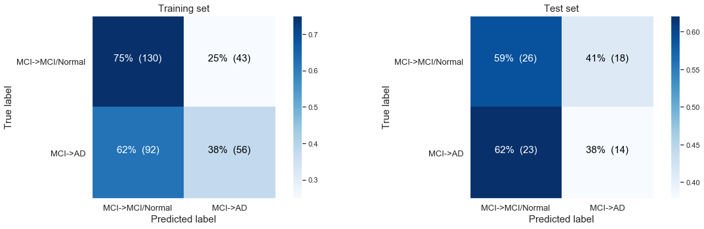
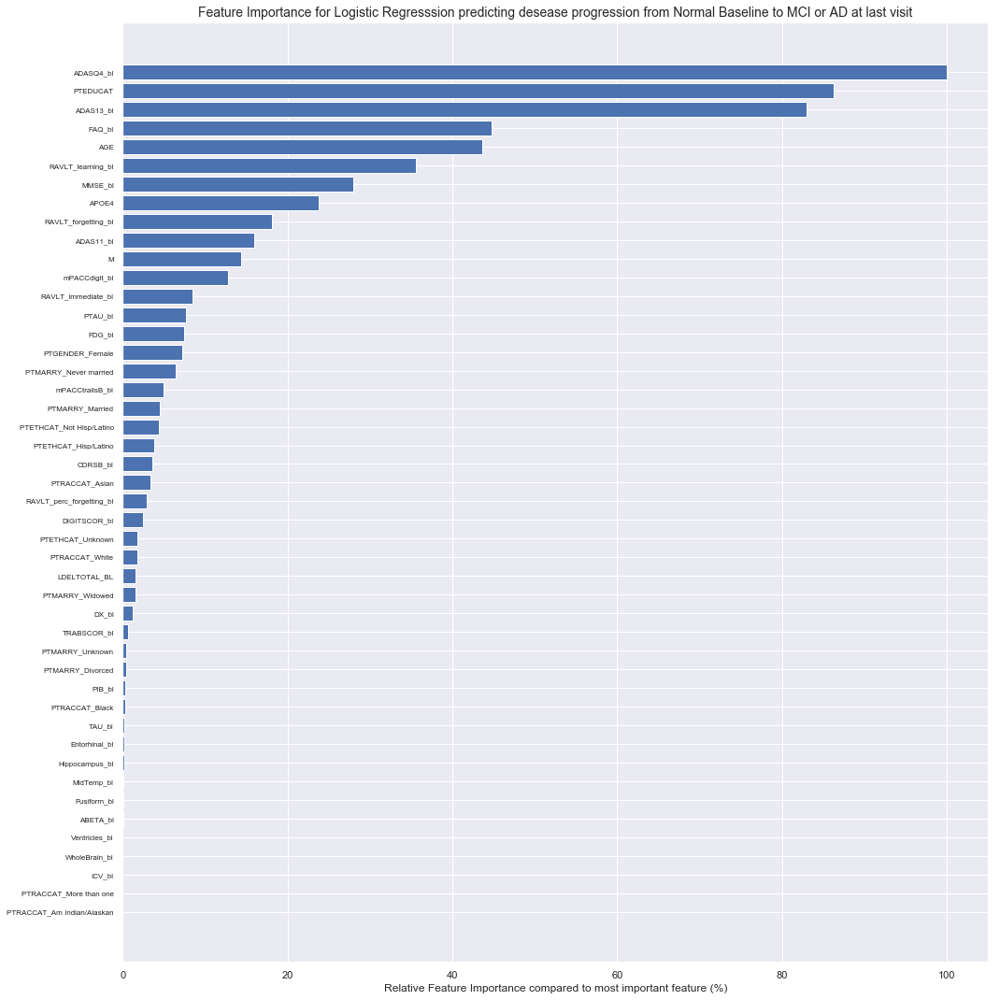
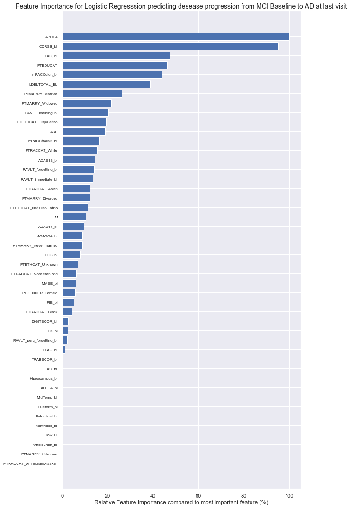
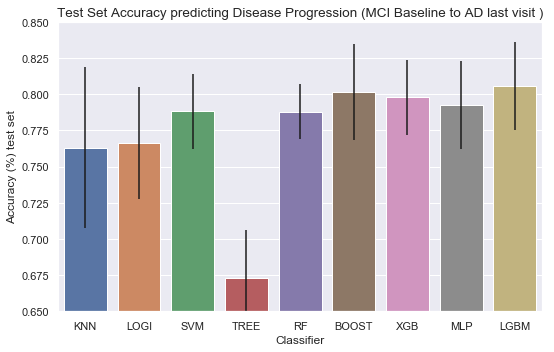

## Contents
{:.no_toc}
*  
{: toc}


# From baseline measurements and the time till the last visit we here try to predict disease progression in the future

Disease progression is defined as worsening of diagnosis on the last visit compared to the the baseline diagnosis.

# 1 Data loading, preperation and cleaning


<div>
<style scoped>
    .dataframe tbody tr th:only-of-type {
        vertical-align: middle;
    }

    .dataframe tbody tr th {
        vertical-align: top;
    }

    .dataframe thead th {
        text-align: right;
    }
</style>
<table border="1" class="dataframe">
  <thead>
    <tr style="text-align: right;">
      <th></th>
      <th>RID</th>
      <th>PTID</th>
      <th>VISCODE</th>
      <th>SITE</th>
      <th>COLPROT</th>
      <th>ORIGPROT</th>
      <th>EXAMDATE</th>
      <th>DX_bl</th>
      <th>AGE</th>
      <th>PTGENDER</th>
      <th>PTEDUCAT</th>
      <th>PTETHCAT</th>
      <th>PTRACCAT</th>
      <th>PTMARRY</th>
      <th>APOE4</th>
      <th>FDG</th>
      <th>PIB</th>
      <th>AV45</th>
      <th>ABETA</th>
      <th>TAU</th>
      <th>PTAU</th>
      <th>CDRSB</th>
      <th>ADAS11</th>
      <th>ADAS13</th>
      <th>ADASQ4</th>
      <th>MMSE</th>
      <th>RAVLT_immediate</th>
      <th>RAVLT_learning</th>
      <th>RAVLT_forgetting</th>
      <th>RAVLT_perc_forgetting</th>
      <th>LDELTOTAL</th>
      <th>DIGITSCOR</th>
      <th>TRABSCOR</th>
      <th>FAQ</th>
      <th>MOCA</th>
      <th>EcogPtMem</th>
      <th>EcogPtLang</th>
      <th>EcogPtVisspat</th>
      <th>EcogPtPlan</th>
      <th>EcogPtOrgan</th>
      <th>EcogPtDivatt</th>
      <th>EcogPtTotal</th>
      <th>EcogSPMem</th>
      <th>EcogSPLang</th>
      <th>EcogSPVisspat</th>
      <th>EcogSPPlan</th>
      <th>EcogSPOrgan</th>
      <th>EcogSPDivatt</th>
      <th>EcogSPTotal</th>
      <th>FLDSTRENG</th>
      <th>FSVERSION</th>
      <th>IMAGEUID</th>
      <th>Ventricles</th>
      <th>Hippocampus</th>
      <th>WholeBrain</th>
      <th>Entorhinal</th>
      <th>Fusiform</th>
      <th>MidTemp</th>
      <th>ICV</th>
      <th>DX</th>
      <th>mPACCdigit</th>
      <th>mPACCtrailsB</th>
      <th>EXAMDATE_bl</th>
      <th>CDRSB_bl</th>
      <th>ADAS11_bl</th>
      <th>ADAS13_bl</th>
      <th>ADASQ4_bl</th>
      <th>MMSE_bl</th>
      <th>RAVLT_immediate_bl</th>
      <th>RAVLT_learning_bl</th>
      <th>RAVLT_forgetting_bl</th>
      <th>RAVLT_perc_forgetting_bl</th>
      <th>LDELTOTAL_BL</th>
      <th>DIGITSCOR_bl</th>
      <th>TRABSCOR_bl</th>
      <th>FAQ_bl</th>
      <th>mPACCdigit_bl</th>
      <th>mPACCtrailsB_bl</th>
      <th>FLDSTRENG_bl</th>
      <th>FSVERSION_bl</th>
      <th>Ventricles_bl</th>
      <th>Hippocampus_bl</th>
      <th>WholeBrain_bl</th>
      <th>Entorhinal_bl</th>
      <th>Fusiform_bl</th>
      <th>MidTemp_bl</th>
      <th>ICV_bl</th>
      <th>MOCA_bl</th>
      <th>EcogPtMem_bl</th>
      <th>EcogPtLang_bl</th>
      <th>EcogPtVisspat_bl</th>
      <th>EcogPtPlan_bl</th>
      <th>EcogPtOrgan_bl</th>
      <th>EcogPtDivatt_bl</th>
      <th>EcogPtTotal_bl</th>
      <th>EcogSPMem_bl</th>
      <th>EcogSPLang_bl</th>
      <th>EcogSPVisspat_bl</th>
      <th>EcogSPPlan_bl</th>
      <th>EcogSPOrgan_bl</th>
      <th>EcogSPDivatt_bl</th>
      <th>EcogSPTotal_bl</th>
      <th>ABETA_bl</th>
      <th>TAU_bl</th>
      <th>PTAU_bl</th>
      <th>FDG_bl</th>
      <th>PIB_bl</th>
      <th>AV45_bl</th>
      <th>Years_bl</th>
      <th>Month_bl</th>
      <th>Month</th>
      <th>M</th>
      <th>update_stamp</th>
    </tr>
  </thead>
  <tbody>
    <tr>
      <th>0</th>
      <td>2</td>
      <td>011_S_0002</td>
      <td>bl</td>
      <td>11</td>
      <td>ADNI1</td>
      <td>ADNI1</td>
      <td>2005-09-08</td>
      <td>CN</td>
      <td>74.3</td>
      <td>Male</td>
      <td>16</td>
      <td>Not Hisp/Latino</td>
      <td>White</td>
      <td>Married</td>
      <td>0.0</td>
      <td>1.36665</td>
      <td>NaN</td>
      <td>NaN</td>
      <td>NaN</td>
      <td>NaN</td>
      <td>NaN</td>
      <td>0.0</td>
      <td>10.67</td>
      <td>18.67</td>
      <td>5.0</td>
      <td>28.0</td>
      <td>44.0</td>
      <td>4.0</td>
      <td>6.0</td>
      <td>54.5455</td>
      <td>10.0</td>
      <td>34.0</td>
      <td>112.0</td>
      <td>0.0</td>
      <td>NaN</td>
      <td>NaN</td>
      <td>NaN</td>
      <td>NaN</td>
      <td>NaN</td>
      <td>NaN</td>
      <td>NaN</td>
      <td>NaN</td>
      <td>NaN</td>
      <td>NaN</td>
      <td>NaN</td>
      <td>NaN</td>
      <td>NaN</td>
      <td>NaN</td>
      <td>NaN</td>
      <td>NaN</td>
      <td>Cross-Sectional FreeSurfer (FreeSurfer Version...</td>
      <td>35475.0</td>
      <td>118233.0</td>
      <td>8336.0</td>
      <td>1229740.0</td>
      <td>4177.0</td>
      <td>16559.0</td>
      <td>27936.0</td>
      <td>1984660.0</td>
      <td>CN</td>
      <td>-4.35795</td>
      <td>-4.15975</td>
      <td>2005-09-08</td>
      <td>0.0</td>
      <td>10.67</td>
      <td>18.67</td>
      <td>5.0</td>
      <td>28</td>
      <td>44.0</td>
      <td>4.0</td>
      <td>6.0</td>
      <td>54.5455</td>
      <td>10.0</td>
      <td>34.0</td>
      <td>112.0</td>
      <td>0.0</td>
      <td>-4.35795</td>
      <td>-4.15975</td>
      <td>NaN</td>
      <td>Cross-Sectional FreeSurfer (FreeSurfer Version...</td>
      <td>118233.0</td>
      <td>8336.0</td>
      <td>1229740.0</td>
      <td>4177.0</td>
      <td>16559.0</td>
      <td>27936.0</td>
      <td>1984660.0</td>
      <td>NaN</td>
      <td>NaN</td>
      <td>NaN</td>
      <td>NaN</td>
      <td>NaN</td>
      <td>NaN</td>
      <td>NaN</td>
      <td>NaN</td>
      <td>NaN</td>
      <td>NaN</td>
      <td>NaN</td>
      <td>NaN</td>
      <td>NaN</td>
      <td>NaN</td>
      <td>NaN</td>
      <td>NaN</td>
      <td>NaN</td>
      <td>NaN</td>
      <td>1.36665</td>
      <td>NaN</td>
      <td>NaN</td>
      <td>0.000000</td>
      <td>0.00000</td>
      <td>0</td>
      <td>0</td>
      <td>2018-11-08 22:51:22.0</td>
    </tr>
    <tr>
      <th>1</th>
      <td>3</td>
      <td>011_S_0003</td>
      <td>bl</td>
      <td>11</td>
      <td>ADNI1</td>
      <td>ADNI1</td>
      <td>2005-09-12</td>
      <td>AD</td>
      <td>81.3</td>
      <td>Male</td>
      <td>18</td>
      <td>Not Hisp/Latino</td>
      <td>White</td>
      <td>Married</td>
      <td>1.0</td>
      <td>1.08355</td>
      <td>NaN</td>
      <td>NaN</td>
      <td>741.5</td>
      <td>239.7</td>
      <td>22.83</td>
      <td>4.5</td>
      <td>22.00</td>
      <td>31.00</td>
      <td>8.0</td>
      <td>20.0</td>
      <td>22.0</td>
      <td>1.0</td>
      <td>4.0</td>
      <td>100.0000</td>
      <td>2.0</td>
      <td>25.0</td>
      <td>148.0</td>
      <td>10.0</td>
      <td>NaN</td>
      <td>NaN</td>
      <td>NaN</td>
      <td>NaN</td>
      <td>NaN</td>
      <td>NaN</td>
      <td>NaN</td>
      <td>NaN</td>
      <td>NaN</td>
      <td>NaN</td>
      <td>NaN</td>
      <td>NaN</td>
      <td>NaN</td>
      <td>NaN</td>
      <td>NaN</td>
      <td>NaN</td>
      <td>Cross-Sectional FreeSurfer (FreeSurfer Version...</td>
      <td>32237.0</td>
      <td>84599.0</td>
      <td>5319.0</td>
      <td>1129830.0</td>
      <td>1791.0</td>
      <td>15506.0</td>
      <td>18422.0</td>
      <td>1920690.0</td>
      <td>Dementia</td>
      <td>-16.58450</td>
      <td>-16.16580</td>
      <td>2005-09-12</td>
      <td>4.5</td>
      <td>22.00</td>
      <td>31.00</td>
      <td>8.0</td>
      <td>20</td>
      <td>22.0</td>
      <td>1.0</td>
      <td>4.0</td>
      <td>100.0000</td>
      <td>2.0</td>
      <td>25.0</td>
      <td>148.0</td>
      <td>10.0</td>
      <td>-16.58450</td>
      <td>-16.16580</td>
      <td>NaN</td>
      <td>Cross-Sectional FreeSurfer (FreeSurfer Version...</td>
      <td>84599.0</td>
      <td>5319.0</td>
      <td>1129830.0</td>
      <td>1791.0</td>
      <td>15506.0</td>
      <td>18422.0</td>
      <td>1920690.0</td>
      <td>NaN</td>
      <td>NaN</td>
      <td>NaN</td>
      <td>NaN</td>
      <td>NaN</td>
      <td>NaN</td>
      <td>NaN</td>
      <td>NaN</td>
      <td>NaN</td>
      <td>NaN</td>
      <td>NaN</td>
      <td>NaN</td>
      <td>NaN</td>
      <td>NaN</td>
      <td>NaN</td>
      <td>741.5</td>
      <td>239.7</td>
      <td>22.83</td>
      <td>1.08355</td>
      <td>NaN</td>
      <td>NaN</td>
      <td>0.000000</td>
      <td>0.00000</td>
      <td>0</td>
      <td>0</td>
      <td>2018-11-08 22:51:22.0</td>
    </tr>
    <tr>
      <th>2</th>
      <td>3</td>
      <td>011_S_0003</td>
      <td>m06</td>
      <td>11</td>
      <td>ADNI1</td>
      <td>ADNI1</td>
      <td>2006-03-13</td>
      <td>AD</td>
      <td>81.3</td>
      <td>Male</td>
      <td>18</td>
      <td>Not Hisp/Latino</td>
      <td>White</td>
      <td>Married</td>
      <td>1.0</td>
      <td>1.05803</td>
      <td>NaN</td>
      <td>NaN</td>
      <td>NaN</td>
      <td>NaN</td>
      <td>NaN</td>
      <td>6.0</td>
      <td>19.00</td>
      <td>30.00</td>
      <td>10.0</td>
      <td>24.0</td>
      <td>19.0</td>
      <td>2.0</td>
      <td>6.0</td>
      <td>100.0000</td>
      <td>NaN</td>
      <td>19.0</td>
      <td>135.0</td>
      <td>12.0</td>
      <td>NaN</td>
      <td>NaN</td>
      <td>NaN</td>
      <td>NaN</td>
      <td>NaN</td>
      <td>NaN</td>
      <td>NaN</td>
      <td>NaN</td>
      <td>NaN</td>
      <td>NaN</td>
      <td>NaN</td>
      <td>NaN</td>
      <td>NaN</td>
      <td>NaN</td>
      <td>NaN</td>
      <td>NaN</td>
      <td>Cross-Sectional FreeSurfer (FreeSurfer Version...</td>
      <td>31863.0</td>
      <td>88580.0</td>
      <td>5446.0</td>
      <td>1100060.0</td>
      <td>2427.0</td>
      <td>14400.0</td>
      <td>16972.0</td>
      <td>1906430.0</td>
      <td>Dementia</td>
      <td>-15.02030</td>
      <td>-13.38660</td>
      <td>2005-09-12</td>
      <td>4.5</td>
      <td>22.00</td>
      <td>31.00</td>
      <td>8.0</td>
      <td>20</td>
      <td>22.0</td>
      <td>1.0</td>
      <td>4.0</td>
      <td>100.0000</td>
      <td>2.0</td>
      <td>25.0</td>
      <td>148.0</td>
      <td>10.0</td>
      <td>-16.58450</td>
      <td>-16.16580</td>
      <td>NaN</td>
      <td>Cross-Sectional FreeSurfer (FreeSurfer Version...</td>
      <td>84599.0</td>
      <td>5319.0</td>
      <td>1129830.0</td>
      <td>1791.0</td>
      <td>15506.0</td>
      <td>18422.0</td>
      <td>1920690.0</td>
      <td>NaN</td>
      <td>NaN</td>
      <td>NaN</td>
      <td>NaN</td>
      <td>NaN</td>
      <td>NaN</td>
      <td>NaN</td>
      <td>NaN</td>
      <td>NaN</td>
      <td>NaN</td>
      <td>NaN</td>
      <td>NaN</td>
      <td>NaN</td>
      <td>NaN</td>
      <td>NaN</td>
      <td>741.5</td>
      <td>239.7</td>
      <td>22.83</td>
      <td>1.08355</td>
      <td>NaN</td>
      <td>NaN</td>
      <td>0.498289</td>
      <td>5.96721</td>
      <td>6</td>
      <td>6</td>
      <td>2018-11-08 22:51:22.0</td>
    </tr>
    <tr>
      <th>3</th>
      <td>3</td>
      <td>011_S_0003</td>
      <td>m12</td>
      <td>11</td>
      <td>ADNI1</td>
      <td>ADNI1</td>
      <td>2006-09-12</td>
      <td>AD</td>
      <td>81.3</td>
      <td>Male</td>
      <td>18</td>
      <td>Not Hisp/Latino</td>
      <td>White</td>
      <td>Married</td>
      <td>1.0</td>
      <td>1.09690</td>
      <td>NaN</td>
      <td>NaN</td>
      <td>601.4</td>
      <td>251.7</td>
      <td>24.18</td>
      <td>3.5</td>
      <td>24.00</td>
      <td>35.00</td>
      <td>10.0</td>
      <td>17.0</td>
      <td>31.0</td>
      <td>2.0</td>
      <td>7.0</td>
      <td>100.0000</td>
      <td>0.0</td>
      <td>21.0</td>
      <td>126.0</td>
      <td>17.0</td>
      <td>NaN</td>
      <td>NaN</td>
      <td>NaN</td>
      <td>NaN</td>
      <td>NaN</td>
      <td>NaN</td>
      <td>NaN</td>
      <td>NaN</td>
      <td>NaN</td>
      <td>NaN</td>
      <td>NaN</td>
      <td>NaN</td>
      <td>NaN</td>
      <td>NaN</td>
      <td>NaN</td>
      <td>NaN</td>
      <td>Cross-Sectional FreeSurfer (FreeSurfer Version...</td>
      <td>35576.0</td>
      <td>90099.0</td>
      <td>5157.0</td>
      <td>1095640.0</td>
      <td>1596.0</td>
      <td>14617.0</td>
      <td>17330.0</td>
      <td>1903820.0</td>
      <td>Dementia</td>
      <td>-21.41690</td>
      <td>-20.22380</td>
      <td>2005-09-12</td>
      <td>4.5</td>
      <td>22.00</td>
      <td>31.00</td>
      <td>8.0</td>
      <td>20</td>
      <td>22.0</td>
      <td>1.0</td>
      <td>4.0</td>
      <td>100.0000</td>
      <td>2.0</td>
      <td>25.0</td>
      <td>148.0</td>
      <td>10.0</td>
      <td>-16.58450</td>
      <td>-16.16580</td>
      <td>NaN</td>
      <td>Cross-Sectional FreeSurfer (FreeSurfer Version...</td>
      <td>84599.0</td>
      <td>5319.0</td>
      <td>1129830.0</td>
      <td>1791.0</td>
      <td>15506.0</td>
      <td>18422.0</td>
      <td>1920690.0</td>
      <td>NaN</td>
      <td>NaN</td>
      <td>NaN</td>
      <td>NaN</td>
      <td>NaN</td>
      <td>NaN</td>
      <td>NaN</td>
      <td>NaN</td>
      <td>NaN</td>
      <td>NaN</td>
      <td>NaN</td>
      <td>NaN</td>
      <td>NaN</td>
      <td>NaN</td>
      <td>NaN</td>
      <td>741.5</td>
      <td>239.7</td>
      <td>22.83</td>
      <td>1.08355</td>
      <td>NaN</td>
      <td>NaN</td>
      <td>0.999316</td>
      <td>11.96720</td>
      <td>12</td>
      <td>12</td>
      <td>2018-11-08 22:51:22.0</td>
    </tr>
  </tbody>
</table>
</div>


```python
# All the different visits for our first patient ID
#df[df.PTID=='011_S_0002' ]['M']
```


```python
indexes_last_visit=[]
for patient_ids in df.PTID.unique():
  latest_visit_M=df[df.PTID==patient_ids]['M'].max()
  d=df[ df.PTID==patient_ids ]['M']== latest_visit_M
  ind=d.index[-1]
  indexes_last_visit.append(ind);
  
# Only last visits
df_last=df.loc[indexes_last_visit]
```


We look when the last visit occors for different groups:
- Based on Diagnosis groups of the first visit (left graph)
 - People with AD at baseline only stayed 2.5 year at the most in our data set.
 - For Normal and MCI patients there were less obvious differences.
- Based on Diagnosis groups of the last visit (right graph)
 - All groups of diagnosis at the last visit have their last visits at similar times. No obvious difference between Dementia/Alzheimer and MCI or Normal diagnosed patients at the last visit.


## 1.2 Data cleaning: we keep only baseline measurments plus the time and the diagnosis of the last visit.
- Dropping meaningless and duplicate features 
- Keep all features of baseline visit
- Drop all features of the last visit measurements except time till last visit and diagnosis


## 1.3 Imputation: Missing value imputation by 5 KNN


# 2 Base Logistic Regression Model

We are splitting in a training set (80%) and test set (20%).


## 2.1 Basic Naive Logistic model only taking into account time till last visit

- Left graph: Disease progression from Normal Baseline to MCI/AD progression on last visit:
 - More progression from normal to MCI or AD after a long time (late last visit); might just be explained by time.
- Right graph: Disease progression from MCI baseline to AD at the last visit.
 - For MCI to AD no real difference in distribution of people with disease progression and stabile disease. 


### 2.1.1 Logistic Regression Disease progression model for baseline normal patients based only on time till last visit

- **The following confusion matrix**: Modeling the disease progression from Normal Baseline progressing to MCI/AD only based on time till last visit.


    
    Simple logistic regression modeling with the CLASS WEIGHTS NON BALANCED
    
    Logistic Regresssion predicting desease progression from Normal Baseline to MCI or AD at last visit
    Training accuracy: 	0.80 , Test accuracy: 	0.63
    


It is more likely for people to stay stabile: 147 stabile versus 36 with disease progression in our training set. If we don't balance for the very unequal classes we end up with a very basic model always "predicting" a person will stay stabile. This is very possible since here we only use the time till the last visit as a variable.

- **The following confusion matrix**: We get a better model when we balance the unequal size groups (by the option ```class_weight='balanced'```) Here we see we are now predicting the people that are showing disease progression, yet of the cost of more False Positives and with very low discrimitive power.


    
    Simple logistic regression modeling with the CLASS WEIGHTS  BALANCED
    
    Logistic Regresssion predicting desease progression from Normal Baseline to MCI or AD at last visit
    Training accuracy: 	0.70 , Test accuracy: 	0.70
    





### 2.1.2  Logistic Regression Disease progression model for baseline MCI patients based only on time till last visit

- **The following confusion matrix**: Modelling non-balanced, MCI Baseline, progressing to AD only based on time till last visit


    
    Simple logistic regression modeling with the CLASS WEIGHTS NON BALANCED
    
    Logistic Regresssion predicting desease progression from MCI Baseline to AD at last visit
    Training accuracy: 	0.58 , Test accuracy: 	0.49
    


**The following confusion matrix**: Modelling balanced, MCI Baseline, progressing to AD only based on time till last visit, yet now again with balanced class.


    
    Simple logistic regression modeling with the CLASS WEIGHTS BALANCED
    
    Logistic Regresssion predicting desease progression from MCI Baseline to AD at last visit
    Training accuracy: 	0.61 , Test accuracy: 	0.54
    


## 2.2 Logistic model  taking into account all baseline measurements and time till last visit

### 2.2.1 Modelling Normal Baseline patients progressing to MCI/AD taking into account all baseline measurements and time till last visit 
- Balanced for the unequal classes


    
    Simple logistic regression modeling with the CLASS WEIGHTS NON BALANCED
    
    Logistic Regresssion predicting desease progression from Normal Baseline to MCI or AD at last visit
    Training accuracy: 	0.75 , Test accuracy: 	0.63
    





### 2.2.1 Modelling MCI Baseline patients progressing to AD taking into account all baseline measurements and time till last visit
- Balanced for the unequal classes


    
    Simple logistic regression modeling with the CLASS WEIGHTS NON BALANCED
    
    Logistic Regresssion predicting desease progression from Normal Baseline to MCI or AD at last visit
    Training accuracy: 	0.76 , Test accuracy: 	0.63
    


    1. M: 			 Months after BL
    2. RAVLT_perc_forget: 	 Percentage forgetting during Reys Auditory Verbal Learning Test
    3. FAQ_bl: 		 Functinoal Activities Questionnaire score at BL
    





# 3 Advanced Model Testing with 4-fold Cross Validation Scoring Reporting with internal CV parameter optimization within training fold

### 3.1 Parameter Optimisation and Cross Validation

- Parameters were optimised by a grid search on specific parameter values using a 3-fold cross-validation on the 75 percent training cohort to determine which parameter values led to the best performance. 
- For quantification of this 3-fold cross-validation (CV) the accuracy was used as the scoring function. 
- After this three-fold CV, the best set of parameters was used to train a model on the full 75% training set, and this model was validated on the remaining 25% percent test cohort.
- At the end we present the average and standard deviation of the accuracy, precision, recall, sensitivity, AUROC etc. of these 4 outer Cross Validations.

**Cross-validation setting:** 
- 4-fold cross validation ( so averages on these 4 test sets will be reported )
- Within every training fold of cross validation we do an internal 3-fold CV to optimise the parameters

**Illustrated example of Parameter Optimization:**
- Model:
 - LogisticRegression(random_state = 1, solver = 'liblinear', class_weight = 'balanced')
- Tested Estimator_parameters 
 - 'C': [0.001, 0.01, 0.1, 1, 10, 100, 1000]


    All 4 PARAMETER OPTIMISATIONS AND CROSS VALIDATIONS OF THE "KNeighborsClassifier" ALGORITHM
    
    This is optimisation and CV number 1  	----------------------------------------------------------------------------
    Mean scores: 				[0.7133 0.71   0.72   0.71   0.72   0.71   0.7133]
    Differences best - other scores:	[0.0067 0.01   0.     0.01   0.     0.01   0.0067]
    The best paremeters set was	 	Set 3: {'C': 0.1}
    Validation Accuracy score: 		[0.69]
    
    This is optimisation and CV number 2  	----------------------------------------------------------------------------
    Mean scores: 				[0.7086 0.7086 0.6954 0.6887 0.6954 0.6887 0.7152]
    Differences best - other scores:	[0.0066 0.0066 0.0199 0.0265 0.0199 0.0265 0.    ]
    The best paremeters set was	 	Set 7: {'C': 1000}
    Validation Accuracy score: 		[0.69 0.73]
    
    This is optimisation and CV number 3  	----------------------------------------------------------------------------
    Mean scores: 				[0.6788 0.6921 0.6854 0.6821 0.6987 0.6821 0.6821]
    Differences best - other scores:	[0.0199 0.0066 0.0132 0.0166 0.     0.0166 0.0166]
    The best paremeters set was	 	Set 5: {'C': 10}
    Validation Accuracy score: 		[0.69 0.73 0.72]
    
    This is optimisation and CV number 4  	----------------------------------------------------------------------------
    Mean scores: 				[0.6987 0.7053 0.6987 0.6987 0.6921 0.7053 0.6854]
    Differences best - other scores:	[0.0066 0.     0.0066 0.0066 0.0132 0.     0.0199]
    The best paremeters set was	 	Set 2: {'C': 0.01}
    Validation Accuracy score: 		[0.69 0.73 0.72 0.7 ]


Here we see a print of all the 4 Cross validations, the accuracy scores with also the best set of paremeters in this run. We see that with every CV run we add a value of the outer validation accuaracy to the last list that is printed.


    ____________________________________________________________________________________________________________________
    
    Average of 4 splits mean_test_score for all 8 parameter sets:
    [0.7 0.7 0.7 0.7 0.7 0.7 0.7]
    Differences best Average - Average for all 8 parameter sets:
    [0.01 0.   0.   0.01 0.   0.01 0.01]
    Best Average mean_test_score = 0.7 for the 2th parameter: {'C': 0.01}
    Best Parameter Set for all 4 splits: [3, 7, 5, 2]
    Occurences of all 8 parameters as Best Parameter Set in a split: Counter({3: 1, 7: 1, 5: 1, 2: 1})


After the for runs of cross validation and parameter optimization we see that our second parameter $C=0.01$ is performing the best. It has the best mean test score from all the tested values for $C=[0.001,0.01,0.1,1,10,100,1000]$ that were tested.

### 3.2 Model Performance and Area Under The Receiver Operating Characteristic Curve


    ____________________________________________________________________________________________________________________
    
    Estimator : All 4 Accuracy Scores of validation on the outer test set with
    the estimator with the optimised parameters trained on the inner test set: 
    
    [0.68627451 0.73       0.72       0.7       ]
    
    		Avg 	(+- STD  )
    		-----------------
    Accuracy: 	0.709 	(+- 0.017) 


<div>
<style scoped>
    .dataframe tbody tr th:only-of-type {
        vertical-align: middle;
    }

    .dataframe tbody tr th {
        vertical-align: top;
    }

    .dataframe thead th {
        text-align: right;
    }
</style>
<table border="1" class="dataframe">
  <thead>
    <tr style="text-align: right;">
      <th></th>
      <th>Logistic_mu</th>
      <th>Logistic_std</th>
    </tr>
  </thead>
  <tbody>
    <tr>
      <th>Average Precision</th>
      <td>0.76</td>
      <td>0.02</td>
    </tr>
    <tr>
      <th>AUROC</th>
      <td>0.78</td>
      <td>0.01</td>
    </tr>
    <tr>
      <th>Precision</th>
      <td>0.68</td>
      <td>0.03</td>
    </tr>
    <tr>
      <th>Recall</th>
      <td>0.70</td>
      <td>0.08</td>
    </tr>
    <tr>
      <th>F1_Score</th>
      <td>0.69</td>
      <td>0.03</td>
    </tr>
    <tr>
      <th>Sensitivity</th>
      <td>0.70</td>
      <td>0.08</td>
    </tr>
    <tr>
      <th>Specificity</th>
      <td>0.72</td>
      <td>0.06</td>
    </tr>
    <tr>
      <th>Accuracy</th>
      <td>0.71</td>
      <td>0.02</td>
    </tr>
  </tbody>
</table>
</div>


### The actual Parameter Optimisation and 5-fold CV wrapped in a function


```python
def CV_and_Parameter_Optimization(X_CV, y_CV, splits, Estimator, Estimator_parameters):
  # All 10 parameter optimisations and cross validations of a certain Classifier
  strat_kfold_external = StratifiedKFold(n_splits=splits, shuffle=True, random_state=1)
  splitted_indexes_external = strat_kfold_external.split(X_CV, y_CV)
  params= [len(Estimator_parameters[param]) for param in Estimator_parameters]
  total_params= np.prod(params)
  best_index=[]
  Sum=[0]*total_params
  AP_Score =np.array([])
  ROC_Score =np.array([])
  Prec_Score =np.array([])
  Recall_Score =np.array([])
  F1_Score =np.array([])
  Sens_Score =np.array([])
  Spec_Score =np.array([])
  Accuracy_Score =np.array([])

  best_predictions_all=np.array([])
  test_all=np.array([])
  i=1
  for train_index_external, test_index_external in splitted_indexes_external:
      print("This is parameter optimisation and CV number {} ... \t{}".format(i, Accuracy_Score))
      i=i+1
      # take i’th fold as test set and the other 3 folds together as training set
      X_train, X_test = X_CV.iloc[train_index_external], X_CV.iloc[test_index_external]
      y_train, y_test = y_CV.iloc[train_index_external], y_CV.iloc[test_index_external]    
      # take the training set and split it randomly (stratified) 
      # in an inner training set of 2/3 size and an inner validation set of 1/3 size

      # for each of the ML methods
      # for each combination of parameter values
      # train the ML method with specified parameters on inner training set and validate on inner validation set
      # take the combination of parameter values that yields highest performance (e.g. area under PR curve), 
      # also write down this parameter value combination train the ML method with best parameter values on
      # the (outer) training set and test on the (outer) test set

      mod=clone(Estimator)
      optimisation_param_AP = GridSearchCV(estimator=mod, param_grid=Estimator_parameters, cv=3, verbose=0, scoring='accuracy')
      optimisation_param_AP.fit(X_train, y_train)
      best_index.append(optimisation_param_AP.best_index_+1)
      Sum=Sum+(optimisation_param_AP.cv_results_['mean_test_score']).round(2)

      # Building Estimator with best parameters
      best= optimisation_param_AP.best_estimator_
      best.fit(X_train, y_train)
      best_predictions = best.predict_proba(X_test)[:,1]
      best_predictions=best_predictions
      Average_precision_score=average_precision_score(y_test, best_predictions)
      best_predictions_binary =  best.predict(X_test)
      t=confusion_matrix(y_test, best_predictions_binary)
      sensitivity=(t[1][1]/(t[1][0]+t[1][1]))
      specificity=(t[0][0]/(t[0][1]+t[0][0]))
      AP_Score =np.append(AP_Score , Average_precision_score)
      ROC_Score =np.append(ROC_Score , roc_auc_score(y_test, best_predictions))
      Prec_Score =np.append(Prec_Score , precision_score(y_test, best_predictions_binary))
      Recall_Score =np.append(Recall_Score , recall_score(y_test, best_predictions_binary))
      F1_Score =np.append(F1_Score , f1_score(y_test, best_predictions_binary))
      Sens_Score =np.append(Sens_Score , sensitivity)
      Spec_Score =np.append(Spec_Score , specificity)
      Accuracy_Score =np.append(Accuracy_Score , accuracy_score(y_test, best_predictions_binary))

      best_predictions_all=np.append(best_predictions_all,best_predictions)
      test_all=np.append(test_all,y_test)
  
  print('Done: Validation Accuracy score: \t\t\t{}'.format(Accuracy_Score .round(3)))
  return AP_Score,  ROC_Score,  Prec_Score,  Recall_Score,  F1_Score,  Sens_Score, Spec_Score, Accuracy_Score,  best_predictions_all, test_all
```


    This is parameter optimisation and CV number 1 ... 	[]
    This is parameter optimisation and CV number 2 ... 	[0.69607843]
    This is parameter optimisation and CV number 3 ... 	[0.69607843 0.73      ]
    This is parameter optimisation and CV number 4 ... 	[0.69607843 0.73       0.72      ]
    Done: Validation Accuracy score: 			[0.696 0.73  0.72  0.72 ]


<div>
<style scoped>
    .dataframe tbody tr th:only-of-type {
        vertical-align: middle;
    }

    .dataframe tbody tr th {
        vertical-align: top;
    }

    .dataframe thead th {
        text-align: right;
    }
</style>
<table border="1" class="dataframe">
  <thead>
    <tr style="text-align: right;">
      <th></th>
      <th>0 Logistic_mu_default</th>
      <th>a Logistic_std_default</th>
    </tr>
  </thead>
  <tbody>
    <tr>
      <th>Average Precision</th>
      <td>0.75</td>
      <td>0.01</td>
    </tr>
    <tr>
      <th>AUROC</th>
      <td>0.78</td>
      <td>0.01</td>
    </tr>
    <tr>
      <th>Precision</th>
      <td>0.69</td>
      <td>0.03</td>
    </tr>
    <tr>
      <th>Recall</th>
      <td>0.71</td>
      <td>0.07</td>
    </tr>
    <tr>
      <th>F1_Score</th>
      <td>0.70</td>
      <td>0.02</td>
    </tr>
    <tr>
      <th>Sensitivity</th>
      <td>0.71</td>
      <td>0.07</td>
    </tr>
    <tr>
      <th>Specificity</th>
      <td>0.72</td>
      <td>0.06</td>
    </tr>
    <tr>
      <th>Accuracy</th>
      <td>0.72</td>
      <td>0.01</td>
    </tr>
  </tbody>
</table>
</div>


## 3.3 Model Performance testing for Baseline patients progressing to MCI or AD.

**Paramater optimization and CV for the following tested algorithms:**

- KNN
- Logistic Regression
- Decision Tree Classifier
- Random Forest
- Gradient Boosting
- XGBoost
- Multi-layer Perceptron
- Light-GBM

#### 3.3.1 KNN 
``` class sklearn.neighbors.KNeighborsClassifier(n_neighbors=5, weights='uniform', algorithm='auto', 
 leaf_size=30, p=2, metric='minkowski', metric_params=None, n_jobs=1, **kwargs)````

Test parameters:
- n_neighbors: 1, 3, 5, 9
- p: 1, 2 (manhattan and euclidean distance)


```python
# X_1 and y_1 are people with baseline normal Diagnosis
X_CV  = X_1 
y_CV  = y_1

# Scaling to a 0 to 1 scale
X_std = (X_CV - X_CV.min(axis=0)) / (X_CV.max(axis=0) - X_CV.min(axis=0))
X_CV  = X_std.dropna(axis=1).copy()

KNN_parameters = {'p':[1,2], 'n_neighbors':[1, 3, 5, 9]}
KNN = KNeighborsClassifier(weights='distance')
```


    This is parameter optimisation and CV number 1 ... 	[]
    This is parameter optimisation and CV number 2 ... 	[0.77586207]
    This is parameter optimisation and CV number 3 ... 	[0.77586207 0.78947368]
    This is parameter optimisation and CV number 4 ... 	[0.77586207 0.78947368 0.73684211]
    Done: Validation Accuracy score: 			[0.776 0.789 0.737 0.754]


<div>
<style scoped>
    .dataframe tbody tr th:only-of-type {
        vertical-align: middle;
    }

    .dataframe tbody tr th {
        vertical-align: top;
    }

    .dataframe thead th {
        text-align: right;
    }
</style>
<table border="1" class="dataframe">
  <thead>
    <tr style="text-align: right;">
      <th></th>
      <th>1 KNN_mu</th>
      <th>1 KNN_std</th>
    </tr>
  </thead>
  <tbody>
    <tr>
      <th>Average Precision</th>
      <td>0.31</td>
      <td>0.06</td>
    </tr>
    <tr>
      <th>AUROC</th>
      <td>0.52</td>
      <td>0.03</td>
    </tr>
    <tr>
      <th>Precision</th>
      <td>0.58</td>
      <td>0.43</td>
    </tr>
    <tr>
      <th>Recall</th>
      <td>0.06</td>
      <td>0.03</td>
    </tr>
    <tr>
      <th>F1_Score</th>
      <td>0.10</td>
      <td>0.06</td>
    </tr>
    <tr>
      <th>Sensitivity</th>
      <td>0.06</td>
      <td>0.03</td>
    </tr>
    <tr>
      <th>Specificity</th>
      <td>0.98</td>
      <td>0.02</td>
    </tr>
    <tr>
      <th>Accuracy</th>
      <td>0.76</td>
      <td>0.02</td>
    </tr>
  </tbody>
</table>
</div>


#### 3.3.2 Logistic Regression
```class sklearn.linear_model.LogisticRegression(penalty=’l2’, dual=False, tol=0.0001,  C=1.0, fit_intercept=True, intercept_scaling=1, class_weight=None, random_state=None,  solver=’liblinear’, max_iter=100, multi_class=’ovr’, verbose=0, warm_start=False, n_jobs=1)```

Test parameters:
- solver : {‘newton-cg’, ‘lbfgs’, ‘liblinear’, ‘sag’, ‘saga’},
- C: 0.001,0.01,0.1,1,10,100,1000 


```python
LOGI_parameters = {'C':[0.001,0.01,0.1,1,10,100,1000] }
LOGI =LogisticRegression(random_state=1,max_iter=1000,tol=5e-4, solver='liblinear', class_weight='balanced')
```


    This is parameter optimisation and CV number 1 ... 	[]
    This is parameter optimisation and CV number 2 ... 	[0.72413793]
    This is parameter optimisation and CV number 3 ... 	[0.72413793 0.80701754]
    This is parameter optimisation and CV number 4 ... 	[0.72413793 0.80701754 0.56140351]
    Done: Validation Accuracy score: 			[0.724 0.807 0.561 0.684]


<div>
<style scoped>
    .dataframe tbody tr th:only-of-type {
        vertical-align: middle;
    }

    .dataframe tbody tr th {
        vertical-align: top;
    }

    .dataframe thead th {
        text-align: right;
    }
</style>
<table border="1" class="dataframe">
  <thead>
    <tr style="text-align: right;">
      <th></th>
      <th>1 KNN_mu</th>
      <th>1 KNN_std</th>
      <th>2 LOGI_mu</th>
      <th>2 LOGI_std</th>
    </tr>
  </thead>
  <tbody>
    <tr>
      <th>Average Precision</th>
      <td>0.31</td>
      <td>0.06</td>
      <td>0.44</td>
      <td>0.09</td>
    </tr>
    <tr>
      <th>AUROC</th>
      <td>0.52</td>
      <td>0.03</td>
      <td>0.72</td>
      <td>0.09</td>
    </tr>
    <tr>
      <th>Precision</th>
      <td>0.58</td>
      <td>0.43</td>
      <td>0.41</td>
      <td>0.12</td>
    </tr>
    <tr>
      <th>Recall</th>
      <td>0.06</td>
      <td>0.03</td>
      <td>0.60</td>
      <td>0.15</td>
    </tr>
    <tr>
      <th>F1_Score</th>
      <td>0.10</td>
      <td>0.06</td>
      <td>0.48</td>
      <td>0.12</td>
    </tr>
    <tr>
      <th>Sensitivity</th>
      <td>0.06</td>
      <td>0.03</td>
      <td>0.60</td>
      <td>0.15</td>
    </tr>
    <tr>
      <th>Specificity</th>
      <td>0.98</td>
      <td>0.02</td>
      <td>0.72</td>
      <td>0.09</td>
    </tr>
    <tr>
      <th>Accuracy</th>
      <td>0.76</td>
      <td>0.02</td>
      <td>0.69</td>
      <td>0.09</td>
    </tr>
  </tbody>
</table>
</div>


#### 3.3.3 SVM
``` class sklearn.svm.SVC(C=1.0, kernel=’rbf’, degree=3, gamma=’auto’, coef0=0.0, shrinking=True, probability=False, tol=0.001, cache_size=200, class_weight=None, verbose=False, max_iter=-1, decision_function_shape=’ovr’, random_state=None) ```

Test parameters:
-  C: 0.001,0.01,0.1,1,10,100,1000 
- gamma = 0.001,0.01,0.1,1


```python
SVC_parameters = {'C':[0.1,1,10], 'gamma':[0.01,0.1,1] }
svc=SVC(probability=True,random_state=1,class_weight='balanced', cache_size=20000,kernel='rbf')
```


    This is parameter optimisation and CV number 1 ... 	[]
    This is parameter optimisation and CV number 2 ... 	[0.70689655]
    This is parameter optimisation and CV number 3 ... 	[0.70689655 0.78947368]
    This is parameter optimisation and CV number 4 ... 	[0.70689655 0.78947368 0.64912281]
    Done: Validation Accuracy score: 			[0.707 0.789 0.649 0.737]


```python
d['3 SVC_mu'] = [SVC_AP.mean(),  SVC_ROC.mean(),  SVC_Prec.mean(),  SVC_Recall.mean(),  SVC_F1.mean(),  SVC_Sens.mean(), SVC_Spec.mean(), SVC_Accuracy.mean()]
d['3 SVC_std'] = [SVC_AP.std(),  SVC_ROC.std(),  SVC_Prec.std(),  SVC_Recall.std(),  SVC_F1.std(),  SVC_Sens.std(), SVC_Spec.std(), SVC_Accuracy.std()]
df = pd.DataFrame(data=d, index=Names)
df.round(2)
```


    SVC never converges...


#### 3.3.4 Decision Tree
```class sklearn.tree.DecisionTreeClassifier(criterion=’gini’, splitter=’best’, max_depth=None, min_samples_split=2, min_samples_leaf=1, min_weight_fraction_leaf=0.0, max_features=None, random_state=None, max_leaf_nodes=None, min_impurity_decrease=0.0, min_impurity_split=None, class_weight=None, presort=False)```

Test parameters:
- max depth = 2, 3, 4, ..., 13, 14, 15


```python
TREE_parameters ={ 'max_depth':range(2,15,2) }    
TREE = DecisionTreeClassifier(random_state=1)
```


    This is parameter optimisation and CV number 1 ... 	[]
    This is parameter optimisation and CV number 2 ... 	[0.70689655]
    This is parameter optimisation and CV number 3 ... 	[0.70689655 0.75438596]
    This is parameter optimisation and CV number 4 ... 	[0.70689655 0.75438596 0.70175439]
    Done: Validation Accuracy score: 			[0.707 0.754 0.702 0.667]


<div>
<style scoped>
    .dataframe tbody tr th:only-of-type {
        vertical-align: middle;
    }

    .dataframe tbody tr th {
        vertical-align: top;
    }

    .dataframe thead th {
        text-align: right;
    }
</style>
<table border="1" class="dataframe">
  <thead>
    <tr style="text-align: right;">
      <th></th>
      <th>1 KNN_mu</th>
      <th>1 KNN_std</th>
      <th>2 LOGI_mu</th>
      <th>2 LOGI_std</th>
      <th>3 SVC_mu</th>
      <th>3 SVC_std</th>
      <th>4 TREE_mu</th>
      <th>4 TREE_std</th>
    </tr>
  </thead>
  <tbody>
    <tr>
      <th>Average Precision</th>
      <td>0.31</td>
      <td>0.06</td>
      <td>0.44</td>
      <td>0.09</td>
      <td>0.32</td>
      <td>0.05</td>
      <td>0.28</td>
      <td>0.02</td>
    </tr>
    <tr>
      <th>AUROC</th>
      <td>0.52</td>
      <td>0.03</td>
      <td>0.72</td>
      <td>0.09</td>
      <td>0.58</td>
      <td>0.02</td>
      <td>0.58</td>
      <td>0.02</td>
    </tr>
    <tr>
      <th>Precision</th>
      <td>0.58</td>
      <td>0.43</td>
      <td>0.41</td>
      <td>0.12</td>
      <td>0.45</td>
      <td>0.32</td>
      <td>0.33</td>
      <td>0.08</td>
    </tr>
    <tr>
      <th>Recall</th>
      <td>0.06</td>
      <td>0.03</td>
      <td>0.60</td>
      <td>0.15</td>
      <td>0.15</td>
      <td>0.10</td>
      <td>0.24</td>
      <td>0.09</td>
    </tr>
    <tr>
      <th>F1_Score</th>
      <td>0.10</td>
      <td>0.06</td>
      <td>0.48</td>
      <td>0.12</td>
      <td>0.19</td>
      <td>0.07</td>
      <td>0.27</td>
      <td>0.08</td>
    </tr>
    <tr>
      <th>Sensitivity</th>
      <td>0.06</td>
      <td>0.03</td>
      <td>0.60</td>
      <td>0.15</td>
      <td>0.15</td>
      <td>0.10</td>
      <td>0.24</td>
      <td>0.09</td>
    </tr>
    <tr>
      <th>Specificity</th>
      <td>0.98</td>
      <td>0.02</td>
      <td>0.72</td>
      <td>0.09</td>
      <td>0.89</td>
      <td>0.09</td>
      <td>0.85</td>
      <td>0.05</td>
    </tr>
    <tr>
      <th>Accuracy</th>
      <td>0.76</td>
      <td>0.02</td>
      <td>0.69</td>
      <td>0.09</td>
      <td>0.72</td>
      <td>0.05</td>
      <td>0.71</td>
      <td>0.03</td>
    </tr>
  </tbody>
</table>
</div>


#### 3.3.5 Random Forest

```class sklearn.ensemble.RandomForestClassifier(n_estimators=10->100, criterion='gini', 
max_depth=None, min_samples_split=2, min_samples_leaf=1, min_weight_fraction_leaf=0.0, 
max_features='auto', max_leaf_nodes=None, min_impurity_split=1e-07, bootstrap=True, 
oob_score=False, n_jobs=1, random_state=None, verbose=0, warm_start=False, class_weight=None)```

Test parameters:
- n_estimators: 50, 100, 500
- max_features: sqrt(#features), log2(#features):
    #If “sqrt”, then max_features=sqrt(n_features) (same as “auto”).
    #If “log2”, then max_features=log2(n_features).
- min_samples_leaf: 1, 5


```python
RF_parameters = {'n_estimators':[50, 100, 500], 'max_features':('sqrt', 'log2'), 'min_samples_leaf':[1, 5]}
RF = RandomForestClassifier(random_state=1)
```


    This is parameter optimisation and CV number 1 ... 	[]
    This is parameter optimisation and CV number 2 ... 	[0.74137931]
    This is parameter optimisation and CV number 3 ... 	[0.74137931 0.77192982]
    This is parameter optimisation and CV number 4 ... 	[0.74137931 0.77192982 0.70175439]
    Done: Validation Accuracy score: 			[0.741 0.772 0.702 0.754]


<div>
<style scoped>
    .dataframe tbody tr th:only-of-type {
        vertical-align: middle;
    }

    .dataframe tbody tr th {
        vertical-align: top;
    }

    .dataframe thead th {
        text-align: right;
    }
</style>
<table border="1" class="dataframe">
  <thead>
    <tr style="text-align: right;">
      <th></th>
      <th>1 KNN_mu</th>
      <th>1 KNN_std</th>
      <th>2 LOGI_mu</th>
      <th>2 LOGI_std</th>
      <th>3 SVC_mu</th>
      <th>3 SVC_std</th>
      <th>4 TREE_mu</th>
      <th>4 TREE_std</th>
      <th>5 RF_mu</th>
      <th>5 RF_std</th>
    </tr>
  </thead>
  <tbody>
    <tr>
      <th>Average Precision</th>
      <td>0.31</td>
      <td>0.06</td>
      <td>0.44</td>
      <td>0.09</td>
      <td>0.32</td>
      <td>0.05</td>
      <td>0.28</td>
      <td>0.02</td>
      <td>0.36</td>
      <td>0.10</td>
    </tr>
    <tr>
      <th>AUROC</th>
      <td>0.52</td>
      <td>0.03</td>
      <td>0.72</td>
      <td>0.09</td>
      <td>0.58</td>
      <td>0.02</td>
      <td>0.58</td>
      <td>0.02</td>
      <td>0.61</td>
      <td>0.07</td>
    </tr>
    <tr>
      <th>Precision</th>
      <td>0.58</td>
      <td>0.43</td>
      <td>0.41</td>
      <td>0.12</td>
      <td>0.45</td>
      <td>0.32</td>
      <td>0.33</td>
      <td>0.08</td>
      <td>0.10</td>
      <td>0.17</td>
    </tr>
    <tr>
      <th>Recall</th>
      <td>0.06</td>
      <td>0.03</td>
      <td>0.60</td>
      <td>0.15</td>
      <td>0.15</td>
      <td>0.10</td>
      <td>0.24</td>
      <td>0.09</td>
      <td>0.04</td>
      <td>0.07</td>
    </tr>
    <tr>
      <th>F1_Score</th>
      <td>0.10</td>
      <td>0.06</td>
      <td>0.48</td>
      <td>0.12</td>
      <td>0.19</td>
      <td>0.07</td>
      <td>0.27</td>
      <td>0.08</td>
      <td>0.06</td>
      <td>0.10</td>
    </tr>
    <tr>
      <th>Sensitivity</th>
      <td>0.06</td>
      <td>0.03</td>
      <td>0.60</td>
      <td>0.15</td>
      <td>0.15</td>
      <td>0.10</td>
      <td>0.24</td>
      <td>0.09</td>
      <td>0.04</td>
      <td>0.07</td>
    </tr>
    <tr>
      <th>Specificity</th>
      <td>0.98</td>
      <td>0.02</td>
      <td>0.72</td>
      <td>0.09</td>
      <td>0.89</td>
      <td>0.09</td>
      <td>0.85</td>
      <td>0.05</td>
      <td>0.95</td>
      <td>0.04</td>
    </tr>
    <tr>
      <th>Accuracy</th>
      <td>0.76</td>
      <td>0.02</td>
      <td>0.69</td>
      <td>0.09</td>
      <td>0.72</td>
      <td>0.05</td>
      <td>0.71</td>
      <td>0.03</td>
      <td>0.74</td>
      <td>0.03</td>
    </tr>
  </tbody>
</table>
</div>


#### 3.3.6 Gradient boosting
``` class sklearn.ensemble.GradientBoostingClassifier(loss='deviance', learning_rate=0.1, n_estimators=100, subsample=1.0, criterion='friedman_mse', min_samples_split=2, min_samples_leaf=1, min_weight_fraction_leaf=0.0, 
 max_depth=3, min_impurity_split=1e-07, init=None, random_state=None, max_features=None, verbose=0, max_leaf_nodes=None, warm_start=False, presort='auto')```

Test parameters:
- n_estimators: 50, 100, 500 
- max_leaf_nodes= 2, 4, 8, 16 
- learning_rate = 1, 0.5, 0.1, 0.05, 0.01


```python
BOOST_parameters = {'n_estimators':[50,100,500],'max_leaf_nodes':[2,4,8,16],'learning_rate':[1, 0.5, 0.1, 0.05, 0.01]}
BOOST=GradientBoostingClassifier(random_state=1)
```


    This is parameter optimisation and CV number 1 ... 	[]
    This is parameter optimisation and CV number 2 ... 	[0.74137931]
    This is parameter optimisation and CV number 3 ... 	[0.74137931 0.80701754]
    This is parameter optimisation and CV number 4 ... 	[0.74137931 0.80701754 0.63157895]
    Done: Validation Accuracy score: 			[0.741 0.807 0.632 0.772]


<div>
<style scoped>
    .dataframe tbody tr th:only-of-type {
        vertical-align: middle;
    }

    .dataframe tbody tr th {
        vertical-align: top;
    }

    .dataframe thead th {
        text-align: right;
    }
</style>
<table border="1" class="dataframe">
  <thead>
    <tr style="text-align: right;">
      <th></th>
      <th>1 KNN_mu</th>
      <th>1 KNN_std</th>
      <th>2 LOGI_mu</th>
      <th>2 LOGI_std</th>
      <th>3 SVC_mu</th>
      <th>3 SVC_std</th>
      <th>4 TREE_mu</th>
      <th>4 TREE_std</th>
      <th>5 RF_mu</th>
      <th>5 RF_std</th>
      <th>6 BOOST_mu</th>
      <th>6 BOOST_std</th>
    </tr>
  </thead>
  <tbody>
    <tr>
      <th>Average Precision</th>
      <td>0.31</td>
      <td>0.06</td>
      <td>0.44</td>
      <td>0.09</td>
      <td>0.32</td>
      <td>0.05</td>
      <td>0.28</td>
      <td>0.02</td>
      <td>0.36</td>
      <td>0.10</td>
      <td>0.45</td>
      <td>0.16</td>
    </tr>
    <tr>
      <th>AUROC</th>
      <td>0.52</td>
      <td>0.03</td>
      <td>0.72</td>
      <td>0.09</td>
      <td>0.58</td>
      <td>0.02</td>
      <td>0.58</td>
      <td>0.02</td>
      <td>0.61</td>
      <td>0.07</td>
      <td>0.68</td>
      <td>0.10</td>
    </tr>
    <tr>
      <th>Precision</th>
      <td>0.58</td>
      <td>0.43</td>
      <td>0.41</td>
      <td>0.12</td>
      <td>0.45</td>
      <td>0.32</td>
      <td>0.33</td>
      <td>0.08</td>
      <td>0.10</td>
      <td>0.17</td>
      <td>0.27</td>
      <td>0.31</td>
    </tr>
    <tr>
      <th>Recall</th>
      <td>0.06</td>
      <td>0.03</td>
      <td>0.60</td>
      <td>0.15</td>
      <td>0.15</td>
      <td>0.10</td>
      <td>0.24</td>
      <td>0.09</td>
      <td>0.04</td>
      <td>0.07</td>
      <td>0.08</td>
      <td>0.09</td>
    </tr>
    <tr>
      <th>F1_Score</th>
      <td>0.10</td>
      <td>0.06</td>
      <td>0.48</td>
      <td>0.12</td>
      <td>0.19</td>
      <td>0.07</td>
      <td>0.27</td>
      <td>0.08</td>
      <td>0.06</td>
      <td>0.10</td>
      <td>0.12</td>
      <td>0.14</td>
    </tr>
    <tr>
      <th>Sensitivity</th>
      <td>0.06</td>
      <td>0.03</td>
      <td>0.60</td>
      <td>0.15</td>
      <td>0.15</td>
      <td>0.10</td>
      <td>0.24</td>
      <td>0.09</td>
      <td>0.04</td>
      <td>0.07</td>
      <td>0.08</td>
      <td>0.09</td>
    </tr>
    <tr>
      <th>Specificity</th>
      <td>0.98</td>
      <td>0.02</td>
      <td>0.72</td>
      <td>0.09</td>
      <td>0.89</td>
      <td>0.09</td>
      <td>0.85</td>
      <td>0.05</td>
      <td>0.95</td>
      <td>0.04</td>
      <td>0.94</td>
      <td>0.07</td>
    </tr>
    <tr>
      <th>Accuracy</th>
      <td>0.76</td>
      <td>0.02</td>
      <td>0.69</td>
      <td>0.09</td>
      <td>0.72</td>
      <td>0.05</td>
      <td>0.71</td>
      <td>0.03</td>
      <td>0.74</td>
      <td>0.03</td>
      <td>0.74</td>
      <td>0.07</td>
    </tr>
  </tbody>
</table>
</div>


#### 3.3.7. XGBoost
 ``` class xgboost.XGBClassifier(max_depth=3, learning_rate=0.1, n_estimators=100, silent=True, objective='binary:logistic', booster='gbtree', n_jobs=1, nthread=None, gamma=0, min_child_weight=1, max_delta_step=0, subsample=1, colsample_bytree=1, colsample_bylevel=1, reg_alpha=0, reg_lambda=1, scale_pos_weight=1, base_score=0.5, random_state=0, seed=None, missing=None, **kwargs)```

Bases: xgboost.sklearn.XGBModel, object
Implementation of the scikit-learn API for XGBoost classification.

Test parameters:
- max_depth = 3,4,...,9,10 
- min_child_weight =  1,3  
- gamma = [0, 0.1,0.2]
- subsample = 0.6, 0,8 
- colsample_bytree = 0.6, 0,8 
- reg_alpha = [0, 0.005, 0.01, 0.05]


```python
XGB2_parameters ={ 'max_depth':range(3,10,2),'min_child_weight':range(1,3,2),
                   'gamma':[0, 0.1,0.2],'subsample':[i/10.0 for i in range(6,9,2)],
                   'colsample_bytree':[i/10.0 for i in range(6,9,2)], 'reg_alpha':[0, 0.005, 0.01, 0.05]}    
XGB2 = XGBClassifier(random_state=1)
```


    This is parameter optimisation and CV number 1 ... 	[]
    This is parameter optimisation and CV number 2 ... 	[0.72413793]
    This is parameter optimisation and CV number 3 ... 	[0.72413793 0.78947368]
    This is parameter optimisation and CV number 4 ... 	[0.72413793 0.78947368 0.64912281]
    Done: Validation Accuracy score: 			[0.724 0.789 0.649 0.737]


<div>
<style scoped>
    .dataframe tbody tr th:only-of-type {
        vertical-align: middle;
    }

    .dataframe tbody tr th {
        vertical-align: top;
    }

    .dataframe thead th {
        text-align: right;
    }
</style>
<table border="1" class="dataframe">
  <thead>
    <tr style="text-align: right;">
      <th></th>
      <th>1 KNN_mu</th>
      <th>1 KNN_std</th>
      <th>2 LOGI_mu</th>
      <th>2 LOGI_std</th>
      <th>3 SVC_mu</th>
      <th>3 SVC_std</th>
      <th>4 TREE_mu</th>
      <th>4 TREE_std</th>
      <th>5 RF_mu</th>
      <th>5 RF_std</th>
      <th>6 BOOST_mu</th>
      <th>6 BOOST_std</th>
      <th>7 XGB2_mu</th>
      <th>7 XGB2_std</th>
    </tr>
  </thead>
  <tbody>
    <tr>
      <th>Average Precision</th>
      <td>0.31</td>
      <td>0.06</td>
      <td>0.44</td>
      <td>0.09</td>
      <td>0.32</td>
      <td>0.05</td>
      <td>0.28</td>
      <td>0.02</td>
      <td>0.36</td>
      <td>0.10</td>
      <td>0.45</td>
      <td>0.16</td>
      <td>0.36</td>
      <td>0.09</td>
    </tr>
    <tr>
      <th>AUROC</th>
      <td>0.52</td>
      <td>0.03</td>
      <td>0.72</td>
      <td>0.09</td>
      <td>0.58</td>
      <td>0.02</td>
      <td>0.58</td>
      <td>0.02</td>
      <td>0.61</td>
      <td>0.07</td>
      <td>0.68</td>
      <td>0.10</td>
      <td>0.63</td>
      <td>0.09</td>
    </tr>
    <tr>
      <th>Precision</th>
      <td>0.58</td>
      <td>0.43</td>
      <td>0.41</td>
      <td>0.12</td>
      <td>0.45</td>
      <td>0.32</td>
      <td>0.33</td>
      <td>0.08</td>
      <td>0.10</td>
      <td>0.17</td>
      <td>0.27</td>
      <td>0.31</td>
      <td>0.44</td>
      <td>0.33</td>
    </tr>
    <tr>
      <th>Recall</th>
      <td>0.06</td>
      <td>0.03</td>
      <td>0.60</td>
      <td>0.15</td>
      <td>0.15</td>
      <td>0.10</td>
      <td>0.24</td>
      <td>0.09</td>
      <td>0.04</td>
      <td>0.07</td>
      <td>0.08</td>
      <td>0.09</td>
      <td>0.11</td>
      <td>0.04</td>
    </tr>
    <tr>
      <th>F1_Score</th>
      <td>0.10</td>
      <td>0.06</td>
      <td>0.48</td>
      <td>0.12</td>
      <td>0.19</td>
      <td>0.07</td>
      <td>0.27</td>
      <td>0.08</td>
      <td>0.06</td>
      <td>0.10</td>
      <td>0.12</td>
      <td>0.14</td>
      <td>0.16</td>
      <td>0.04</td>
    </tr>
    <tr>
      <th>Sensitivity</th>
      <td>0.06</td>
      <td>0.03</td>
      <td>0.60</td>
      <td>0.15</td>
      <td>0.15</td>
      <td>0.10</td>
      <td>0.24</td>
      <td>0.09</td>
      <td>0.04</td>
      <td>0.07</td>
      <td>0.08</td>
      <td>0.09</td>
      <td>0.11</td>
      <td>0.04</td>
    </tr>
    <tr>
      <th>Specificity</th>
      <td>0.98</td>
      <td>0.02</td>
      <td>0.72</td>
      <td>0.09</td>
      <td>0.89</td>
      <td>0.09</td>
      <td>0.85</td>
      <td>0.05</td>
      <td>0.95</td>
      <td>0.04</td>
      <td>0.94</td>
      <td>0.07</td>
      <td>0.91</td>
      <td>0.07</td>
    </tr>
    <tr>
      <th>Accuracy</th>
      <td>0.76</td>
      <td>0.02</td>
      <td>0.69</td>
      <td>0.09</td>
      <td>0.72</td>
      <td>0.05</td>
      <td>0.71</td>
      <td>0.03</td>
      <td>0.74</td>
      <td>0.03</td>
      <td>0.74</td>
      <td>0.07</td>
      <td>0.72</td>
      <td>0.05</td>
    </tr>
  </tbody>
</table>
</div>


#### 3.3.8 MLP

```class sklearn.neural_network.MLPClassifier(hidden_layer_sizes=(100, ), activation='relu', solver='adam', alpha=0.0001, batch_size='auto', learning_rate='constant', learning_rate_init=0.001, power_t=0.5, max_iter=200, shuffle=True, random_state=None, tol=0.0001, verbose=False, warm_start=False, momentum=0.9, nesterovs_momentum=True, early_stopping=False, validation_fraction=0.1, beta_1=0.9, beta_2=0.999, epsilon=1e-08)```

Test parameters:
- hidden_layer_sizes: (3, ), (20, ), (50, ), (100, )
- activation: relu, logistic
- alpha = 0.00001, 0.0001, 0.001, 0.09, 0.1, 0.5 and 0.9 (assuming this is the decay parameter in Weng et al)


```python
MLP_parameters = {'activation':('relu', 'logistic'), 'hidden_layer_sizes':[(3, ),(20, ),(20,20 ),(50, ),(50,50 ),(100, )],
                 'alpha':[0.0001,0.001,0.09,0.1,0.5]}
MLP = MLPClassifier(random_state=1, max_iter=500,solver='adam')
# It will give warnings without the increase of the standard max_iterations (200) to 2000
# Tolerance softening from standard tol (1e-4) to (2e-4)
```


    This is parameter optimisation and CV number 1 ... 	[]
    This is parameter optimisation and CV number 2 ... 	[0.72413793]
    This is parameter optimisation and CV number 3 ... 	[0.72413793 0.77192982]
    This is parameter optimisation and CV number 4 ... 	[0.72413793 0.77192982 0.63157895]
    Done: Validation Accuracy score: 			[0.724 0.772 0.632 0.772]


<div>
<style scoped>
    .dataframe tbody tr th:only-of-type {
        vertical-align: middle;
    }

    .dataframe tbody tr th {
        vertical-align: top;
    }

    .dataframe thead th {
        text-align: right;
    }
</style>
<table border="1" class="dataframe">
  <thead>
    <tr style="text-align: right;">
      <th></th>
      <th>1 KNN_mu</th>
      <th>1 KNN_std</th>
      <th>2 LOGI_mu</th>
      <th>2 LOGI_std</th>
      <th>3 SVC_mu</th>
      <th>3 SVC_std</th>
      <th>4 TREE_mu</th>
      <th>4 TREE_std</th>
      <th>5 RF_mu</th>
      <th>5 RF_std</th>
      <th>6 BOOST_mu</th>
      <th>6 BOOST_std</th>
      <th>7 XGB2_mu</th>
      <th>7 XGB2_std</th>
      <th>8 MLP_mu</th>
      <th>8 MLP_std</th>
    </tr>
  </thead>
  <tbody>
    <tr>
      <th>Average Precision</th>
      <td>0.31</td>
      <td>0.06</td>
      <td>0.44</td>
      <td>0.09</td>
      <td>0.32</td>
      <td>0.05</td>
      <td>0.28</td>
      <td>0.02</td>
      <td>0.36</td>
      <td>0.10</td>
      <td>0.45</td>
      <td>0.16</td>
      <td>0.36</td>
      <td>0.09</td>
      <td>0.39</td>
      <td>0.07</td>
    </tr>
    <tr>
      <th>AUROC</th>
      <td>0.52</td>
      <td>0.03</td>
      <td>0.72</td>
      <td>0.09</td>
      <td>0.58</td>
      <td>0.02</td>
      <td>0.58</td>
      <td>0.02</td>
      <td>0.61</td>
      <td>0.07</td>
      <td>0.68</td>
      <td>0.10</td>
      <td>0.63</td>
      <td>0.09</td>
      <td>0.63</td>
      <td>0.05</td>
    </tr>
    <tr>
      <th>Precision</th>
      <td>0.58</td>
      <td>0.43</td>
      <td>0.41</td>
      <td>0.12</td>
      <td>0.45</td>
      <td>0.32</td>
      <td>0.33</td>
      <td>0.08</td>
      <td>0.10</td>
      <td>0.17</td>
      <td>0.27</td>
      <td>0.31</td>
      <td>0.44</td>
      <td>0.33</td>
      <td>0.28</td>
      <td>0.18</td>
    </tr>
    <tr>
      <th>Recall</th>
      <td>0.06</td>
      <td>0.03</td>
      <td>0.60</td>
      <td>0.15</td>
      <td>0.15</td>
      <td>0.10</td>
      <td>0.24</td>
      <td>0.09</td>
      <td>0.04</td>
      <td>0.07</td>
      <td>0.08</td>
      <td>0.09</td>
      <td>0.11</td>
      <td>0.04</td>
      <td>0.15</td>
      <td>0.12</td>
    </tr>
    <tr>
      <th>F1_Score</th>
      <td>0.10</td>
      <td>0.06</td>
      <td>0.48</td>
      <td>0.12</td>
      <td>0.19</td>
      <td>0.07</td>
      <td>0.27</td>
      <td>0.08</td>
      <td>0.06</td>
      <td>0.10</td>
      <td>0.12</td>
      <td>0.14</td>
      <td>0.16</td>
      <td>0.04</td>
      <td>0.17</td>
      <td>0.11</td>
    </tr>
    <tr>
      <th>Sensitivity</th>
      <td>0.06</td>
      <td>0.03</td>
      <td>0.60</td>
      <td>0.15</td>
      <td>0.15</td>
      <td>0.10</td>
      <td>0.24</td>
      <td>0.09</td>
      <td>0.04</td>
      <td>0.07</td>
      <td>0.08</td>
      <td>0.09</td>
      <td>0.11</td>
      <td>0.04</td>
      <td>0.15</td>
      <td>0.12</td>
    </tr>
    <tr>
      <th>Specificity</th>
      <td>0.98</td>
      <td>0.02</td>
      <td>0.72</td>
      <td>0.09</td>
      <td>0.89</td>
      <td>0.09</td>
      <td>0.85</td>
      <td>0.05</td>
      <td>0.95</td>
      <td>0.04</td>
      <td>0.94</td>
      <td>0.07</td>
      <td>0.91</td>
      <td>0.07</td>
      <td>0.90</td>
      <td>0.11</td>
    </tr>
    <tr>
      <th>Accuracy</th>
      <td>0.76</td>
      <td>0.02</td>
      <td>0.69</td>
      <td>0.09</td>
      <td>0.72</td>
      <td>0.05</td>
      <td>0.71</td>
      <td>0.03</td>
      <td>0.74</td>
      <td>0.03</td>
      <td>0.74</td>
      <td>0.07</td>
      <td>0.72</td>
      <td>0.05</td>
      <td>0.72</td>
      <td>0.06</td>
    </tr>
  </tbody>
</table>
</div>


#### 3.3.9 LGBM

```class lightgbm.Dataset(data, label=None, reference=None, weight=None, group=None, init_score=None, silent=False, feature_name='auto', categorical_feature='auto', params=None, free_raw_data=True)```

Test parameters:
- max_depth = 2, 3, 4, 5, 6, 7, 8, 9,10, 30
- n_estimators = 5, 25, 50


```python
LGBM_params = {'max_depth' : [2,3,4,5,6,7,8,9,10, 30],
                'n_estimators': [5, 25, 50]}
lgbm=LGBMClassifier(random_state=1)
```


    This is parameter optimisation and CV number 1 ... 	[]
    This is parameter optimisation and CV number 2 ... 	[0.75862069]
    This is parameter optimisation and CV number 3 ... 	[0.75862069 0.77192982]
    This is parameter optimisation and CV number 4 ... 	[0.75862069 0.77192982 0.70175439]
    Done: Validation Accuracy score: 			[0.759 0.772 0.702 0.772]


<div>
<style scoped>
    .dataframe tbody tr th:only-of-type {
        vertical-align: middle;
    }

    .dataframe tbody tr th {
        vertical-align: top;
    }

    .dataframe thead th {
        text-align: right;
    }
</style>
<table border="1" class="dataframe">
  <thead>
    <tr style="text-align: right;">
      <th></th>
      <th>1 KNN_mu</th>
      <th>1 KNN_std</th>
      <th>2 LOGI_mu</th>
      <th>2 LOGI_std</th>
      <th>3 SVC_mu</th>
      <th>3 SVC_std</th>
      <th>4 TREE_mu</th>
      <th>4 TREE_std</th>
      <th>5 RF_mu</th>
      <th>5 RF_std</th>
      <th>6 BOOST_mu</th>
      <th>6 BOOST_std</th>
      <th>7 XGB2_mu</th>
      <th>7 XGB2_std</th>
      <th>8 MLP_mu</th>
      <th>8 MLP_std</th>
      <th>9 LGBM_mu</th>
      <th>9 LGBM_std</th>
    </tr>
  </thead>
  <tbody>
    <tr>
      <th>Average Precision</th>
      <td>0.31</td>
      <td>0.06</td>
      <td>0.44</td>
      <td>0.09</td>
      <td>0.32</td>
      <td>0.05</td>
      <td>0.28</td>
      <td>0.02</td>
      <td>0.36</td>
      <td>0.10</td>
      <td>0.45</td>
      <td>0.16</td>
      <td>0.36</td>
      <td>0.09</td>
      <td>0.39</td>
      <td>0.07</td>
      <td>0.39</td>
      <td>0.06</td>
    </tr>
    <tr>
      <th>AUROC</th>
      <td>0.52</td>
      <td>0.03</td>
      <td>0.72</td>
      <td>0.09</td>
      <td>0.58</td>
      <td>0.02</td>
      <td>0.58</td>
      <td>0.02</td>
      <td>0.61</td>
      <td>0.07</td>
      <td>0.68</td>
      <td>0.10</td>
      <td>0.63</td>
      <td>0.09</td>
      <td>0.63</td>
      <td>0.05</td>
      <td>0.69</td>
      <td>0.03</td>
    </tr>
    <tr>
      <th>Precision</th>
      <td>0.58</td>
      <td>0.43</td>
      <td>0.41</td>
      <td>0.12</td>
      <td>0.45</td>
      <td>0.32</td>
      <td>0.33</td>
      <td>0.08</td>
      <td>0.10</td>
      <td>0.17</td>
      <td>0.27</td>
      <td>0.31</td>
      <td>0.44</td>
      <td>0.33</td>
      <td>0.28</td>
      <td>0.18</td>
      <td>0.06</td>
      <td>0.11</td>
    </tr>
    <tr>
      <th>Recall</th>
      <td>0.06</td>
      <td>0.03</td>
      <td>0.60</td>
      <td>0.15</td>
      <td>0.15</td>
      <td>0.10</td>
      <td>0.24</td>
      <td>0.09</td>
      <td>0.04</td>
      <td>0.07</td>
      <td>0.08</td>
      <td>0.09</td>
      <td>0.11</td>
      <td>0.04</td>
      <td>0.15</td>
      <td>0.12</td>
      <td>0.04</td>
      <td>0.07</td>
    </tr>
    <tr>
      <th>F1_Score</th>
      <td>0.10</td>
      <td>0.06</td>
      <td>0.48</td>
      <td>0.12</td>
      <td>0.19</td>
      <td>0.07</td>
      <td>0.27</td>
      <td>0.08</td>
      <td>0.06</td>
      <td>0.10</td>
      <td>0.12</td>
      <td>0.14</td>
      <td>0.16</td>
      <td>0.04</td>
      <td>0.17</td>
      <td>0.11</td>
      <td>0.05</td>
      <td>0.08</td>
    </tr>
    <tr>
      <th>Sensitivity</th>
      <td>0.06</td>
      <td>0.03</td>
      <td>0.60</td>
      <td>0.15</td>
      <td>0.15</td>
      <td>0.10</td>
      <td>0.24</td>
      <td>0.09</td>
      <td>0.04</td>
      <td>0.07</td>
      <td>0.08</td>
      <td>0.09</td>
      <td>0.11</td>
      <td>0.04</td>
      <td>0.15</td>
      <td>0.12</td>
      <td>0.04</td>
      <td>0.07</td>
    </tr>
    <tr>
      <th>Specificity</th>
      <td>0.98</td>
      <td>0.02</td>
      <td>0.72</td>
      <td>0.09</td>
      <td>0.89</td>
      <td>0.09</td>
      <td>0.85</td>
      <td>0.05</td>
      <td>0.95</td>
      <td>0.04</td>
      <td>0.94</td>
      <td>0.07</td>
      <td>0.91</td>
      <td>0.07</td>
      <td>0.90</td>
      <td>0.11</td>
      <td>0.97</td>
      <td>0.06</td>
    </tr>
    <tr>
      <th>Accuracy</th>
      <td>0.76</td>
      <td>0.02</td>
      <td>0.69</td>
      <td>0.09</td>
      <td>0.72</td>
      <td>0.05</td>
      <td>0.71</td>
      <td>0.03</td>
      <td>0.74</td>
      <td>0.03</td>
      <td>0.74</td>
      <td>0.07</td>
      <td>0.72</td>
      <td>0.05</td>
      <td>0.72</td>
      <td>0.06</td>
      <td>0.75</td>
      <td>0.03</td>
    </tr>
  </tbody>
</table>
</div>


## 3.4 Model Performance testing for MCI patients progressing to AD.

**Paramater optimization and CV for the following tested algorithms:**

- KNN
- Logistic Regression
- Decision Tree Classifier
- Random Forest
- Gradient Boosting
- XGBoost
- Multi-layer Perceptron
- Light-GBM

#### 3.4.1 KNN 
``` class sklearn.neighbors.KNeighborsClassifier(n_neighbors=5, weights='uniform', algorithm='auto', 
 leaf_size=30, p=2, metric='minkowski', metric_params=None, n_jobs=1, **kwargs)````

Test parameters:
- n_neighbors: 1, 3, 5, 9
- p: 1, 2 (manhattan and euclidean distance): *Note: manhattan distance based on the grid-like streets of New York*


```python
# X_1 and y_1 are people with baseline normal Diagnosis
X_CV  = X_2
y_CV  = y_2

# Scaling to a 0 to 1 scale
X_std = (X_CV - X_CV.min(axis=0)) / (X_CV.max(axis=0) - X_CV.min(axis=0))
X_CV  = X_std.dropna(axis=1).copy()

KNN_parameters = {'p':[1,2], 'n_neighbors':[1, 3, 5, 9]}
KNN = KNeighborsClassifier(weights='distance')
```


    This is parameter optimisation and CV number 1 ... 	[]
    This is parameter optimisation and CV number 2 ... 	[0.67647059]
    This is parameter optimisation and CV number 3 ... 	[0.67647059 0.68      ]
    This is parameter optimisation and CV number 4 ... 	[0.67647059 0.68       0.76      ]
    Done: Validation Accuracy score: 			[0.676 0.68  0.76  0.69 ]


<div>
<style scoped>
    .dataframe tbody tr th:only-of-type {
        vertical-align: middle;
    }

    .dataframe tbody tr th {
        vertical-align: top;
    }

    .dataframe thead th {
        text-align: right;
    }
</style>
<table border="1" class="dataframe">
  <thead>
    <tr style="text-align: right;">
      <th></th>
      <th>1 KNN_mu</th>
      <th>1 KNN_std</th>
    </tr>
  </thead>
  <tbody>
    <tr>
      <th>Average Precision</th>
      <td>0.69</td>
      <td>0.05</td>
    </tr>
    <tr>
      <th>AUROC</th>
      <td>0.76</td>
      <td>0.06</td>
    </tr>
    <tr>
      <th>Precision</th>
      <td>0.67</td>
      <td>0.07</td>
    </tr>
    <tr>
      <th>Recall</th>
      <td>0.74</td>
      <td>0.07</td>
    </tr>
    <tr>
      <th>F1_Score</th>
      <td>0.70</td>
      <td>0.02</td>
    </tr>
    <tr>
      <th>Sensitivity</th>
      <td>0.74</td>
      <td>0.07</td>
    </tr>
    <tr>
      <th>Specificity</th>
      <td>0.67</td>
      <td>0.11</td>
    </tr>
    <tr>
      <th>Accuracy</th>
      <td>0.70</td>
      <td>0.03</td>
    </tr>
  </tbody>
</table>
</div>


#### 3.4.2 Logistic Regression
```class sklearn.linear_model.LogisticRegression(penalty=’l2’, dual=False, tol=0.0001,  C=1.0, fit_intercept=True, intercept_scaling=1, class_weight=None, random_state=None,  solver=’liblinear’, max_iter=100, multi_class=’ovr’, verbose=0, warm_start=False, n_jobs=1)```

Test parameters:
- solver : {‘newton-cg’, ‘lbfgs’, ‘liblinear’, ‘sag’, ‘saga’},
- C: 0.001,0.01,0.1,1,10,100,1000 


```python
LOGI_parameters = {'C':[0.001,0.01,0.1,1,10,100,1000] }
LOGI =LogisticRegression(random_state=1,max_iter=1000,tol=5e-4, solver='liblinear', class_weight='balanced')
```


    This is parameter optimisation and CV number 1 ... 	[]
    This is parameter optimisation and CV number 2 ... 	[0.62745098]
    This is parameter optimisation and CV number 3 ... 	[0.62745098 0.66      ]
    This is parameter optimisation and CV number 4 ... 	[0.62745098 0.66       0.72      ]
    Done: Validation Accuracy score: 			[0.627 0.66  0.72  0.71 ]


<div>
<style scoped>
    .dataframe tbody tr th:only-of-type {
        vertical-align: middle;
    }

    .dataframe tbody tr th {
        vertical-align: top;
    }

    .dataframe thead th {
        text-align: right;
    }
</style>
<table border="1" class="dataframe">
  <thead>
    <tr style="text-align: right;">
      <th></th>
      <th>1 KNN_mu</th>
      <th>1 KNN_std</th>
      <th>2 LOGI_mu</th>
      <th>2 LOGI_std</th>
    </tr>
  </thead>
  <tbody>
    <tr>
      <th>Average Precision</th>
      <td>0.69</td>
      <td>0.05</td>
      <td>0.74</td>
      <td>0.05</td>
    </tr>
    <tr>
      <th>AUROC</th>
      <td>0.76</td>
      <td>0.06</td>
      <td>0.77</td>
      <td>0.04</td>
    </tr>
    <tr>
      <th>Precision</th>
      <td>0.67</td>
      <td>0.07</td>
      <td>0.65</td>
      <td>0.06</td>
    </tr>
    <tr>
      <th>Recall</th>
      <td>0.74</td>
      <td>0.07</td>
      <td>0.71</td>
      <td>0.09</td>
    </tr>
    <tr>
      <th>F1_Score</th>
      <td>0.70</td>
      <td>0.02</td>
      <td>0.67</td>
      <td>0.03</td>
    </tr>
    <tr>
      <th>Sensitivity</th>
      <td>0.74</td>
      <td>0.07</td>
      <td>0.71</td>
      <td>0.09</td>
    </tr>
    <tr>
      <th>Specificity</th>
      <td>0.67</td>
      <td>0.11</td>
      <td>0.65</td>
      <td>0.12</td>
    </tr>
    <tr>
      <th>Accuracy</th>
      <td>0.70</td>
      <td>0.03</td>
      <td>0.68</td>
      <td>0.04</td>
    </tr>
  </tbody>
</table>
</div>


#### 3.4.3 SVM
``` class sklearn.svm.SVC(C=1.0, kernel=’rbf’, degree=3, gamma=’auto’, coef0=0.0, shrinking=True, probability=False, tol=0.001, cache_size=200, class_weight=None, verbose=False, max_iter=-1, decision_function_shape=’ovr’, random_state=None) ```

Test parameters:
-  C: 0.001,0.01,0.1,1,10,100,1000 
- gamma = 0.001,0.01,0.1,1


```python
SVC_parameters = {'C':[0.1,1,10], 'gamma':[0.01,0.1,1] }
svc=SVC(probability=True,random_state=1,class_weight='balanced', cache_size=20000,kernel='rbf')
```


    This is parameter optimisation and CV number 1 ... 	[]
    This is parameter optimisation and CV number 2 ... 	[0.71568627]
    This is parameter optimisation and CV number 3 ... 	[0.71568627 0.67      ]
    This is parameter optimisation and CV number 4 ... 	[0.71568627 0.67       0.73      ]
    Done: Validation Accuracy score: 			[0.716 0.67  0.73  0.71 ]


```python
d['3 SVC_mu'] = [SVC_AP.mean(),  SVC_ROC.mean(),  SVC_Prec.mean(),  SVC_Recall.mean(),  SVC_F1.mean(),  SVC_Sens.mean(), SVC_Spec.mean(), SVC_Accuracy.mean()]
d['3 SVC_std'] = [SVC_AP.std(),  SVC_ROC.std(),  SVC_Prec.std(),  SVC_Recall.std(),  SVC_F1.std(),  SVC_Sens.std(), SVC_Spec.std(), SVC_Accuracy.std()]
df = pd.DataFrame(data=d, index=Names)
df.round(2)
```


<div>
<style scoped>
    .dataframe tbody tr th:only-of-type {
        vertical-align: middle;
    }

    .dataframe tbody tr th {
        vertical-align: top;
    }

    .dataframe thead th {
        text-align: right;
    }
</style>
<table border="1" class="dataframe">
  <thead>
    <tr style="text-align: right;">
      <th></th>
      <th>1 KNN_mu</th>
      <th>1 KNN_std</th>
      <th>2 LOGI_mu</th>
      <th>2 LOGI_std</th>
      <th>3 SVC_mu</th>
      <th>3 SVC_std</th>
      <th>4 TREE_mu</th>
      <th>4 TREE_std</th>
    </tr>
  </thead>
  <tbody>
    <tr>
      <th>Average Precision</th>
      <td>0.69</td>
      <td>0.05</td>
      <td>0.74</td>
      <td>0.05</td>
      <td>0.76</td>
      <td>0.04</td>
      <td>0.59</td>
      <td>0.04</td>
    </tr>
    <tr>
      <th>AUROC</th>
      <td>0.76</td>
      <td>0.06</td>
      <td>0.77</td>
      <td>0.04</td>
      <td>0.79</td>
      <td>0.03</td>
      <td>0.67</td>
      <td>0.03</td>
    </tr>
    <tr>
      <th>Precision</th>
      <td>0.67</td>
      <td>0.07</td>
      <td>0.65</td>
      <td>0.06</td>
      <td>0.68</td>
      <td>0.04</td>
      <td>0.61</td>
      <td>0.03</td>
    </tr>
    <tr>
      <th>Recall</th>
      <td>0.74</td>
      <td>0.07</td>
      <td>0.71</td>
      <td>0.09</td>
      <td>0.70</td>
      <td>0.06</td>
      <td>0.61</td>
      <td>0.16</td>
    </tr>
    <tr>
      <th>F1_Score</th>
      <td>0.70</td>
      <td>0.02</td>
      <td>0.67</td>
      <td>0.03</td>
      <td>0.69</td>
      <td>0.02</td>
      <td>0.59</td>
      <td>0.09</td>
    </tr>
    <tr>
      <th>Sensitivity</th>
      <td>0.74</td>
      <td>0.07</td>
      <td>0.71</td>
      <td>0.09</td>
      <td>0.70</td>
      <td>0.06</td>
      <td>0.61</td>
      <td>0.16</td>
    </tr>
    <tr>
      <th>Specificity</th>
      <td>0.67</td>
      <td>0.11</td>
      <td>0.65</td>
      <td>0.12</td>
      <td>0.71</td>
      <td>0.08</td>
      <td>0.66</td>
      <td>0.10</td>
    </tr>
    <tr>
      <th>Accuracy</th>
      <td>0.70</td>
      <td>0.03</td>
      <td>0.68</td>
      <td>0.04</td>
      <td>0.71</td>
      <td>0.02</td>
      <td>0.64</td>
      <td>0.03</td>
    </tr>
  </tbody>
</table>
</div>


#### 3.4.4 Decision Tree
```class sklearn.tree.DecisionTreeClassifier(criterion=’gini’, splitter=’best’, max_depth=None, min_samples_split=2, min_samples_leaf=1, min_weight_fraction_leaf=0.0, max_features=None, random_state=None, max_leaf_nodes=None, min_impurity_decrease=0.0, min_impurity_split=None, class_weight=None, presort=False)```

Test parameters:
- max depth = 2, 3, 4, ..., 13, 14, 15


```python
TREE_parameters ={ 'max_depth':range(2,15,2) }    
TREE = DecisionTreeClassifier(random_state=1)
```


    This is parameter optimisation and CV number 1 ... 	[]
    This is parameter optimisation and CV number 2 ... 	[0.64705882]
    This is parameter optimisation and CV number 3 ... 	[0.64705882 0.68      ]
    This is parameter optimisation and CV number 4 ... 	[0.64705882 0.68       0.61      ]
    Done: Validation Accuracy score: 			[0.647 0.68  0.61  0.61 ]


<div>
<style scoped>
    .dataframe tbody tr th:only-of-type {
        vertical-align: middle;
    }

    .dataframe tbody tr th {
        vertical-align: top;
    }

    .dataframe thead th {
        text-align: right;
    }
</style>
<table border="1" class="dataframe">
  <thead>
    <tr style="text-align: right;">
      <th></th>
      <th>1 KNN_mu</th>
      <th>1 KNN_std</th>
      <th>2 LOGI_mu</th>
      <th>2 LOGI_std</th>
      <th>3 SVC_mu</th>
      <th>3 SVC_std</th>
      <th>4 TREE_mu</th>
      <th>4 TREE_std</th>
    </tr>
  </thead>
  <tbody>
    <tr>
      <th>Average Precision</th>
      <td>0.69</td>
      <td>0.05</td>
      <td>0.74</td>
      <td>0.05</td>
      <td>0.76</td>
      <td>0.04</td>
      <td>0.59</td>
      <td>0.04</td>
    </tr>
    <tr>
      <th>AUROC</th>
      <td>0.76</td>
      <td>0.06</td>
      <td>0.77</td>
      <td>0.04</td>
      <td>0.79</td>
      <td>0.03</td>
      <td>0.67</td>
      <td>0.03</td>
    </tr>
    <tr>
      <th>Precision</th>
      <td>0.67</td>
      <td>0.07</td>
      <td>0.65</td>
      <td>0.06</td>
      <td>0.68</td>
      <td>0.04</td>
      <td>0.61</td>
      <td>0.03</td>
    </tr>
    <tr>
      <th>Recall</th>
      <td>0.74</td>
      <td>0.07</td>
      <td>0.71</td>
      <td>0.09</td>
      <td>0.70</td>
      <td>0.06</td>
      <td>0.61</td>
      <td>0.16</td>
    </tr>
    <tr>
      <th>F1_Score</th>
      <td>0.70</td>
      <td>0.02</td>
      <td>0.67</td>
      <td>0.03</td>
      <td>0.69</td>
      <td>0.02</td>
      <td>0.59</td>
      <td>0.09</td>
    </tr>
    <tr>
      <th>Sensitivity</th>
      <td>0.74</td>
      <td>0.07</td>
      <td>0.71</td>
      <td>0.09</td>
      <td>0.70</td>
      <td>0.06</td>
      <td>0.61</td>
      <td>0.16</td>
    </tr>
    <tr>
      <th>Specificity</th>
      <td>0.67</td>
      <td>0.11</td>
      <td>0.65</td>
      <td>0.12</td>
      <td>0.71</td>
      <td>0.08</td>
      <td>0.66</td>
      <td>0.10</td>
    </tr>
    <tr>
      <th>Accuracy</th>
      <td>0.70</td>
      <td>0.03</td>
      <td>0.68</td>
      <td>0.04</td>
      <td>0.71</td>
      <td>0.02</td>
      <td>0.64</td>
      <td>0.03</td>
    </tr>
  </tbody>
</table>
</div>


#### 3.4.5 Random Forest

```class sklearn.ensemble.RandomForestClassifier(n_estimators=10->100, criterion='gini', 
max_depth=None, min_samples_split=2, min_samples_leaf=1, min_weight_fraction_leaf=0.0, 
max_features='auto', max_leaf_nodes=None, min_impurity_split=1e-07, bootstrap=True, 
oob_score=False, n_jobs=1, random_state=None, verbose=0, warm_start=False, class_weight=None)```

Test parameters:
- n_estimators: 50, 100, 500
- max_features: sqrt(#features), log2(#features):
    #If “sqrt”, then max_features=sqrt(n_features) (same as “auto”).
    #If “log2”, then max_features=log2(n_features).
- min_samples_leaf: 1, 5


```python
RF_parameters = {'n_estimators':[50, 100, 500], 'max_features':('sqrt', 'log2'), 'min_samples_leaf':[1, 5]}
RF = RandomForestClassifier(random_state=1)
```


    This is parameter optimisation and CV number 1 ... 	[]
    This is parameter optimisation and CV number 2 ... 	[0.73529412]
    This is parameter optimisation and CV number 3 ... 	[0.73529412 0.71      ]
    This is parameter optimisation and CV number 4 ... 	[0.73529412 0.71       0.72      ]
    Done: Validation Accuracy score: 			[0.735 0.71  0.72  0.69 ]


<div>
<style scoped>
    .dataframe tbody tr th:only-of-type {
        vertical-align: middle;
    }

    .dataframe tbody tr th {
        vertical-align: top;
    }

    .dataframe thead th {
        text-align: right;
    }
</style>
<table border="1" class="dataframe">
  <thead>
    <tr style="text-align: right;">
      <th></th>
      <th>1 KNN_mu</th>
      <th>1 KNN_std</th>
      <th>2 LOGI_mu</th>
      <th>2 LOGI_std</th>
      <th>3 SVC_mu</th>
      <th>3 SVC_std</th>
      <th>4 TREE_mu</th>
      <th>4 TREE_std</th>
      <th>5 RF_mu</th>
      <th>5 RF_std</th>
    </tr>
  </thead>
  <tbody>
    <tr>
      <th>Average Precision</th>
      <td>0.69</td>
      <td>0.05</td>
      <td>0.74</td>
      <td>0.05</td>
      <td>0.76</td>
      <td>0.04</td>
      <td>0.59</td>
      <td>0.04</td>
      <td>0.76</td>
      <td>0.02</td>
    </tr>
    <tr>
      <th>AUROC</th>
      <td>0.76</td>
      <td>0.06</td>
      <td>0.77</td>
      <td>0.04</td>
      <td>0.79</td>
      <td>0.03</td>
      <td>0.67</td>
      <td>0.03</td>
      <td>0.79</td>
      <td>0.02</td>
    </tr>
    <tr>
      <th>Precision</th>
      <td>0.67</td>
      <td>0.07</td>
      <td>0.65</td>
      <td>0.06</td>
      <td>0.68</td>
      <td>0.04</td>
      <td>0.61</td>
      <td>0.03</td>
      <td>0.70</td>
      <td>0.04</td>
    </tr>
    <tr>
      <th>Recall</th>
      <td>0.74</td>
      <td>0.07</td>
      <td>0.71</td>
      <td>0.09</td>
      <td>0.70</td>
      <td>0.06</td>
      <td>0.61</td>
      <td>0.16</td>
      <td>0.67</td>
      <td>0.08</td>
    </tr>
    <tr>
      <th>F1_Score</th>
      <td>0.70</td>
      <td>0.02</td>
      <td>0.67</td>
      <td>0.03</td>
      <td>0.69</td>
      <td>0.02</td>
      <td>0.59</td>
      <td>0.09</td>
      <td>0.68</td>
      <td>0.03</td>
    </tr>
    <tr>
      <th>Sensitivity</th>
      <td>0.74</td>
      <td>0.07</td>
      <td>0.71</td>
      <td>0.09</td>
      <td>0.70</td>
      <td>0.06</td>
      <td>0.61</td>
      <td>0.16</td>
      <td>0.67</td>
      <td>0.08</td>
    </tr>
    <tr>
      <th>Specificity</th>
      <td>0.67</td>
      <td>0.11</td>
      <td>0.65</td>
      <td>0.12</td>
      <td>0.71</td>
      <td>0.08</td>
      <td>0.66</td>
      <td>0.10</td>
      <td>0.75</td>
      <td>0.07</td>
    </tr>
    <tr>
      <th>Accuracy</th>
      <td>0.70</td>
      <td>0.03</td>
      <td>0.68</td>
      <td>0.04</td>
      <td>0.71</td>
      <td>0.02</td>
      <td>0.64</td>
      <td>0.03</td>
      <td>0.71</td>
      <td>0.02</td>
    </tr>
  </tbody>
</table>
</div>


#### 3.4.6 Gradient boosting
``` class sklearn.ensemble.GradientBoostingClassifier(loss='deviance', learning_rate=0.1, n_estimators=100, subsample=1.0, criterion='friedman_mse', min_samples_split=2, min_samples_leaf=1, min_weight_fraction_leaf=0.0, 
 max_depth=3, min_impurity_split=1e-07, init=None, random_state=None, max_features=None, verbose=0, max_leaf_nodes=None, warm_start=False, presort='auto')```

Test parameters:
- n_estimators: 50, 100, 500 
- max_leaf_nodes= 2, 4, 8, 16 
- learning_rate = 1, 0.5, 0.1, 0.05, 0.01


```python
BOOST_parameters = {'n_estimators':[50,100,500],'max_leaf_nodes':[2,4,8,16],'learning_rate':[1, 0.5, 0.1, 0.05, 0.01]}
BOOST=GradientBoostingClassifier(random_state=1)
```


    This is parameter optimisation and CV number 1 ... 	[]
    This is parameter optimisation and CV number 2 ... 	[0.74509804]
    This is parameter optimisation and CV number 3 ... 	[0.74509804 0.68      ]
    This is parameter optimisation and CV number 4 ... 	[0.74509804 0.68       0.75      ]
    Done: Validation Accuracy score: 			[0.745 0.68  0.75  0.73 ]


<div>
<style scoped>
    .dataframe tbody tr th:only-of-type {
        vertical-align: middle;
    }

    .dataframe tbody tr th {
        vertical-align: top;
    }

    .dataframe thead th {
        text-align: right;
    }
</style>
<table border="1" class="dataframe">
  <thead>
    <tr style="text-align: right;">
      <th></th>
      <th>1 KNN_mu</th>
      <th>1 KNN_std</th>
      <th>2 LOGI_mu</th>
      <th>2 LOGI_std</th>
      <th>3 SVC_mu</th>
      <th>3 SVC_std</th>
      <th>4 TREE_mu</th>
      <th>4 TREE_std</th>
      <th>5 RF_mu</th>
      <th>5 RF_std</th>
      <th>6 BOOST_mu</th>
      <th>6 BOOST_std</th>
    </tr>
  </thead>
  <tbody>
    <tr>
      <th>Average Precision</th>
      <td>0.69</td>
      <td>0.05</td>
      <td>0.74</td>
      <td>0.05</td>
      <td>0.76</td>
      <td>0.04</td>
      <td>0.59</td>
      <td>0.04</td>
      <td>0.76</td>
      <td>0.02</td>
      <td>0.78</td>
      <td>0.05</td>
    </tr>
    <tr>
      <th>AUROC</th>
      <td>0.76</td>
      <td>0.06</td>
      <td>0.77</td>
      <td>0.04</td>
      <td>0.79</td>
      <td>0.03</td>
      <td>0.67</td>
      <td>0.03</td>
      <td>0.79</td>
      <td>0.02</td>
      <td>0.80</td>
      <td>0.03</td>
    </tr>
    <tr>
      <th>Precision</th>
      <td>0.67</td>
      <td>0.07</td>
      <td>0.65</td>
      <td>0.06</td>
      <td>0.68</td>
      <td>0.04</td>
      <td>0.61</td>
      <td>0.03</td>
      <td>0.70</td>
      <td>0.04</td>
      <td>0.71</td>
      <td>0.05</td>
    </tr>
    <tr>
      <th>Recall</th>
      <td>0.74</td>
      <td>0.07</td>
      <td>0.71</td>
      <td>0.09</td>
      <td>0.70</td>
      <td>0.06</td>
      <td>0.61</td>
      <td>0.16</td>
      <td>0.67</td>
      <td>0.08</td>
      <td>0.70</td>
      <td>0.04</td>
    </tr>
    <tr>
      <th>F1_Score</th>
      <td>0.70</td>
      <td>0.02</td>
      <td>0.67</td>
      <td>0.03</td>
      <td>0.69</td>
      <td>0.02</td>
      <td>0.59</td>
      <td>0.09</td>
      <td>0.68</td>
      <td>0.03</td>
      <td>0.70</td>
      <td>0.02</td>
    </tr>
    <tr>
      <th>Sensitivity</th>
      <td>0.74</td>
      <td>0.07</td>
      <td>0.71</td>
      <td>0.09</td>
      <td>0.70</td>
      <td>0.06</td>
      <td>0.61</td>
      <td>0.16</td>
      <td>0.67</td>
      <td>0.08</td>
      <td>0.70</td>
      <td>0.04</td>
    </tr>
    <tr>
      <th>Specificity</th>
      <td>0.67</td>
      <td>0.11</td>
      <td>0.65</td>
      <td>0.12</td>
      <td>0.71</td>
      <td>0.08</td>
      <td>0.66</td>
      <td>0.10</td>
      <td>0.75</td>
      <td>0.07</td>
      <td>0.75</td>
      <td>0.07</td>
    </tr>
    <tr>
      <th>Accuracy</th>
      <td>0.70</td>
      <td>0.03</td>
      <td>0.68</td>
      <td>0.04</td>
      <td>0.71</td>
      <td>0.02</td>
      <td>0.64</td>
      <td>0.03</td>
      <td>0.71</td>
      <td>0.02</td>
      <td>0.73</td>
      <td>0.03</td>
    </tr>
  </tbody>
</table>
</div>


#### 3.4.7. XGBoost
 ``` class xgboost.XGBClassifier(max_depth=3, learning_rate=0.1, n_estimators=100, silent=True, objective='binary:logistic', booster='gbtree', n_jobs=1, nthread=None, gamma=0, min_child_weight=1, max_delta_step=0, subsample=1, colsample_bytree=1, colsample_bylevel=1, reg_alpha=0, reg_lambda=1, scale_pos_weight=1, base_score=0.5, random_state=0, seed=None, missing=None, **kwargs)```

Bases: xgboost.sklearn.XGBModel, object
Implementation of the scikit-learn API for XGBoost classification.

Test parameters:
- max_depth = 3,4,...,9,10 
- min_child_weight =  1,3  
- gamma = [0, 0.1,0.2]
- subsample = 0.6, 0,8 
- colsample_bytree = 0.6, 0,8 
- reg_alpha = [0, 0.005, 0.01, 0.05]


```python
XGB2_parameters ={ 'max_depth':range(3,10,2),'min_child_weight':range(1,3,2),
                   'gamma':[0, 0.1,0.2],'subsample':[i/10.0 for i in range(6,9,2)],
                   'colsample_bytree':[i/10.0 for i in range(6,9,2)], 'reg_alpha':[0, 0.005, 0.01, 0.05]}    
XGB2 = XGBClassifier(random_state=1)
```


    This is parameter optimisation and CV number 1 ... 	[]
    This is parameter optimisation and CV number 2 ... 	[0.7254902]
    This is parameter optimisation and CV number 3 ... 	[0.7254902 0.71     ]
    This is parameter optimisation and CV number 4 ... 	[0.7254902 0.71      0.77     ]
    Done: Validation Accuracy score: 			[0.725 0.71  0.77  0.71 ]


<div>
<style scoped>
    .dataframe tbody tr th:only-of-type {
        vertical-align: middle;
    }

    .dataframe tbody tr th {
        vertical-align: top;
    }

    .dataframe thead th {
        text-align: right;
    }
</style>
<table border="1" class="dataframe">
  <thead>
    <tr style="text-align: right;">
      <th></th>
      <th>1 KNN_mu</th>
      <th>1 KNN_std</th>
      <th>2 LOGI_mu</th>
      <th>2 LOGI_std</th>
      <th>3 SVC_mu</th>
      <th>3 SVC_std</th>
      <th>4 TREE_mu</th>
      <th>4 TREE_std</th>
      <th>5 RF_mu</th>
      <th>5 RF_std</th>
      <th>6 BOOST_mu</th>
      <th>6 BOOST_std</th>
      <th>7 XGB2_mu</th>
      <th>7 XGB2_std</th>
    </tr>
  </thead>
  <tbody>
    <tr>
      <th>Average Precision</th>
      <td>0.69</td>
      <td>0.05</td>
      <td>0.74</td>
      <td>0.05</td>
      <td>0.76</td>
      <td>0.04</td>
      <td>0.59</td>
      <td>0.04</td>
      <td>0.76</td>
      <td>0.02</td>
      <td>0.78</td>
      <td>0.05</td>
      <td>0.79</td>
      <td>0.02</td>
    </tr>
    <tr>
      <th>AUROC</th>
      <td>0.76</td>
      <td>0.06</td>
      <td>0.77</td>
      <td>0.04</td>
      <td>0.79</td>
      <td>0.03</td>
      <td>0.67</td>
      <td>0.03</td>
      <td>0.79</td>
      <td>0.02</td>
      <td>0.80</td>
      <td>0.03</td>
      <td>0.80</td>
      <td>0.03</td>
    </tr>
    <tr>
      <th>Precision</th>
      <td>0.67</td>
      <td>0.07</td>
      <td>0.65</td>
      <td>0.06</td>
      <td>0.68</td>
      <td>0.04</td>
      <td>0.61</td>
      <td>0.03</td>
      <td>0.70</td>
      <td>0.04</td>
      <td>0.71</td>
      <td>0.05</td>
      <td>0.72</td>
      <td>0.04</td>
    </tr>
    <tr>
      <th>Recall</th>
      <td>0.74</td>
      <td>0.07</td>
      <td>0.71</td>
      <td>0.09</td>
      <td>0.70</td>
      <td>0.06</td>
      <td>0.61</td>
      <td>0.16</td>
      <td>0.67</td>
      <td>0.08</td>
      <td>0.70</td>
      <td>0.04</td>
      <td>0.68</td>
      <td>0.01</td>
    </tr>
    <tr>
      <th>F1_Score</th>
      <td>0.70</td>
      <td>0.02</td>
      <td>0.67</td>
      <td>0.03</td>
      <td>0.69</td>
      <td>0.02</td>
      <td>0.59</td>
      <td>0.09</td>
      <td>0.68</td>
      <td>0.03</td>
      <td>0.70</td>
      <td>0.02</td>
      <td>0.70</td>
      <td>0.02</td>
    </tr>
    <tr>
      <th>Sensitivity</th>
      <td>0.74</td>
      <td>0.07</td>
      <td>0.71</td>
      <td>0.09</td>
      <td>0.70</td>
      <td>0.06</td>
      <td>0.61</td>
      <td>0.16</td>
      <td>0.67</td>
      <td>0.08</td>
      <td>0.70</td>
      <td>0.04</td>
      <td>0.68</td>
      <td>0.01</td>
    </tr>
    <tr>
      <th>Specificity</th>
      <td>0.67</td>
      <td>0.11</td>
      <td>0.65</td>
      <td>0.12</td>
      <td>0.71</td>
      <td>0.08</td>
      <td>0.66</td>
      <td>0.10</td>
      <td>0.75</td>
      <td>0.07</td>
      <td>0.75</td>
      <td>0.07</td>
      <td>0.77</td>
      <td>0.05</td>
    </tr>
    <tr>
      <th>Accuracy</th>
      <td>0.70</td>
      <td>0.03</td>
      <td>0.68</td>
      <td>0.04</td>
      <td>0.71</td>
      <td>0.02</td>
      <td>0.64</td>
      <td>0.03</td>
      <td>0.71</td>
      <td>0.02</td>
      <td>0.73</td>
      <td>0.03</td>
      <td>0.73</td>
      <td>0.02</td>
    </tr>
  </tbody>
</table>
</div>


#### 3.4.8 MLP

```class sklearn.neural_network.MLPClassifier(hidden_layer_sizes=(100, ), activation='relu', solver='adam', alpha=0.0001, batch_size='auto', learning_rate='constant', learning_rate_init=0.001, power_t=0.5, max_iter=200, shuffle=True, random_state=None, tol=0.0001, verbose=False, warm_start=False, momentum=0.9, nesterovs_momentum=True, early_stopping=False, validation_fraction=0.1, beta_1=0.9, beta_2=0.999, epsilon=1e-08)```

Test parameters:
- hidden_layer_sizes: (3, ), (20, ), (50, ), (100, )
- activation: relu, logistic
- alpha = 0.00001, 0.0001, 0.001, 0.09, 0.1, 0.5 and 0.9 (assuming this is the decay parameter in Weng et al)


```python
MLP_parameters = {'activation':('relu', 'logistic'), 'hidden_layer_sizes':[(3, ),(20, ),(20,20 ),(50, ),(50,50 ),(100, )],
                 'alpha':[0.0001,0.001,0.09,0.1,0.5]}
MLP = MLPClassifier(random_state=1, max_iter=500,solver='adam')
# It will give warnings without the increase of the standard max_iterations (200) to 2000
# Tolerance softening from standard tol (1e-4) to (2e-4)
```


    This is parameter optimisation and CV number 1 ... 	[]
    This is parameter optimisation and CV number 2 ... 	[0.71568627]
    This is parameter optimisation and CV number 3 ... 	[0.71568627 0.74      ]
    This is parameter optimisation and CV number 4 ... 	[0.71568627 0.74       0.77      ]
    Done: Validation Accuracy score: 			[0.716 0.74  0.77  0.68 ]


<div>
<style scoped>
    .dataframe tbody tr th:only-of-type {
        vertical-align: middle;
    }

    .dataframe tbody tr th {
        vertical-align: top;
    }

    .dataframe thead th {
        text-align: right;
    }
</style>
<table border="1" class="dataframe">
  <thead>
    <tr style="text-align: right;">
      <th></th>
      <th>1 KNN_mu</th>
      <th>1 KNN_std</th>
      <th>2 LOGI_mu</th>
      <th>2 LOGI_std</th>
      <th>3 SVC_mu</th>
      <th>3 SVC_std</th>
      <th>4 TREE_mu</th>
      <th>4 TREE_std</th>
      <th>5 RF_mu</th>
      <th>5 RF_std</th>
      <th>6 BOOST_mu</th>
      <th>6 BOOST_std</th>
      <th>7 XGB2_mu</th>
      <th>7 XGB2_std</th>
      <th>8 MLP_mu</th>
      <th>8 MLP_std</th>
    </tr>
  </thead>
  <tbody>
    <tr>
      <th>Average Precision</th>
      <td>0.69</td>
      <td>0.05</td>
      <td>0.74</td>
      <td>0.05</td>
      <td>0.76</td>
      <td>0.04</td>
      <td>0.59</td>
      <td>0.04</td>
      <td>0.76</td>
      <td>0.02</td>
      <td>0.78</td>
      <td>0.05</td>
      <td>0.79</td>
      <td>0.02</td>
      <td>0.77</td>
      <td>0.04</td>
    </tr>
    <tr>
      <th>AUROC</th>
      <td>0.76</td>
      <td>0.06</td>
      <td>0.77</td>
      <td>0.04</td>
      <td>0.79</td>
      <td>0.03</td>
      <td>0.67</td>
      <td>0.03</td>
      <td>0.79</td>
      <td>0.02</td>
      <td>0.80</td>
      <td>0.03</td>
      <td>0.80</td>
      <td>0.03</td>
      <td>0.79</td>
      <td>0.03</td>
    </tr>
    <tr>
      <th>Precision</th>
      <td>0.67</td>
      <td>0.07</td>
      <td>0.65</td>
      <td>0.06</td>
      <td>0.68</td>
      <td>0.04</td>
      <td>0.61</td>
      <td>0.03</td>
      <td>0.70</td>
      <td>0.04</td>
      <td>0.71</td>
      <td>0.05</td>
      <td>0.72</td>
      <td>0.04</td>
      <td>0.72</td>
      <td>0.05</td>
    </tr>
    <tr>
      <th>Recall</th>
      <td>0.74</td>
      <td>0.07</td>
      <td>0.71</td>
      <td>0.09</td>
      <td>0.70</td>
      <td>0.06</td>
      <td>0.61</td>
      <td>0.16</td>
      <td>0.67</td>
      <td>0.08</td>
      <td>0.70</td>
      <td>0.04</td>
      <td>0.68</td>
      <td>0.01</td>
      <td>0.68</td>
      <td>0.08</td>
    </tr>
    <tr>
      <th>F1_Score</th>
      <td>0.70</td>
      <td>0.02</td>
      <td>0.67</td>
      <td>0.03</td>
      <td>0.69</td>
      <td>0.02</td>
      <td>0.59</td>
      <td>0.09</td>
      <td>0.68</td>
      <td>0.03</td>
      <td>0.70</td>
      <td>0.02</td>
      <td>0.70</td>
      <td>0.02</td>
      <td>0.69</td>
      <td>0.05</td>
    </tr>
    <tr>
      <th>Sensitivity</th>
      <td>0.74</td>
      <td>0.07</td>
      <td>0.71</td>
      <td>0.09</td>
      <td>0.70</td>
      <td>0.06</td>
      <td>0.61</td>
      <td>0.16</td>
      <td>0.67</td>
      <td>0.08</td>
      <td>0.70</td>
      <td>0.04</td>
      <td>0.68</td>
      <td>0.01</td>
      <td>0.68</td>
      <td>0.08</td>
    </tr>
    <tr>
      <th>Specificity</th>
      <td>0.67</td>
      <td>0.11</td>
      <td>0.65</td>
      <td>0.12</td>
      <td>0.71</td>
      <td>0.08</td>
      <td>0.66</td>
      <td>0.10</td>
      <td>0.75</td>
      <td>0.07</td>
      <td>0.75</td>
      <td>0.07</td>
      <td>0.77</td>
      <td>0.05</td>
      <td>0.77</td>
      <td>0.05</td>
    </tr>
    <tr>
      <th>Accuracy</th>
      <td>0.70</td>
      <td>0.03</td>
      <td>0.68</td>
      <td>0.04</td>
      <td>0.71</td>
      <td>0.02</td>
      <td>0.64</td>
      <td>0.03</td>
      <td>0.71</td>
      <td>0.02</td>
      <td>0.73</td>
      <td>0.03</td>
      <td>0.73</td>
      <td>0.02</td>
      <td>0.73</td>
      <td>0.03</td>
    </tr>
  </tbody>
</table>
</div>


#### 3.4.9 LGBM

```class lightgbm.Dataset(data, label=None, reference=None, weight=None, group=None, init_score=None, silent=False, feature_name='auto', categorical_feature='auto', params=None, free_raw_data=True)```

Test parameters:
- max_depth = 2, 3, 4, 5, 6, 7, 8, 9,10, 30
- n_estimators = 5, 25, 50


```python
LGBM_params = {'max_depth' : [2,3,4,5,6,7,8,9,10, 30],
                'n_estimators': [5, 25, 50]}
lgbm=LGBMClassifier(random_state=1)
```


    This is parameter optimisation and CV number 1 ... 	[]
    This is parameter optimisation and CV number 2 ... 	[0.73529412]
    This is parameter optimisation and CV number 3 ... 	[0.73529412 0.71      ]
    This is parameter optimisation and CV number 4 ... 	[0.73529412 0.71       0.77      ]
    Done: Validation Accuracy score: 			[0.735 0.71  0.77  0.76 ]


<div>
<style scoped>
    .dataframe tbody tr th:only-of-type {
        vertical-align: middle;
    }

    .dataframe tbody tr th {
        vertical-align: top;
    }

    .dataframe thead th {
        text-align: right;
    }
</style>
<table border="1" class="dataframe">
  <thead>
    <tr style="text-align: right;">
      <th></th>
      <th>1 KNN_mu</th>
      <th>1 KNN_std</th>
      <th>2 LOGI_mu</th>
      <th>2 LOGI_std</th>
      <th>3 SVC_mu</th>
      <th>3 SVC_std</th>
      <th>4 TREE_mu</th>
      <th>4 TREE_std</th>
      <th>5 RF_mu</th>
      <th>5 RF_std</th>
      <th>6 BOOST_mu</th>
      <th>6 BOOST_std</th>
      <th>7 XGB2_mu</th>
      <th>7 XGB2_std</th>
      <th>8 MLP_mu</th>
      <th>8 MLP_std</th>
      <th>9 LGBM_mu</th>
      <th>9 LGBM_std</th>
    </tr>
  </thead>
  <tbody>
    <tr>
      <th>Average Precision</th>
      <td>0.69</td>
      <td>0.05</td>
      <td>0.74</td>
      <td>0.05</td>
      <td>0.76</td>
      <td>0.04</td>
      <td>0.59</td>
      <td>0.04</td>
      <td>0.76</td>
      <td>0.02</td>
      <td>0.78</td>
      <td>0.05</td>
      <td>0.79</td>
      <td>0.02</td>
      <td>0.77</td>
      <td>0.04</td>
      <td>0.79</td>
      <td>0.03</td>
    </tr>
    <tr>
      <th>AUROC</th>
      <td>0.76</td>
      <td>0.06</td>
      <td>0.77</td>
      <td>0.04</td>
      <td>0.79</td>
      <td>0.03</td>
      <td>0.67</td>
      <td>0.03</td>
      <td>0.79</td>
      <td>0.02</td>
      <td>0.80</td>
      <td>0.03</td>
      <td>0.80</td>
      <td>0.03</td>
      <td>0.79</td>
      <td>0.03</td>
      <td>0.81</td>
      <td>0.03</td>
    </tr>
    <tr>
      <th>Precision</th>
      <td>0.67</td>
      <td>0.07</td>
      <td>0.65</td>
      <td>0.06</td>
      <td>0.68</td>
      <td>0.04</td>
      <td>0.61</td>
      <td>0.03</td>
      <td>0.70</td>
      <td>0.04</td>
      <td>0.71</td>
      <td>0.05</td>
      <td>0.72</td>
      <td>0.04</td>
      <td>0.72</td>
      <td>0.05</td>
      <td>0.73</td>
      <td>0.04</td>
    </tr>
    <tr>
      <th>Recall</th>
      <td>0.74</td>
      <td>0.07</td>
      <td>0.71</td>
      <td>0.09</td>
      <td>0.70</td>
      <td>0.06</td>
      <td>0.61</td>
      <td>0.16</td>
      <td>0.67</td>
      <td>0.08</td>
      <td>0.70</td>
      <td>0.04</td>
      <td>0.68</td>
      <td>0.01</td>
      <td>0.68</td>
      <td>0.08</td>
      <td>0.71</td>
      <td>0.01</td>
    </tr>
    <tr>
      <th>F1_Score</th>
      <td>0.70</td>
      <td>0.02</td>
      <td>0.67</td>
      <td>0.03</td>
      <td>0.69</td>
      <td>0.02</td>
      <td>0.59</td>
      <td>0.09</td>
      <td>0.68</td>
      <td>0.03</td>
      <td>0.70</td>
      <td>0.02</td>
      <td>0.70</td>
      <td>0.02</td>
      <td>0.69</td>
      <td>0.05</td>
      <td>0.72</td>
      <td>0.02</td>
    </tr>
    <tr>
      <th>Sensitivity</th>
      <td>0.74</td>
      <td>0.07</td>
      <td>0.71</td>
      <td>0.09</td>
      <td>0.70</td>
      <td>0.06</td>
      <td>0.61</td>
      <td>0.16</td>
      <td>0.67</td>
      <td>0.08</td>
      <td>0.70</td>
      <td>0.04</td>
      <td>0.68</td>
      <td>0.01</td>
      <td>0.68</td>
      <td>0.08</td>
      <td>0.71</td>
      <td>0.01</td>
    </tr>
    <tr>
      <th>Specificity</th>
      <td>0.67</td>
      <td>0.11</td>
      <td>0.65</td>
      <td>0.12</td>
      <td>0.71</td>
      <td>0.08</td>
      <td>0.66</td>
      <td>0.10</td>
      <td>0.75</td>
      <td>0.07</td>
      <td>0.75</td>
      <td>0.07</td>
      <td>0.77</td>
      <td>0.05</td>
      <td>0.77</td>
      <td>0.05</td>
      <td>0.77</td>
      <td>0.04</td>
    </tr>
    <tr>
      <th>Accuracy</th>
      <td>0.70</td>
      <td>0.03</td>
      <td>0.68</td>
      <td>0.04</td>
      <td>0.71</td>
      <td>0.02</td>
      <td>0.64</td>
      <td>0.03</td>
      <td>0.71</td>
      <td>0.02</td>
      <td>0.73</td>
      <td>0.03</td>
      <td>0.73</td>
      <td>0.02</td>
      <td>0.73</td>
      <td>0.03</td>
      <td>0.74</td>
      <td>0.02</td>
    </tr>
  </tbody>
</table>
</div>


#### Plot of the AUROC curve for all the classifiers for MCI to AD progression


#### Plot of the Precision-Recall curve for all the classifiers for MCI to AD progression


<div>
<style scoped>
    .dataframe tbody tr th:only-of-type {
        vertical-align: middle;
    }

    .dataframe tbody tr th {
        vertical-align: top;
    }

    .dataframe thead th {
        text-align: right;
    }
</style>
<table border="1" class="dataframe">
  <thead>
    <tr style="text-align: right;">
      <th></th>
      <th>Accuracy_mean</th>
      <th>Accuracy_std</th>
    </tr>
  </thead>
  <tbody>
    <tr>
      <th>KNN</th>
      <td>0.701618</td>
      <td>0.034070</td>
    </tr>
    <tr>
      <th>LOGI</th>
      <td>0.679363</td>
      <td>0.037616</td>
    </tr>
    <tr>
      <th>SVM</th>
      <td>0.706422</td>
      <td>0.022255</td>
    </tr>
    <tr>
      <th>TREE</th>
      <td>0.636765</td>
      <td>0.029189</td>
    </tr>
    <tr>
      <th>RF</th>
      <td>0.713824</td>
      <td>0.016442</td>
    </tr>
    <tr>
      <th>BOOST</th>
      <td>0.726275</td>
      <td>0.027715</td>
    </tr>
    <tr>
      <th>XGB</th>
      <td>0.728873</td>
      <td>0.024573</td>
    </tr>
    <tr>
      <th>MLP</th>
      <td>0.726422</td>
      <td>0.032991</td>
    </tr>
    <tr>
      <th>LGBM</th>
      <td>0.743824</td>
      <td>0.023258</td>
    </tr>
  </tbody>
</table>
</div>


# 4 Results Summary


    'Normal->MCI/AD Progression model Results:'


<div>
<style scoped>
    .dataframe tbody tr th:only-of-type {
        vertical-align: middle;
    }

    .dataframe tbody tr th {
        vertical-align: top;
    }

    .dataframe thead th {
        text-align: right;
    }
</style>
<table border="1" class="dataframe">
  <thead>
    <tr style="text-align: right;">
      <th></th>
      <th>1 KNN_mu</th>
      <th>1 KNN_std</th>
      <th>2 LOGI_mu</th>
      <th>2 LOGI_std</th>
      <th>3 SVC_mu</th>
      <th>3 SVC_std</th>
      <th>4 TREE_mu</th>
      <th>4 TREE_std</th>
      <th>5 RF_mu</th>
      <th>5 RF_std</th>
      <th>6 BOOST_mu</th>
      <th>6 BOOST_std</th>
      <th>7 XGB2_mu</th>
      <th>7 XGB2_std</th>
      <th>8 MLP_mu</th>
      <th>8 MLP_std</th>
      <th>9 LGBM_mu</th>
      <th>9 LGBM_std</th>
    </tr>
  </thead>
  <tbody>
    <tr>
      <th>Average Precision</th>
      <td>0.307126</td>
      <td>0.055251</td>
      <td>0.442508</td>
      <td>0.092327</td>
      <td>0.320274</td>
      <td>0.046882</td>
      <td>0.277984</td>
      <td>0.016486</td>
      <td>0.359445</td>
      <td>0.101354</td>
      <td>0.447209</td>
      <td>0.160570</td>
      <td>0.355902</td>
      <td>0.087726</td>
      <td>0.386976</td>
      <td>0.070872</td>
      <td>0.386408</td>
      <td>0.061556</td>
    </tr>
    <tr>
      <th>AUROC</th>
      <td>0.518669</td>
      <td>0.026174</td>
      <td>0.718563</td>
      <td>0.094239</td>
      <td>0.578921</td>
      <td>0.024697</td>
      <td>0.575596</td>
      <td>0.019703</td>
      <td>0.609578</td>
      <td>0.070487</td>
      <td>0.677120</td>
      <td>0.101390</td>
      <td>0.625656</td>
      <td>0.086751</td>
      <td>0.631931</td>
      <td>0.049712</td>
      <td>0.685346</td>
      <td>0.030745</td>
    </tr>
    <tr>
      <th>Precision</th>
      <td>0.583333</td>
      <td>0.433013</td>
      <td>0.408554</td>
      <td>0.120337</td>
      <td>0.450000</td>
      <td>0.321023</td>
      <td>0.329487</td>
      <td>0.078729</td>
      <td>0.100000</td>
      <td>0.173205</td>
      <td>0.270833</td>
      <td>0.308305</td>
      <td>0.441288</td>
      <td>0.327005</td>
      <td>0.281250</td>
      <td>0.184877</td>
      <td>0.062500</td>
      <td>0.108253</td>
    </tr>
    <tr>
      <th>Recall</th>
      <td>0.056319</td>
      <td>0.032593</td>
      <td>0.604396</td>
      <td>0.145163</td>
      <td>0.152473</td>
      <td>0.095356</td>
      <td>0.243132</td>
      <td>0.090981</td>
      <td>0.038462</td>
      <td>0.066617</td>
      <td>0.075549</td>
      <td>0.094241</td>
      <td>0.114011</td>
      <td>0.039883</td>
      <td>0.149725</td>
      <td>0.119205</td>
      <td>0.038462</td>
      <td>0.066617</td>
    </tr>
    <tr>
      <th>F1_Score</th>
      <td>0.100298</td>
      <td>0.058251</td>
      <td>0.483180</td>
      <td>0.122521</td>
      <td>0.186090</td>
      <td>0.068783</td>
      <td>0.271626</td>
      <td>0.077587</td>
      <td>0.055556</td>
      <td>0.096225</td>
      <td>0.117647</td>
      <td>0.144088</td>
      <td>0.157790</td>
      <td>0.036269</td>
      <td>0.170481</td>
      <td>0.114021</td>
      <td>0.047619</td>
      <td>0.082479</td>
    </tr>
    <tr>
      <th>Sensitivity</th>
      <td>0.056319</td>
      <td>0.032593</td>
      <td>0.604396</td>
      <td>0.145163</td>
      <td>0.152473</td>
      <td>0.095356</td>
      <td>0.243132</td>
      <td>0.090981</td>
      <td>0.038462</td>
      <td>0.066617</td>
      <td>0.075549</td>
      <td>0.094241</td>
      <td>0.114011</td>
      <td>0.039883</td>
      <td>0.149725</td>
      <td>0.119205</td>
      <td>0.038462</td>
      <td>0.066617</td>
    </tr>
    <tr>
      <th>Specificity</th>
      <td>0.977273</td>
      <td>0.022727</td>
      <td>0.721591</td>
      <td>0.090017</td>
      <td>0.892045</td>
      <td>0.090017</td>
      <td>0.846591</td>
      <td>0.049206</td>
      <td>0.954545</td>
      <td>0.035935</td>
      <td>0.937500</td>
      <td>0.070738</td>
      <td>0.909091</td>
      <td>0.073645</td>
      <td>0.897727</td>
      <td>0.107204</td>
      <td>0.965909</td>
      <td>0.059047</td>
    </tr>
    <tr>
      <th>Accuracy</th>
      <td>0.764141</td>
      <td>0.020122</td>
      <td>0.694192</td>
      <td>0.088542</td>
      <td>0.720584</td>
      <td>0.050755</td>
      <td>0.707426</td>
      <td>0.031221</td>
      <td>0.742362</td>
      <td>0.025830</td>
      <td>0.737976</td>
      <td>0.065673</td>
      <td>0.724894</td>
      <td>0.050138</td>
      <td>0.724894</td>
      <td>0.057300</td>
      <td>0.751059</td>
      <td>0.028980</td>
    </tr>
  </tbody>
</table>
</div>


**Conclusion:** For the model predicting normal Baseline to MCI or Alzheimer progression the Logistic regression, Gradient Boosting and LGBM model have the highest AUROC and predictive power.





    'MCI->AD Progression model Results::'


<div>
<style scoped>
    .dataframe tbody tr th:only-of-type {
        vertical-align: middle;
    }

    .dataframe tbody tr th {
        vertical-align: top;
    }

    .dataframe thead th {
        text-align: right;
    }
</style>
<table border="1" class="dataframe">
  <thead>
    <tr style="text-align: right;">
      <th></th>
      <th>1 KNN_mu</th>
      <th>1 KNN_std</th>
      <th>2 LOGI_mu</th>
      <th>2 LOGI_std</th>
      <th>3 SVC_mu</th>
      <th>3 SVC_std</th>
      <th>4 TREE_mu</th>
      <th>4 TREE_std</th>
      <th>5 RF_mu</th>
      <th>5 RF_std</th>
      <th>6 BOOST_mu</th>
      <th>6 BOOST_std</th>
      <th>7 XGB2_mu</th>
      <th>7 XGB2_std</th>
      <th>8 MLP_mu</th>
      <th>8 MLP_std</th>
      <th>9 LGBM_mu</th>
      <th>9 LGBM_std</th>
    </tr>
  </thead>
  <tbody>
    <tr>
      <th>Average Precision</th>
      <td>0.69</td>
      <td>0.05</td>
      <td>0.74</td>
      <td>0.05</td>
      <td>0.76</td>
      <td>0.04</td>
      <td>0.59</td>
      <td>0.04</td>
      <td>0.76</td>
      <td>0.02</td>
      <td>0.78</td>
      <td>0.05</td>
      <td>0.79</td>
      <td>0.02</td>
      <td>0.77</td>
      <td>0.04</td>
      <td>0.79</td>
      <td>0.03</td>
    </tr>
    <tr>
      <th>AUROC</th>
      <td>0.76</td>
      <td>0.06</td>
      <td>0.77</td>
      <td>0.04</td>
      <td>0.79</td>
      <td>0.03</td>
      <td>0.67</td>
      <td>0.03</td>
      <td>0.79</td>
      <td>0.02</td>
      <td>0.80</td>
      <td>0.03</td>
      <td>0.80</td>
      <td>0.03</td>
      <td>0.79</td>
      <td>0.03</td>
      <td>0.81</td>
      <td>0.03</td>
    </tr>
    <tr>
      <th>Precision</th>
      <td>0.67</td>
      <td>0.07</td>
      <td>0.65</td>
      <td>0.06</td>
      <td>0.68</td>
      <td>0.04</td>
      <td>0.61</td>
      <td>0.03</td>
      <td>0.70</td>
      <td>0.04</td>
      <td>0.71</td>
      <td>0.05</td>
      <td>0.72</td>
      <td>0.04</td>
      <td>0.72</td>
      <td>0.05</td>
      <td>0.73</td>
      <td>0.04</td>
    </tr>
    <tr>
      <th>Recall</th>
      <td>0.74</td>
      <td>0.07</td>
      <td>0.71</td>
      <td>0.09</td>
      <td>0.70</td>
      <td>0.06</td>
      <td>0.61</td>
      <td>0.16</td>
      <td>0.67</td>
      <td>0.08</td>
      <td>0.70</td>
      <td>0.04</td>
      <td>0.68</td>
      <td>0.01</td>
      <td>0.68</td>
      <td>0.08</td>
      <td>0.71</td>
      <td>0.01</td>
    </tr>
    <tr>
      <th>F1_Score</th>
      <td>0.70</td>
      <td>0.02</td>
      <td>0.67</td>
      <td>0.03</td>
      <td>0.69</td>
      <td>0.02</td>
      <td>0.59</td>
      <td>0.09</td>
      <td>0.68</td>
      <td>0.03</td>
      <td>0.70</td>
      <td>0.02</td>
      <td>0.70</td>
      <td>0.02</td>
      <td>0.69</td>
      <td>0.05</td>
      <td>0.72</td>
      <td>0.02</td>
    </tr>
    <tr>
      <th>Sensitivity</th>
      <td>0.74</td>
      <td>0.07</td>
      <td>0.71</td>
      <td>0.09</td>
      <td>0.70</td>
      <td>0.06</td>
      <td>0.61</td>
      <td>0.16</td>
      <td>0.67</td>
      <td>0.08</td>
      <td>0.70</td>
      <td>0.04</td>
      <td>0.68</td>
      <td>0.01</td>
      <td>0.68</td>
      <td>0.08</td>
      <td>0.71</td>
      <td>0.01</td>
    </tr>
    <tr>
      <th>Specificity</th>
      <td>0.67</td>
      <td>0.11</td>
      <td>0.65</td>
      <td>0.12</td>
      <td>0.71</td>
      <td>0.08</td>
      <td>0.66</td>
      <td>0.10</td>
      <td>0.75</td>
      <td>0.07</td>
      <td>0.75</td>
      <td>0.07</td>
      <td>0.77</td>
      <td>0.05</td>
      <td>0.77</td>
      <td>0.05</td>
      <td>0.77</td>
      <td>0.04</td>
    </tr>
    <tr>
      <th>Accuracy</th>
      <td>0.70</td>
      <td>0.03</td>
      <td>0.68</td>
      <td>0.04</td>
      <td>0.71</td>
      <td>0.02</td>
      <td>0.64</td>
      <td>0.03</td>
      <td>0.71</td>
      <td>0.02</td>
      <td>0.73</td>
      <td>0.03</td>
      <td>0.73</td>
      <td>0.02</td>
      <td>0.73</td>
      <td>0.03</td>
      <td>0.74</td>
      <td>0.02</td>
    </tr>
  </tbody>
</table>
</div>


**Conclusion:** For the model predicting MCI Baseline to  Alzheimer progression the Gradient Boosting, XGBoost and LGBM model that have the highest AUROC and predictive power!
